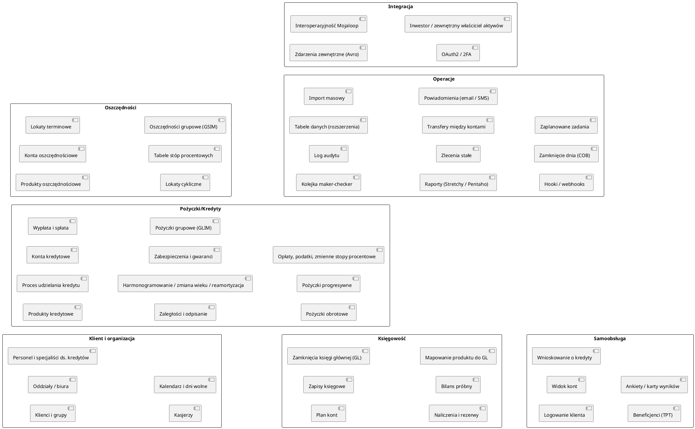
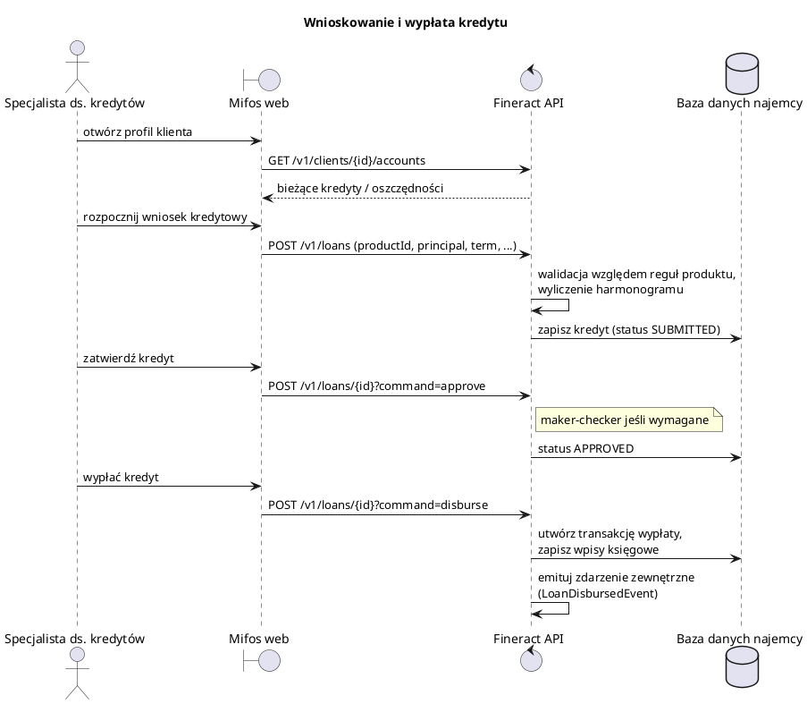
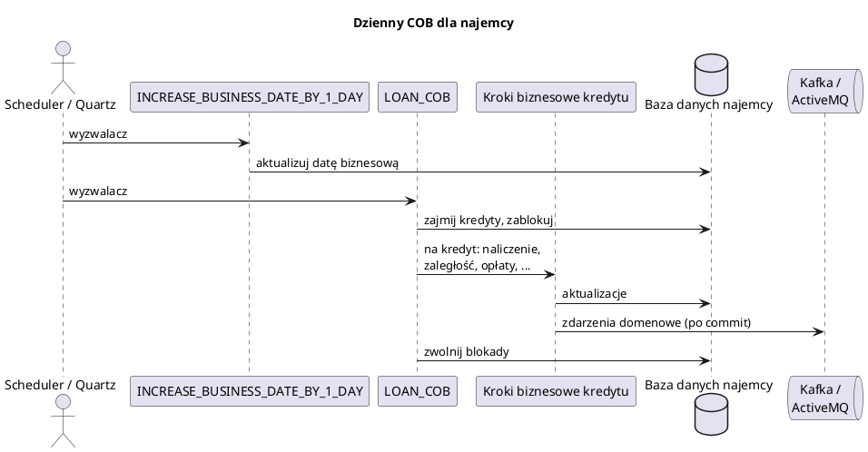
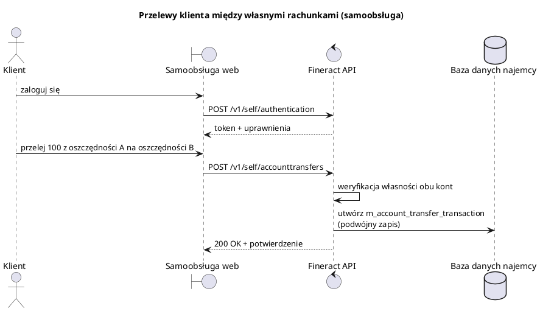

# Przegląd produktu

<strong>Przejdź do dowolnego dokumentu</strong>

**[Indeks](../README.md)**

**Biznesowe:** [01 Podsumowanie wykonawcze](01-executive-summary.md) · **02 Przegląd produktu** · [03 Procesy biznesowe](03-business-processes.md) · [04 Słownik domenowy](04-domain-glossary.md) · [05 Reguły biznesowe](05-business-rules.md) · [06 Integracje i interesariusze](06-integrations-and-stakeholders.md) · [07 Ryzyka i luki](07-risks-and-gaps.md)

**Techniczne:** [01 Przegląd architektury](../technical/01-architecture-overview.md) · [02 Stos technologiczny](../technical/02-tech-stack.md) · [03 Mapa repozytorium](../technical/03-repository-map.md) · [04 Model danych](../technical/04-data-model.md) · [05 Dokumentacja API](../technical/05-api-reference.md) · [06 Przepływy uruchomieniowe](../technical/06-runtime-flows.md) · [07 Infrastruktura i wdrożenie](../technical/07-infrastructure-and-deployment.md) · [08 Konfiguracja i flagi funkcji](../technical/08-configuration-and-feature-flags.md) · [09 Model bezpieczeństwa](../technical/09-security-model.md) · [10 Podręcznik operacyjny](../technical/10-operational-runbook.md) · [11 Strategia testowania](../technical/11-testing-strategy.md) · [12 Rejestr decyzji](../technical/12-decision-log.md)

> Możliwości, persony i główne ścieżki użytkownika.

## Mapa możliwości

## Persony

| Persona | Cel | Główny interfejs |
| --- | --- | --- |
| **Specjalista ds. kredytów** | Pozyskiwanie klientów, udzielanie i wypłacanie kredytów, zbieranie spłat. | Klient webowy Mifos → `/v1/clients`, `/v1/loans/...`. |
| **Kierownik oddziału** | Przypisywanie personelu, zarządzanie dniami wolnymi, nadzór nad kasjerami, zatwierdzanie kolejki maker-checker. | `/v1/offices`, `/v1/staff`, `/v1/makercheckers`. |
| **Księgowy back-office** | Utrzymywanie planu kont, zamykanie okresów, sporządzanie bilansu próbnego. | `/v1/glaccounts`, `/v1/journalentries`, `/v1/glclosures`, `/v1/runaccruals`. |
| **Operacje / SRE** | Uruchamianie COB, monitorowanie zadań, zarządzanie najemcami (tenants). | `/v1/jobs`, `/v1/scheduler`, `/v1/internal/cob`, Spring Boot Actuator. |
| **Zgodność / audytor** | Inspekcja logu audytu, historii komend, zapisów księgowych. | `/v1/audits`, `request_audit_table`, `f_command_source`. |
| **Klient (samoobsługa)** | Przegląd własnych kont, przelewanie środków, wnioskowanie o produkty. | Interfejs użytkownika samoobsługi Mifos / mobile → `/v1/self/*`. |
| **Partner / integrator fintech** | Zakładanie kont, księgowanie transakcji, konsumowanie zdarzeń. | Chronione OAuth2 REST API + zdarzenia zewnętrzne Avro. |
| **Regulator** | Odczyt raportów MIX-Market / Pentaho. | `/v1/reports`, `/v1/runreports`, `/v1/mixreport`. |
| **Skarbiec / ryzyko** | Stosowanie zasad tworzenia rezerw, monitorowanie koszyków zaległości. | `/v1/provisioningcategory`, `/v1/provisioningcriteria`, `/v1/provisioningentries`, `/v1/delinquency`. |
| **Administrator bazy danych najemcy (Tenant DBA)** | Przygotowanie bazy danych najemcy, zarządzanie migracjami, przywracanie kopii zapasowych. | Schemat przechowywania najemców; Liquibase. |

## Główne przypadki użycia

### Zarządzanie portfelem klientów

- Rejestracja osoby fizycznej lub jednostki prawnej innej niż osoba (CRUD na `m_client`, `m_client_non_person`).
- Gromadzenie dokumentów KYC, adresów, członków rodziny, identyfikatorów.
- Grupowanie klientów w grupy i centra dla produktów wspólnych.
- Opcjonalne rozszerzanie za pomocą **tabel danych** (niestandardowe kolumny).

### Udzielanie i obsługa kredytów

- Konfiguracja **produktu kredytowego** z walutą, modelem odsetkowym, częstotliwością spłat, opłatami, zasadami księgowymi.
- Przyjęcie **wniosku** kredytowego, przeprowadzenie procesu zatwierdzania (opcjonalnie maker-checker), wypłata, generowanie harmonogramu spłat.
- Księgowanie spłat przy użyciu jednej z konfigurowalnych **strategii procesora transakcji** (np. standard Mifos, RBI Indie, płatność zaawansowana).
- Śledzenie zaległości poprzez **koszyki** (np. 30/60/90 dni po terminie) aktualizowane codziennie przez COB.
- Zmiana harmonogramu, wieku lub reamortyzacja pozostałych sald w razie potrzeby.
- Odpisywanie, zamykanie lub wycofywanie transakcji z pełną ścieżką audytu.

### Obsługa oszczędności, lokat terminowych i cyklicznych

- Konfiguracja produktów oszczędnościowych z tabelami stóp procentowych (progi według kwoty i okresu).
- Otwieranie kont; przyjmowanie depozytów i okresowe wypłacanie odsetek.
- Nakładanie opłat i prowizji; blokady środków; zarządzanie uśpionymi kontami.
- Stosowanie komponentów podatkowych (np. podatek u źródła) przy księgowaniu odsetek.

### Prowadzenie księgowości

- Utrzymywanie planu kont (`acc_gl_account`).
- Mapowanie produktów kredytowych/oszczędnościowych do kont GL, aby transakcje automatycznie generowały zapisy księgowe.
- Uruchamianie **zamknięć GL** na koniec okresu, które ustalają datę graniczną dla zapisów z datą wsteczną.
- Uruchamianie **naliczeń** i **zapisów rezerw** dla kredytów (rezerwy na straty kredytowe).
- Okresowa agregacja zapisów księgowych (zadanie `JOURNAL_ENTRY_AGGREGATION`) dla wydajności raportowania.

### Dzienny proces zamknięcia dnia (COB)

- Przesunięcie "daty biznesowej" systemu poprzez zadanie `INCREASE_BUSINESS_DATE_BY_1_DAY`.
- Uruchomienie COB dla kredytów dla wszystkich kredytów w porcjach (zadanie partycjonowane `LOAN_COB`): stosowanie naliczeń, ustawianie znaczników zaległości, nakładanie kar na zaległe raty, przeliczanie odsetek itp.
- Nadrabianie zaległości, jeśli system miał opóźnienie, poprzez `/v1/internal/cob/catch-up`.

### Samoobsługa dla klientów

- Uwierzytelnianie klienta poprzez `/v1/self/authentication`.
- Przegląd własnych danych, kont, wyciągów (`/v1/self/clients`, `/v1/self/savingsaccounts` itp.).
- Wnioskowanie o produkty, planowanie transferów, rejestrowanie beneficjentów (TPT), odpowiadanie na ankiety.

### Integracja z centrami płatniczymi / pieniądzem mobilnym

- API **interoperacyjności** w stylu Mojaloop (`/v1/interoperation/...`) do wystawiania kwotowań, transferów i sprawdzania stron.
- **Zdarzenia zewnętrzne** przesyłające zmiany stanu do tematów Kafki lub kolejek JMS dla systemów zewnętrznych.
- **Webhooki / hooki** przesyłające określone zdarzenia pod skonfigurowane adresy URL.

## Topowe ścieżki użytkownika

## Ceny i licencjonowanie

Licencja Apache 2.0. Brak opłat licencyjnych. Operatorzy ponoszą koszty prowadzenia i wsparcia platformy.

---

← Poprzedni: [Podsumowanie wykonawcze](01-executive-summary.md) · ↑ [Indeks](../README.md) · Następny: [Procesy biznesowe](03-business-processes.md) →
