# Procesy biznesowe

<strong>Skocz do dowolnego dokumentu</strong>

**[Indeks](../README.md)**

**Biznesowe:** [01 Podsumowanie menedżerskie](01-executive-summary.md) · [02 Przegląd produktu](02-product-overview.md) · **03 Procesy biznesowe** · [04 Słownik domenowy](04-domain-glossary.md) · [05 Reguły biznesowe](05-business-rules.md) · [06 Integracje i interesariusze](06-integrations-and-stakeholders.md) · [07 Ryzyka i luki](07-risks-and-gaps.md)

**Techniczne:** [01 Przegląd architektury](../technical/01-architecture-overview.md) · [02 Stos technologiczny](../technical/02-tech-stack.md) · [03 Mapa repozytorium](../technical/03-repository-map.md) · [04 Model danych](../technical/04-data-model.md) · [05 Dokumentacja API](../technical/05-api-reference.md) · [06 Przepływy uruchomieniowe](../technical/06-runtime-flows.md) · [07 Infrastruktura i wdrożenie](../technical/07-infrastructure-and-deployment.md) · [08 Konfiguracja i flagi funkcji](../technical/08-configuration-and-feature-flags.md) · [09 Model bezpieczeństwa](../technical/09-security-model.md) · [10 Podręcznik operacyjny](../technical/10-operational-runbook.md) · [11 Strategia testowania](../technical/11-testing-strategy.md) · [12 Dziennik decyzji](../technical/12-decision-log.md)

> Kompleksowe (end-to-end) przepływy pracy obsługiwane przez system, z opisami w stylu swimlane. Wszystkie odniesienia do interfejsów API i koncepcji domenowych prowadzą do dokumentacji technicznej.

## 1. Onboarding klienta

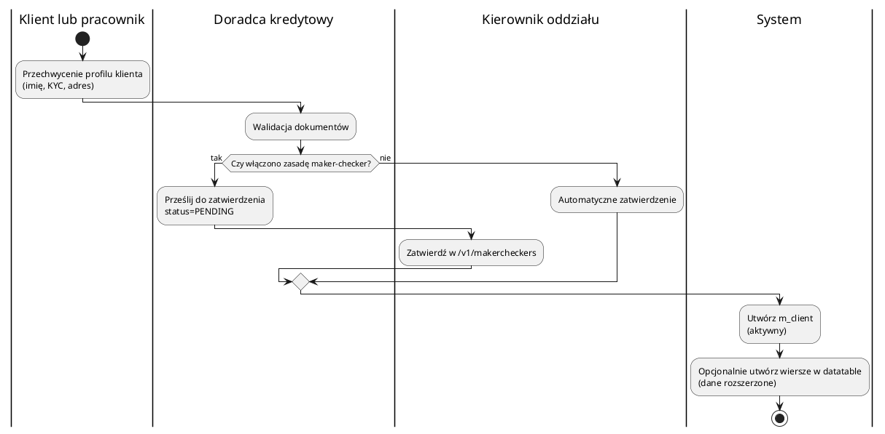

Wywołane API: `/v1/clients`, `/v1/clients/{clientId}/identifiers`, `/v1/clients/{clientId}/familymembers`, `/v1/clients/{clientId}/addresses`, `/v1/datatables/...`. Zobacz [`docs/technical/05-api-reference.md`](../technical/05-api-reference.md).

## 2. Udzielanie pożyczek, zatwierdzanie i wypłata

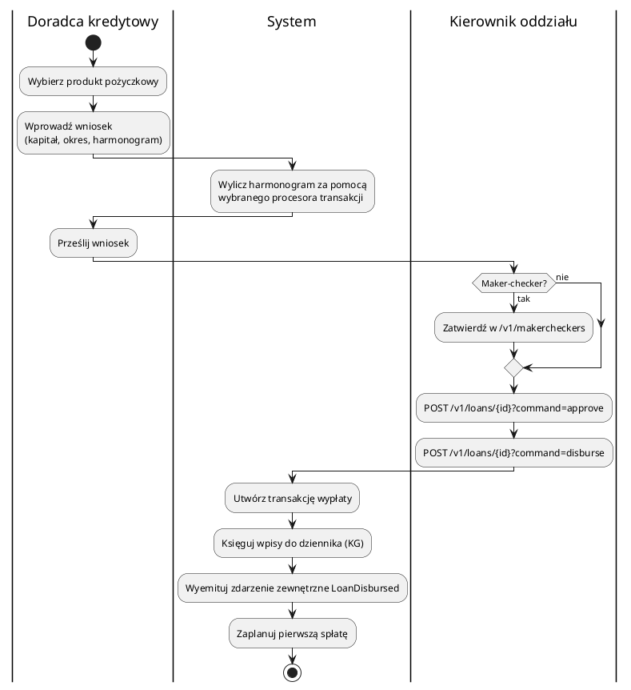

Uwagi:

- Harmonogram zależy od **konfiguracji produktu pożyczkowego** (metoda odsetkowa, ponowne przeliczanie, opłaty) oraz **strategii procesora transakcji**. Zobacz [`docs/technical/08-configuration-and-feature-flags.md`](../technical/08-configuration-and-feature-flags.md#loan-transaction-processors-applicationproperties165-179).
- Pożyczki grupowe (GLIM) i oszczędności grupowe (GSIM) postępują zgodnie z tym samym przepływem, ale na poziomie konta grupowego.

## 3. Spłata

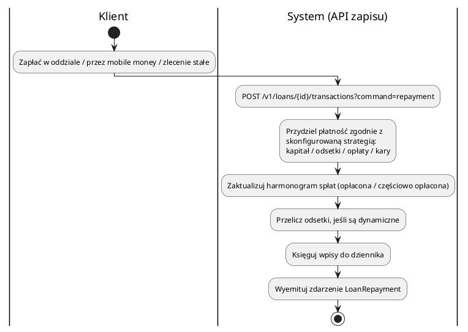

Jeśli spłata w pełni pokrywa kapitał + naliczone odsetki, system oznacza pożyczkę jako **zamkniętą** (closed). Jeśli opłata lub kara została umorzona, używane są dedykowane polecenia (`waive_charge`, `waive_interest`).

## 4. Codzienne zamknięcie dnia (COB)

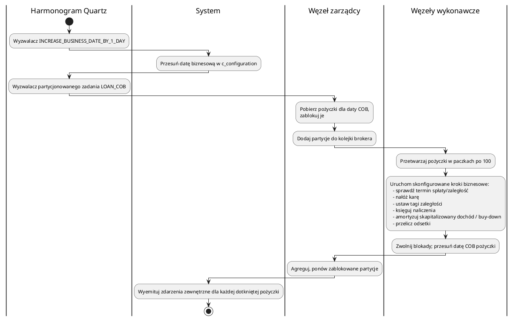

Scenariusz nadrabiania zaległości: gdy najemca (tenant) ma opóźnienia (np. awaria bazy danych), wywołaj `/v1/internal/cob/catch-up`, aby przetworzyć zaległe dni.

## 5. Zatwierdzanie Maker-checker (zasada czterech oczu)

Dotyczy każdej operacji zapisu, dla której instytucja włączyła zasadę czterech oczu.

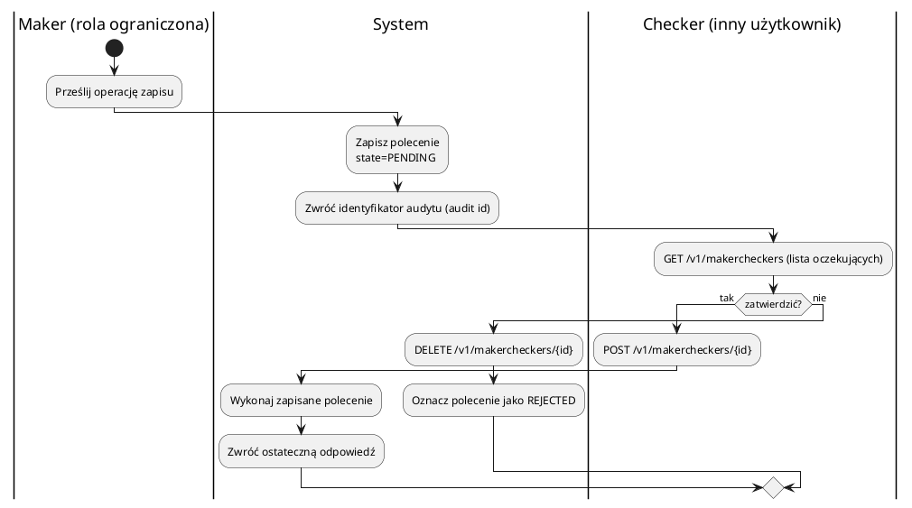

Decyzje i znaczniki czasu są zapisywane; stanowi to ścieżkę audytu instytucji (`/v1/audits` i `request_audit_table`).

## 6. Księgowe zamknięcie okresu

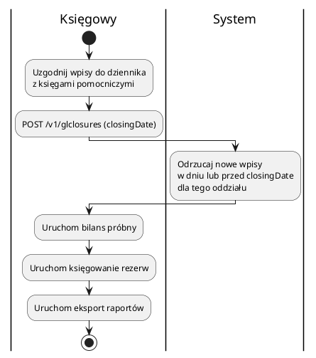

Zamknięcie KG (Księgi Głównej) odbywa się **na oddział**: centrala może zamknąć okres, podczas gdy oddziały nadal mają otwarte okresy (lub odwrotnie, w zależności od polityki).

## 7. Tworzenie rezerw (na straty pożyczkowe)

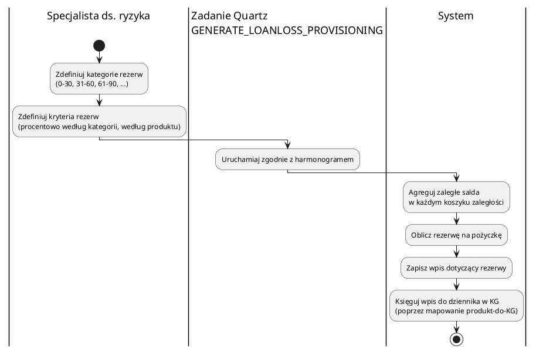

## 8. Zlecenia stałe i przelewy między kontami

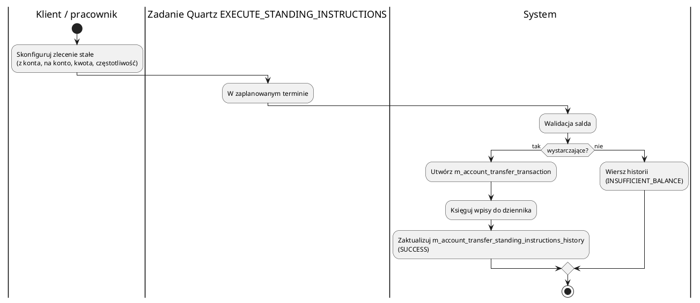

## 9. Import masowy

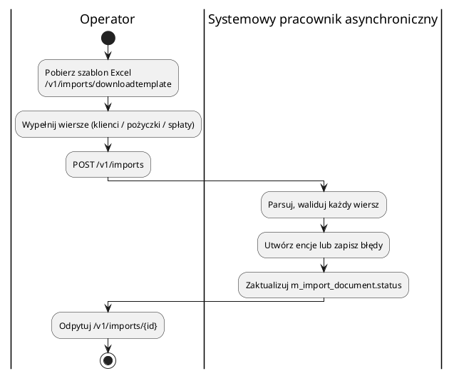

Import masowy jest kanoniczną ścieżką migracji z arkuszy kalkulacyjnych / systemów spuścizny (legacy).

## 10. Integracja ze zdarzeniami zewnętrznymi

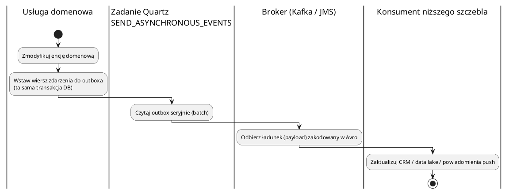

Wzorzec outbox gwarantuje, że zdarzenia zostaną opublikowane tylko wtedy, gdy zmiana w bazowej bazie danych zostanie utrwalona.

## 11. Przepływ samoobsługowy klienta

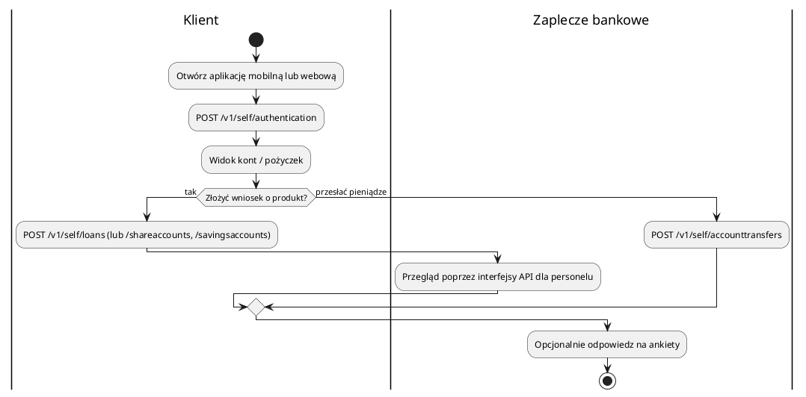

## 12. Raportowanie i ujawnianie danych

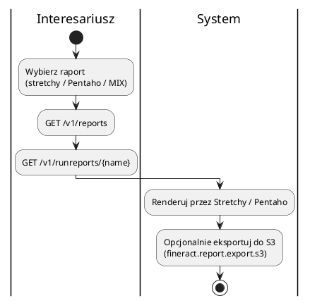

Raporty Stretchy to szablony SQL przechowywane w `stretchy_report` i parametryzowane przez `stretchy_report_parameter`. Raporty MIX-Market mapują tagi taksonomii XBRL poprzez `mix_taxonomy_mapping`.

## 13. Onboarding najemcy (operacyjny)

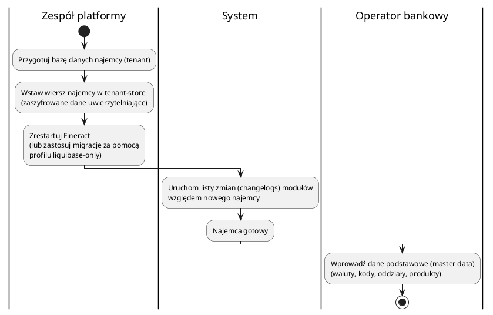

Zobacz [`docs/technical/10-operational-runbook.md#adding-a-tenant`](../technical/10-operational-runbook.md#adding-a-tenant).

## Własność procesów *(wnioskowana)*

| Proces | Prawdopodobna rola właściciela |
| --- | --- |
| Onboarding klienta, KYC | Operacje bankowe / compliance. |
| Udzielanie i zatwierdzanie pożyczek | Dział kredytowy / doradcy kredytowi. |
| Codzienne COB | SRE platformy + back office. |
| Zamknięcie KG | Finanse. |
| Tworzenie rezerw | Ryzyko. |
| Integracja zdarzeń zewnętrznych | Integracja / platforma danych. |
| Onboarding najemcy | Administrator baz danych (DBA) platformy. |

> TODO (wymaga potwierdzenia od MŚP/SME): przypisz imiennych ekspertów (SME) (lub zespoły) do każdego procesu przed opublikowaniem tego dokumentu interesariuszom nietechnicznym.

---

← Poprzedni: [Przegląd produktu](02-product-overview.md) · ↑ [Indeks](../README.md) · Następny: [Słownik domenowy](04-domain-glossary.md) →
