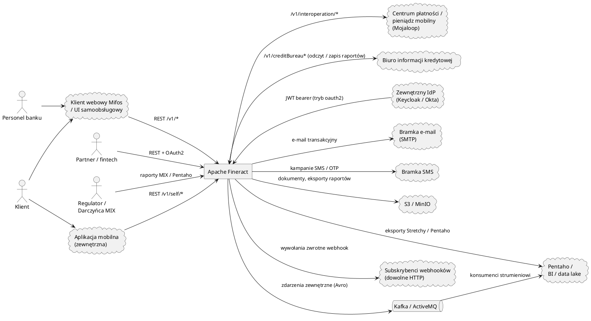

# Integracje i interesariusze

<strong>Skocz do dowolnego dokumentu</strong>

**[Indeks](../README.md)**

**Biznesowe:** [01 Podsumowanie menedżerskie](01-executive-summary.md) · [02 Przegląd produktu](02-product-overview.md) · [03 Procesy biznesowe](03-business-processes.md) · [04 Słownik domenowy](04-domain-glossary.md) · [05 Reguły biznesowe](05-business-rules.md) · **06 Integracje i interesariusze** · [07 Ryzyka i luki](07-risks-and-gaps.md)

**Techniczne:** [01 Przegląd architektury](../technical/01-architecture-overview.md) · [02 Stos technologiczny](../technical/02-tech-stack.md) · [03 Mapa repozytorium](../technical/03-repository-map.md) · [04 Model danych](../technical/04-data-model.md) · [05 Dokumentacja API](../technical/05-api-reference.md) · [06 Przepływy uruchomieniowe](../technical/06-runtime-flows.md) · [07 Infrastruktura i wdrożenie](../technical/07-infrastructure-and-deployment.md) · [08 Konfiguracja i flagi funkcji](../technical/08-configuration-and-feature-flags.md) · [09 Model bezpieczeństwa](../technical/09-security-model.md) · [10 Podręcznik operacyjny](../technical/10-operational-runbook.md) · [11 Strategia testowania](../technical/11-testing-strategy.md) · [12 Dziennik decyzji](../technical/12-decision-log.md)

> Systemy nadrzędne i podrzędne, usługi stron trzecich, wymieniane dane oraz prawdopodobna własność.

## Mapa integracji

## Integracje przychodzące

### Klient webowy Mifos (UI)

- Oficjalna aplikacja webowa społeczności Mifos wywołuje API dla personelu (`/v1/*`).
- Dołączone pliki compose: `docker-compose-community-app.yml`, `docker-compose-web-app.yml`.
- Uwierzytelnianie: domyślnie HTTP Basic; OAuth2 po skonfigurowaniu.

### Interfejsy samoobsługowe (web i mobile)

- Korzystają z `/v1/self/authentication`, a następnie odczytują/zapisują wyłącznie zasoby należące do wywołującego klienta.
- Autoryzacja wymuszana przez `SelfServiceUserAuthorizationManager`.
- Powiadomienia push: klient może zarejestrować urządzenie przez `/v1/self/device/registration`; stos FCM/GCM opisany w `org.apache.fineract.infrastructure.gcm`.

### Partnerzy / integratorzy fintech

- Dostęp programistyczny przez `/v1/*` (REST) oraz `/v1/batches` dla transakcji złożonych.
- Zazwyczaj wdrażane z trybem **OAuth2** (`FINERACT_SECURITY_OAUTH_ENABLED=true`).
- Dostępne wygenerowane zestawy SDK klienta: `fineract-client` (Retrofit) i `fineract-client-feign` (Feign).

### Interoperacyjność Mojaloop

- `/v1/interoperation/*` implementuje powierzchnię API Mojaloop po stronie FSP: `parties/{idType}/{idValue}`, `quotes`, `transfers`, `requests`.
- Moduł: `org.apache.fineract.interoperation` (w `fineract-provider`).
- Zaprojektowany do podłączenia do centrum płatności w celu realizacji przelewów między różnymi FSP.

> DO ZROBIENIA (wymaga potwierdzenia od eksperta): która wersja API Mojaloop (1.0 / 1.1 / 2.x) jest zaimplementowana i czy rozliczenie (settlement) jest w zakresie.

### Zewnętrzny dostawca tożsamości (IdP)

- Gdy `FINERACT_SECURITY_OAUTH_ENABLED=true`, Fineract działa jako **serwer zasobów OAuth2**.
- Dołączony `AuthorizationServerConfig` zapewnia wewnątrzpamieciowy serwer autoryzacji do celów programistycznych; wdrożenia produkcyjne zazwyczaj zamieniają go na zewnętrzny IdP (Keycloak, Okta, Auth0).

## Integracje wychodzące

### Zdarzenia zewnętrzne

- **Transport**: Apache Kafka (preferowany), JMS / ActiveMQ lub wewnątrzprocesowe zdarzenia Spring.
- **Format**: Apache Avro, schematy w module `fineract-avro-schemas` (pliki `*.avsc` generują klasy Java za pomocą wtyczki Gradle Avro).
- **Nazwa tematu** (domyślna dla Kafki): `external-events` (`fineract.events.external.producer.kafka.topic.name`).
- **Wzorzec**: outbox — zdarzenia są zapisywane w bazie danych w ramach transakcji biznesowej i wysyłane przez zadanie `SEND_ASYNCHRONOUS_EVENTS` po zatwierdzeniu (commit).
- **Retencja** zarządzana przez zadanie `PURGE_EXTERNAL_EVENTS`.

### Webhooki (hooks)

- Tabela dla każdego tenanta `m_hook_configuration` rejestruje wywołania zwrotne HTTP dla każdego typu zdarzenia.
- API: `/v1/hooks`. Payload to JSON; szablonowanie przez Mustache (`m_template`).
- Zachowanie w przypadku ponowień / błędów jest sterowane zdarzeniami wewnątrz aplikacji *(wnioskowane)*.

### SMS

- API: `/v1/sms`, `/v1/smscampaigns`.
- Kolejka wychodząca: `sms_messages_outbound`.
- Zadania Quartz: `UPDATE_SMS_OUTBOUND_WITH_CAMPAIGN_MESSAGE`, `SEND_MESSAGES_TO_SMS_GATEWAY`, `GET_DELIVERY_REPORTS_FROM_SMS_GATEWAY`.
- Bramka jest **dostarczana przez operatora** — Fineract wykonuje wychodzące żądania HTTP pod skonfigurowany URL z poświadczeniami w `c_external_service_properties`.

### E-mail

- API: `/v1/email`, `/v1/email/configuration`, `/v1/email/campaign`.
- Kolejka wychodząca: `scheduled_email_messages_outbound`.
- Zadania Quartz: `UPDATE_EMAIL_OUTBOUND_WITH_CAMPAIGN_MESSAGE`, `EXECUTE_EMAIL`.
- Poświadczenia SMTP dla każdego tenanta przechowywane w `scheduled_email_configuration`.

### Magazyn dokumentów (S3)

- Gdy `fineract.content.s3.enabled=true`, załączniki do dokumentów i eksporty raportów są zapisywane w S3.
- Obsługuje niestandardowe punkty końcowe (MinIO, kompatybilne z GCS). Zobacz `application.properties:188-194`.

### Zadanie wysyłki raportów

- Zaplanowany raport Pentaho/Stretchy może być okresowo wysyłany e-mailem. API: `/v1/reportMailingJob*`. Tabele: `m_report_mailing_job` *(wnioskowane)*. Zadanie `EXECUTE_REPORT_MAILING_JOBS`.

### Integracja z biurem informacji kredytowej

- API `/v1/CreditBureauConfiguration`, `/v1/creditBureauIntegration`, `/v1/creditreport`.
- Tabele: `m_creditbureau`, `m_creditbureau_configuration`, `m_creditbureau_loanproduct_mapping`, `m_creditbureau_token`, `m_creditreport`.
- Implementacja biura jest wtykowa; platforma przechowuje tokeny, pobrane raporty oraz mapowanie na produkt.

### Pentaho / analityka biznesowa (BI)

- Raporty Pentaho `.prpt` są przechowywane i serwowane przez Fineract.
- Narzędzia BI mogą również czytać bezpośrednio z bazy danych tenanta (dozwolone połączenie z repliką tylko do odczytu przez `fineract.tenant.read-only-host`).

## Interesariusze według kompetencji

| Interesariusz | Prawdopodobny zespół właścicielski | Główne punkty styku |
| --- | --- | --- |
| Aplikacja webowa Mifos | Zespół UX / front-end banku | `/v1/*` + `/v1/self/*`. |
| Personel banku | Operacje oddziałowe | `/v1/clients`, `/v1/loans`, `/v1/savingsaccounts`, `/v1/makercheckers`. |
| Klient (samoobsługa) | Zespół kanałów cyfrowych | `/v1/self/*`. |
| Zespół produktów kredytowych | Kredyty | `/v1/loanproducts`, strategie procesorów transakcji, mapowania produktów na księgę główną. |
| Zespół produktów oszczędnościowych | Depozyty / oszczędności | `/v1/savingsproducts`, `/v1/fixeddepositproducts`, `/v1/recurringdepositproducts`, tabele oprocentowania. |
| Księgowość | Finanse | `/v1/glaccounts`, `/v1/glclosures`, `/v1/journalentries`, `/v1/runaccruals`. |
| Zgodność / audyt | Zgodność (Compliance) | `/v1/audits`, `request_audit_table`, magazyn poleceń. |
| Ryzyko | Ryzyko | `/v1/provisioningcategory`, `/v1/provisioningcriteria`, `/v1/delinquency`, zadanie NPA. |
| Raportowanie / łącznik z regulatorem | Zespół MI | `/v1/reports`, `/v1/runreports`, `/v1/mixreport`. |
| Skarbiec / operacje płatnicze | Skarbiec (Treasury) | `/v1/accounttransfers`, `/v1/standinginstructions`, `/v1/tellers`, interoperacyjność. |
| Platforma / SRE | SRE | Spring Boot Actuator, Quartz, wewnętrzne mechanizmy COB, manifesty Kubernetes. |
| DBA Tenanta | Baza danych / dane | Magazyn tenantów, Liquibase, kopie zapasowe. |
| Administrator tożsamości | Bezpieczeństwo | `m_appuser`, `m_role`, `m_permission`, rejestracje klientów OAuth2. |
| Zespół integracji | Integracja / platforma danych | Zdarzenia zewnętrzne (Kafka), webhooki, zestawy SDK dla partnerów. |

> DO ZROBIENIA (wymaga potwierdzenia od eksperta): sfinalizowanie nazw zespołów właścicielskich zgodnie z faktycznym schematem organizacyjnym instytucji wdrażającej.

## Dane wymieniane z podmiotami zewnętrznymi

| Kontrahent | Kierunek danych | Wrażliwość | Kanał |
| --- | --- | --- | --- |
| Hub Mojaloop | KYC + kwoty; klient jest klientem **innego FSP** w przypadku transakcji przychodzących. | Wysoka (PII, pieniężne). | HTTPS REST. |
| Biuro informacji kredytowej | KYC + historia kredytowa → biuro; raport kredytowy ← biuro. | Wysoka. | HTTPS REST. |
| Bramka SMS | OTP, SMS o zdarzeniach na koncie. | Średnia (ref. konta). | HTTPS REST. |
| SMTP | Wyciągi, e-maile OTP, kampanie marketingowe. | Średnia. | SMTP. |
| Subskrybenci webhooków | JSON zdarzenia domenowego. | Zmienna; konfigurowalna dla każdego hooka. | HTTPS POST. |
| Konsumenci Kafki | Avro zdarzenia domenowego. | Zmienna. | TCP (zalecany TLS). |
| S3 | Dokumenty, eksporty raportów. | Wysoka (PII, dokumenty kont). | HTTPS. |
| Narzędzia BI | Zapytania do repliki tylko do odczytu lub zaplanowane eksporty. | Wysoka. | JDBC / plik. |
| Klient webowy Mifos | Wszystkie dane personelu. | Wysoka. | HTTPS REST. |
| Aplikacje samoobsługowe | Tylko dane samoobsługowe. | Wysoka. | HTTPS REST. |
| Zewnętrzny IdP | Wydawanie / introspekcja JWT. | Średnia. | HTTPS. |

## Uwierzytelnianie w Fineract według typu integracji

| Integrator | Uwierzytelnianie |
| --- | --- |
| Klient webowy Mifos | Basic auth + nagłówek tenanta (domyślnie) lub OAuth2 po skonfigurowaniu. |
| UI samoobsługowe | Basic auth (`/v1/self/authentication`) lub OAuth2. |
| Partner / fintech | OAuth2 (zazwyczaj), bearer JWT. |
| Hub Mojaloop | Mutual TLS / Basic auth + nagłówek tenanta *(wnioskowane — zweryfikować z przewodnikiem wdrożenia Mojaloop)*. |
| Pracownik Quartz / Spring Batch | Wewnętrzne (brak HTTP); ta sama JVM lub zaufana sieć brokera. |
| Przesyłanie importu masowego | Takie samo jak wywołującego. |

## Uwierzytelnianie z Fineract według typu integracji

| Integracja | Uwierzytelnianie wychodzące |
| --- | --- |
| Webhooki | Konfigurowalne dla każdego hooka (poświadczenia w `m_hook_configuration`). |
| Kafka | Plaintext (domyślnie) lub SASL/IAM (np. AWS MSK przy użyciu `aws-msk-iam-auth`). |
| ActiveMQ | Nazwa użytkownika/hasło (ustawiane przez `FINERACT_REMOTE_JOB_MESSAGE_HANDLER_JMS_BROKER_USERNAME/PASSWORD`). |
| SMS | Dla każdej bramki, przechowywane w `c_external_service_properties`. |
| E-mail | Poświadczenia SMTP w `scheduled_email_configuration`. |
| S3 | Sygnatura AWS (profil instancji lub klucze statyczne). |
| Biuro informacji kredytowej | Dla każdego biura, przechowywane w `m_creditbureau_token`. |

## Integracje poza zakresem

- Brak gotowej integracji z konkretnymi dostawcami KYC — operatorzy muszą zbudować własnego subskrybenta webhooków lub adapter REST.
- Brak gotowego eksportu księgi głównej do oddzielnego systemu ERP — Fineract jest systemem ewidencji. Integracja przez raporty lub zdarzenia.
- Brak front-endu dla personelu w tym repozytorium — Mifos web to oddzielny projekt.

## Punkty styku dla zgodności (Compliance)

- **Dziennik audytu** — `request_audit_table`, `f_command_source`. API: `/v1/audits`, `/v1/makercheckers`.
- **Maker-checker** — wbudowany.
- **Szyfrowanie w spoczynku** — tylko dla poświadczeń bazy danych tenanta w magazynie tenantów. Szyfrowanie danych tenanta w spoczynku jest obowiązkiem **silnika bazy danych**.
- **Rezydencja danych** — bazy danych dla poszczególnych tenantów sprawiają, że rezydencja jest trywialna: należy umieścić bazę danych każdego tenanta w odpowiednim regionie.

---

← Poprzedni: [Reguły biznesowe](05-business-rules.md) · ↑ [Indeks](../README.md) · Następny: [Ryzyka i luki](07-risks-and-gaps.md) →
