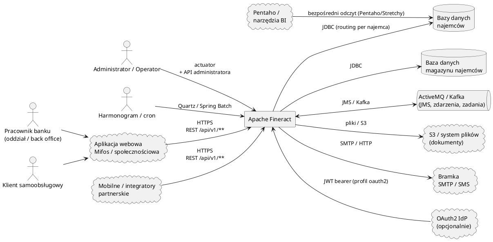
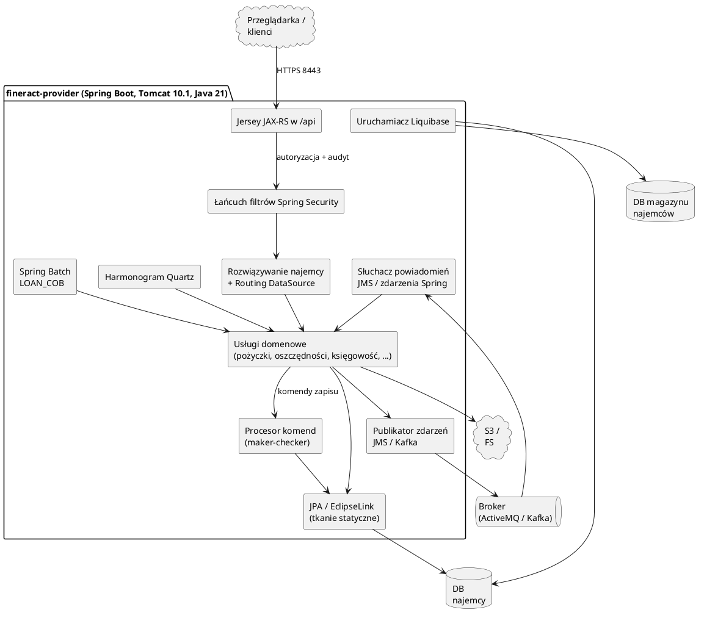
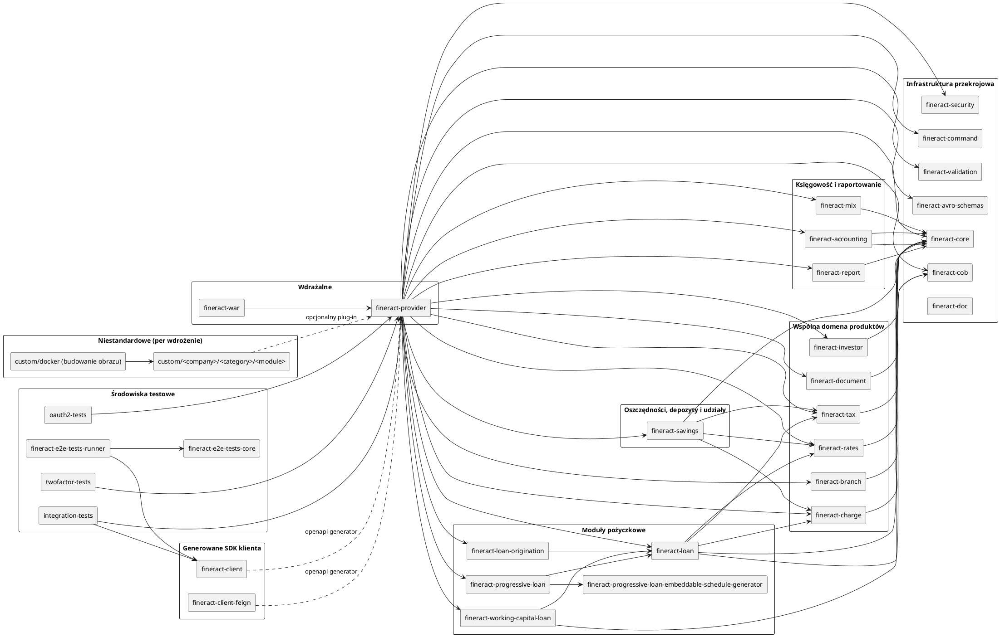

# Przegląd architektury

<strong>Przejdź do dowolnego dokumentu</strong>

**[Indeks](../README.md)**

**Biznesowe:** [01 Podsumowanie wykonawcze](../business/01-executive-summary.md) · [02 Przegląd produktu](../business/02-product-overview.md) · [03 Procesy biznesowe](../business/03-business-processes.md) · [04 Słownik domenowy](../business/04-domain-glossary.md) · [05 Reguły biznesowe](../business/05-business-rules.md) · [06 Integracje i interesariusze](../business/06-integrations-and-stakeholders.md) · [07 Ryzyka i luki](../business/07-risks-and-gaps.md)

**Techniczne:** **01 Przegląd architektury** · [02 Stos technologiczny](02-tech-stack.md) · [03 Mapa repozytorium](03-repository-map.md) · [04 Model danych](04-data-model.md) · [05 Dokumentacja API](05-api-reference.md) · [06 Przepływy uruchomieniowe](06-runtime-flows.md) · [07 Infrastruktura i wdrożenie](07-infrastructure-and-deployment.md) · [08 Konfiguracja i flagi funkcji](08-configuration-and-feature-flags.md) · [09 Model bezpieczeństwa](09-security-model.md) · [10 Podręcznik operacyjny](10-operational-runbook.md) · [11 Strategia testowania](11-testing-strategy.md) · [12 Dziennik decyzji](12-decision-log.md)

> Przegląd Apache Fineract w stylu C4: kontekst, kontenery, komponenty.

Fineract to platforma bankowości rdzeniowej typu **monolit modułowy**: pojedyncza wdrażalna aplikacja Spring Boot (`fineract-provider`), która agreguje wiele wewnętrznych modułów Gradle. Każdy moduł posiada wycinek domeny bankowej (pożyczki, oszczędności, księgowość itp.) i dostarcza własny dziennik zmian Liquibase. Ruch REST jest scentralizowany w `/api` i przekazywany przez Jersey do zasobów JAX-RS.

## C1 — Kontekst systemu

Aktorzy zewnętrzni:

- **Pracownicy banku i użytkownicy oddziałów** korzystają z API REST poprzez klienta webowego Mifos.
- **Klienci samoobsługowi** korzystają ze ścieżek `/api/v1/self/**` (np. `SelfClientsApiResource`, `SelfLoansApiResource`).
- **Operatorzy** uruchamiają migracje Liquibase (specjalny profil, `application-liquibase-only.properties`) oraz Spring Boot Actuator (`/actuator/health/{liveness,readiness}`).
- **Harmonogramy** wyzwalają zadania Quartz oraz partycjonowane zadania Spring Batch (w szczególności Loan COB).

## C2 — Kontenery

### Jak trafia żądanie

1. Żądanie HTTPS trafia do Tomcat na porcie 8443 (`config/docker/env/fineract.env`, `kubernetes/fineract-server-deployment.yml`).
2. Łańcuch filtrów serwletów: HSTS → CORS → rozwiązywanie najemcy (nagłówek `Fineract-Platform-Tenant-Id`) → uwierzytelnianie → drugi składnik (jeśli włączony).
3. Jersey kieruje URI do zasobu `@Path` w `org.apache.fineract.<module>..api` (`JerseyConfig` rejestruje wszystkie beany `@Path` i `@Provider`, `fineract-provider/.../infrastructure/core/jersey/JerseyConfig.java:37`).
4. API odczytu przechodzą przez `*ReadPlatformService` (odczyty Spring JDBC + JPA). API zapisu budują `CommandWrapper` i wysyłają go poprzez **Procesor Komend** w celu wsparcia maker-checker, idempotentności (nagłówek `Idempotency-Key`, patrz `application.properties:163`) oraz audytu.
5. JPA EclipseLink utrwala dane; `RoutingDataSource` wybiera odpowiedni `DataSource` dla danego najemcy na podstawie rozwiązanego najemcy.

### Przetwarzanie w tle

- **Quartz** harmonogramuje małe powtarzające się zadania z wyliczenia `JobName` (`fineract-core/.../infrastructure/jobs/service/JobName.java`): okresowe naliczenia, aktualizacje NPA, wysyłanie SMS/Email, zwiększanie daty biznesowej/COB itp.
- **Spring Batch** zarządza długotrwałymi zadaniami partycjonowanymi (`fineract.partitioned-job.partitioned-job-properties[0].job-name=LOAN_COB`, `application.properties:88-95`). Loan COB iteruje po pożyczkach w porcjach (domyślnie porcja 100, partycja 100) i uruchamia konfigurowalne **kroki biznesowe** (`COBBusinessStep`, np. `CheckLoanRepaymentDueBusinessStep`, `SetLoanDelinquencyTagsBusinessStep`).
- **Asynchroniczne wysyłanie zadań** pozwala węzłowi typu *manager* na kolejkowanie zadań, które konsumują węzły typu *worker*. Profile `fineract.mode.batch-manager-enabled` i `fineract.mode.batch-worker-enabled` (`application.properties:67-70`) kontrolują role; format przesyłu wykorzystuje zdarzenia Spring (domyślnie), JMS lub Kafkę w zależności od `fineract.remote-job-message-handler.*`.

### Wielonajemność (Multi-tenancy)

- Pojedyncza aplikacja, *osobna baza danych dla najemcy*: rejestr (**magazyn najemców**) zawiera listę najemców i ich parametry połączenia (host DB, port, poświadczenia, opcjonalna replika tylko do odczytu, parametry szyfrowania). Właściwości `fineract.tenant.*` (`application.properties:44-65`) inicjują domyślnego najemcę przy pierwszym uruchomieniu.
- `RoutingDataSource` (`fineract-provider/.../infrastructure/core/config/JdbcConfig.java`) rozszerza `AbstractRoutingDataSource` ze Springa i kluczuje połączenia identyfikatorem najemcy rozwiązanym w czasie filtrowania.
- Istnieje podział na dwie bazy danych: schemat **magazynu najemców** (rejestr) vs schemat **najemcy** (dane bankowe). Oba są migrowane przez Liquibase w tym samym procesie uruchomienia (`db.changelog-master.xml:30-44`).

## C3 — Komponenty i moduły

Widok komponentów obejmuje trzy warstwy, od ogólnej do szczegółowej:

- **C3.1** — każdy moduł Gradle i kierunki zależności.
- **C3.2** — powierzchnia API REST wewnątrz `fineract-provider`, pogrupowana według pakietów Java.
- **C3.3** — wewnętrzne komponenty modułów przekrojowych i domenowych oraz sposób ich współpracy.

### C3.1 — Wszystkie moduły Gradle

Źródło: `settings.gradle:49-96` oraz lista `fineractJavaProjects` w `build.gradle:26-58`. Strzałki oznaczają "zależy od".

### C3.2 — Powierzchnia API REST `fineract-provider`

Zasoby są zorganizowane według ich pakietów Java (`org.apache.fineract.<...>.api`). Wszystkie ścieżki są montowane w `/api/v1/...`. Źródła: każda klasa z adnotacją `@Path` w `fineract-provider/src/main/java` oraz `JerseyConfig` (`org.apache.fineract.infrastructure.core.jersey.JerseyConfig`).

```plantuml
@startuml
skinparam packageStyle rectangle
skinparam componentStyle rectangle

package "fineract-provider" {

  [ServerApplication\n(Spring Boot main)] as boot
  [JerseyConfig\n@ApplicationPath /api] as jersey
  [FineractWebApplicationConfiguration] as webcfg
  [FineractLiquibaseOnlyApplicationConfiguration] as liqcfg
  [SecurityConfig] as seccfg
  [AuthorizationServerConfig] as authcfg
  [JdbcConfig (RoutingDataSource)] as jdbccfg
  [ScheduledJobRunnerConfig] as schedcfg

  package "useradministration" {
    [UsersApiResource\n/v1/users]
    [RolesApiResource\n/v1/roles]
    [PermissionsApiResource\n/v1/permissions]
    [UserDetailsApiResource]
    [PasswordPreferencesApiResource]
  }

  package "infrastructure.security" {
    [AuthenticationApiResource\n/v1/authentication]
    [TwoFactorApiResource\n/v1/twofactor]
  }

  package "organisation" {
    [OfficesApiResource\n/v1/offices]
    [StaffApiResource\n/v1/staff]
    [HolidaysApiResource\n/v1/holidays]
    [WorkingDaysApiResource\n/v1/workingdays]
    [TellersApiResource\n/v1/tellers]
    [CashiersJournalApiResource\n/v1/cashiersjournal]
    [OfficeTransactionsApiResource\n/v1/officetransactions]
    [FundsApiResource\n/v1/funds]
    [CurrenciesApiResource\n/v1/currencies]
    [PaymentTypesApiResource\n/v1/paymenttypes]
  }

  package "portfolio.client" {
    [ClientApiResource\n/v1/clients]
    [ClientChargesApiResource]
    [ClientCollateralsApiResource]
    [ClientIdentifiersApiResource]
    [ClientFamilyMembersApiResource]
    [AddressApiResource]
  }

  package "portfolio.group" {
    [GroupsApiResource\n/v1/groups]
    [CentersApiResource\n/v1/centers]
    [GroupLevelsApiResource\n/v1/grouplevels]
    [CollectionSheetApiResource\n/v1/collectionsheet]
  }

  package "portfolio.loanaccount" {
    [LoansApiResource\n/v1/loans]
    [LoanProductsApiResource\n/v1/loanproducts]
    [LoanChargesApiResource]
    [LoanDisbursementsApiResource]
    [LoanGuarantorsApiResource]
    [LoanScheduleApiResource]
    [PostDatedChecksApiResource]
    [LoanReassignmentApiResource]
    [DelinquencyApiResource\n/v1/delinquency]
    [GLIMApiResource]
  }

  package "portfolio.loanaccount\n(zmiana harmonogramu, naliczenia)" {
    [RescheduleLoansApiResource\n/v1/rescheduleloans]
    [RunAccrualsApiResource\n/v1/runaccruals]
  }

  package "portfolio.savings" {
    [SavingsAccountApiResource\n/v1/savingsaccounts]
    [SavingsProductsApiResource\n/v1/savingsproducts]
    [FixedDepositAccountsApiResource]
    [FixedDepositProductsApiResource]
    [RecurringDepositAccountsApiResource]
    [RecurringDepositProductsApiResource]
    [InterestRateChartsApiResource]
    [GSIMApiResource]
  }

  package "portfolio.shareaccount\n+ shareproducts" {
    [ShareAccountsApiResource]
    [ShareProductsApiResource]
    [DividendsApiResource]
  }

  package "portfolio.transfer" {
    [AccountTransfersApiResource\n/v1/accounttransfers]
    [StandingInstructionsApiResource\n/v1/standinginstructions]
    [StandingInstructionRunHistoryApiResource]
  }

  package "portfolio.collateralmanagement" {
    [CollateralManagementApiResource]
    [LoanCollateralManagementApiResource]
  }

  package "portfolio.calendar / .meeting" {
    [CalendarsApiResource]
    [MeetingsApiResource]
    [NotesApiResource]
  }

  package "portfolio.self (samoobsługa)" {
    [SelfAuthenticationApiResource\n/v1/self/authentication]
    [SelfClientsApiResource\n/v1/self/clients]
    [SelfLoansApiResource\n/v1/self/loans]
    [SelfLoanProductsApiResource]
    [SelfSavingsAccountsApiResource]
    [SelfSavingsProductsApiResource]
    [SelfShareAccountsApiResource]
    [SelfAccountTransfersApiResource]
    [SelfBeneficiariesTptApiResource\n/v1/self/beneficiaries/tpt]
    [SelfPocketsApiResource]
    [SelfRegistrationApiResource]
    [SelfRunReportsApiResource]
    [SelfSurveysApiResource]
    [SelfUserDetailsApiResource]
    [SelfDeviceRegistrationApiResource]
  }

  package "accounting" {
    [GLAccountsApiResource\n/v1/glaccounts]
    [GLClosuresApiResource\n/v1/glclosures]
    [JournalEntriesApiResource\n/v1/journalentries]
    [FinancialActivityAccountsApiResource]
    [AccountingRulesApiResource\n/v1/accountingrules]
    [ProvisioningCategoryApiResource]
    [ProvisioningCriteriaApiResource]
    [ProvisioningEntriesApiResource]
  }

  package "infrastructure.codes" {
    [CodesApiResource\n/v1/codes]
    [CodeValuesApiResource]
  }

  package "infrastructure.configuration" {
    [GlobalConfigurationApiResource\n/v1/configurations]
    [ExternalServicesApiResource\n/v1/externalservice]
    [InstanceModeApiResource\n/v1/instance-mode]
  }

  package "infrastructure.creditbureau" {
    [CreditBureauApiResource]
    [CreditBureauConfigurationApiResource]
    [CreditBureauIntegrationApiResource]
  }

  package "infrastructure.dataqueries\n(raporty i datatables)" {
    [DatatablesApiResource\n/v1/datatables]
    [EntityDatatableChecksApiResource]
    [FieldConfigurationApiResource]
    [EntityToEntityMappingApiResource\n/v1/entitytoentitymapping]
    [ReportsApiResource\n/v1/reports]
    [RunReportsApiResource\n/v1/runreports]
    [AdHocQueryApiResource\n/v1/adhocquery]
  }

  package "infrastructure.documentmanagement" {
    [DocumentApiResource]
    [ImagesApiResource]
  }

  package "infrastructure.bulkimport" {
    [BulkImportsApiResource\n/v1/imports]
  }

  package "infrastructure.jobs" {
    [SchedulerApiResource\n/v1/scheduler]
    [JobsApiResource\n/v1/jobs]
  }

  package "infrastructure.cache" {
    [CachesApiResource\n/v1/caches]
  }

  package "infrastructure.event\n.external" {
    [ExternalEventsApiResource\n/v1/externalevents/configuration]
  }

  package "infrastructure.hooks" {
    [HooksApiResource\n/v1/hooks]
  }

  package "infrastructure.notification" {
    [NotificationsApiResource\n/v1/notifications]
  }

  package "infrastructure.sms" {
    [SmsApiResource\n/v1/sms]
    [SmsCampaignsApiResource\n/v1/smscampaigns]
  }

  package "infrastructure.campaigns.email" {
    [EmailApiResource\n/v1/email]
    [EmailCampaignApiResource]
    [EmailConfigurationApiResource]
  }

  package "infrastructure.template" {
    [TemplatesApiResource\n/v1/templates]
  }

  package "infrastructure.search" {
    [SearchApiResource\n/v1/search]
  }

  package "infrastructure.businessdate" {
    [BusinessDateApiResource\n/v1/businessdate]
  }

  package "infrastructure.audit\n+ command" {
    [AuditApiResource\n/v1/audits]
    [MakerCheckersApiResource\n/v1/makercheckers]
  }

  package "infrastructure.reportmailingjob" {
    [ReportMailingJobApiResource]
    [ReportMailingJobRunHistoryApiResource]
  }

  package "infrastructure.entityaccess" {
    [EntityToEntityAccessApiResource]
  }

  package "infrastructure.accountnumberformat" {
    [AccountNumberFormatApiResource]
  }

  package "interoperation" {
    [InteroperationApiResource\n/v1/interoperation]
  }

  package "spm (ankiety, karty wyników)" {
    [SurveyApiResource\n/v1/surveys]
    [ScorecardApiResource]
    [LookupTableApiResource]
  }

  package "batch" {
    [BatchApiResource\n/v1/batches]
  }

  package "cob.api (wewnętrzne)" {
    [LoanCOBCatchUpApiResource\n/v1/internal/cob]
    [WorkingCapitalLoanCOBCatchUpApiResource]
    [LoanAccountLockApiResource]
    [InternalLoanAccountLockApiResource]
    [ConfigureBusinessStepApiResource]
    [InternalCOBApiResource]
  }

  package "useradministration.passwordpreferences\n+ template" {
    [TemplateApiResource]
    [SearchTemplateApiResource]
  }
}

boot --> webcfg
boot --> liqcfg
webcfg --> jersey
webcfg --> seccfg
webcfg --> authcfg
webcfg --> jdbccfg
webcfg --> schedcfg
@enduml
```

### C3.3 — Komponenty przekrojowe i domenowe

Szczegółowy wgląd w moduły wspomniane w C3.1 — rzeczywiste usługi, kroki biznesowe i elementy utrwalania wewnątrz każdego modułu, do których delegują zasoby REST dostawcy.

```plantuml
@startuml
skinparam packageStyle rectangle
skinparam componentStyle rectangle

package "fineract-core" {
  [JobName enum] as jobname
  [Encje bazowe &\nDTO] as basedto
  [BatchRequest /\nBatchResponse] as batchdto
  [Encje rdzeniowe\norganizacji / użytkownika] as orgcore
  [PlatformSecurityContext] as psec
  [ThreadLocalContextUtil] as tlc
  [Narzędzia wspólne] as cutil
}

package "fineract-security" {
  [TenantAwareBasicAuthenticationFilter] as tabaf
  [TenantAwareJpaPlatformUserDetailsService] as tajuds
  [PasswordEncoderFactory] as pwd
  [Usługa drugiego składnika] as tfsvc
}

package "fineract-validation" {
  [Ograniczenia &\nwalidatory JSR-380] as jsr380
}

package "fineract-command" {
  [CommandSourceWritePlatformService] as cmdSrc
  [CommandWrapper /\nCommandWrapperBuilder] as cmdwrap
  [CommandHandlerProvider] as cmdHandler
  [CommandReplayService] as cmdReplay
  [PortfolioCommandSourceWritePlatformService] as portfCmd
  [Śledzenie idempotentności\nw f_command_source] as idem
}

package "fineract-cob" {
  [COBBusinessStepService] as cobSvc
  [COBBusinessStep] as cobStep
  [BatchJobConfiguration] as batchcfg
  [InitialisationTasklet] as initTask
  [LoanLockingService] as loanLock
  [PartitionerService] as parter
  [BusinessStepConfigService] as bscfg
}

package "fineract-loan" {
  [LoanWritePlatformService] as loanW
  [LoanReadPlatformService] as loanR
  [LoanProductWritePlatformService] as lprodW
  [LoanScheduleCalculationPlatformService] as lschedSvc
  [DelinquencyWritePlatformService] as delinqW
  [GuarantorWritePlatformService] as guarW
  [LoanCollateralManagementService] as collMgr
  [LoanArrearsAgingService] as arrears
  [InterestPauseService] as ipause
  [Strategie\nLoanTransactionProcessor] as lprocs
  [Zasady alokacji\npłatności / kredytu] as palloc
  [Kroki biznesowe Loan COB:\nCheckLoanRepaymentDue,\nCheckLoanRepaymentOverdue,\nApplyChargeToOverdue,\nSetLoanDelinquencyTags,\nAccrualActivityPosting,\nAddPeriodicAccrualEntries,\nLoanInterestRecalculation,\nUpdateLoanArrearsAging,\nCapitalizedIncomeAmortization,\nBuyDownFeeAmortization,\nCheckDueInstallments] as loanSteps
}

package "fineract-loan-origination" {
  [LoanOriginationService] as origSvc
  [Konwertery aplikacji &\nsłuchacze zdarzeń] as origConv
}

package "fineract-progressive-loan" {
  [Konto pożyczki progresywnej\n+ konfiguracja produktu] as ploanCfg
  [Usługi zaległości\n+ harmonogramu progresywnego] as ploanSvc
}

package "fineract-progressive-loan-embeddable\n-schedule-generator" {
  [EmbeddableProgressiveLoanScheduleGenerator] as pgenSvc
}

package "fineract-working-capital-loan" {
  [Usługa pożyczki obrotowej] as wcloanSvc
  [Tasklety COB pożyczki obrotowej\n(DummyBusinessStep, ...)] as wcloanCob
}

package "fineract-savings" {
  [SavingsAccountWritePlatformService] as savW
  [SavingsAccountReadPlatformService] as savR
  [SavingsProductWritePlatformService] as svprodW
  [DepositAccountWritePlatformService] as depW
  [InterestRateChartService] as irchart
  [SavingsCOBBusinessStep] as savCob
  [InteropService] as savInterop
}

package "fineract-accounting" {
  [GLAccountWritePlatformService] as glW
  [JournalEntryWritePlatformService] as jeW
  [JournalEntryReadPlatformService] as jeR
  [GLClosureService] as glClose
  [AccrualService] as accrSvc
  [ProvisioningEntriesService] as provSvc
  [TrialBalanceService] as tbSvc
  [ProductToGLAccountMappingService] as p2gl
  [AccountingRuleService] as accRule
  [JournalEntryAggregationJob] as jeAgg
  [FinancialActivityAccountService] as faAcc
}

package "fineract-investor" {
  [Usługi zewnętrznego\nwłaściciela aktywów] as eaSvc
  [Wzbogacacz inwestora\n+ serializator] as invEnr
  [InvestorCOBBusinessStep] as invCob
}

package "fineract-charge" {
  [ChargeWritePlatformService] as chgW
  [ChargeReadPlatformService] as chgR
}

package "fineract-rates" {
  [FloatingRateService] as frSvc
  [FloatingRatePeriodService] as frPSvc
}

package "fineract-tax" {
  [TaxComponentService] as txCmp
  [TaxGroupService] as txGrp
}

package "fineract-branch" {
  [Usługi biura / personelu /\nkasjera] as brSvc
}

package "fineract-document" {
  [DocumentWritePlatformService] as docW
  [DocumentReadPlatformService] as docR
  [Repozytorium zawartości\n(system plików | S3)] as content
}

package "fineract-report" {
  [ReportingService] as repSvc
  [Renderowanie SQL Stretchy] as stretchy
  [Renderowanie Pentaho] as pentaho
}

package "fineract-mix" {
  [MixTaxonomyService] as mixTax
  [MixMappingService] as mixMap
  [MixReportService] as mixRep
}

package "fineract-avro-schemas" {
  [Pliki .avsc\n(LoanDisbursed, LoanRepayment,\nSavingsTransaction, zdarzenia GL, ...)] as avsc
  [Generowane SDK Java] as avsdk
}

package "fineract-provider — wiring" {
  [LoansApiResource] as loanApi
  [SavingsAccountApiResource] as savApi
  [JournalEntriesApiResource] as glApi
  [BatchApiResource] as batchApi
  [LoanCOBCatchUpApiResource] as cobApi
  [Quartz ScheduledJobRunner\n+ JobName] as quartz
  [Zadanie Spring Batch\nLOAN_COB] as sbatch
  [ExternalEventService\n(outbox + sender)] as extEvt
  [HooksService] as hookSvc
  [NotificationGenerator] as notif
  [Ekspozycja\nreports / runreports] as reportApi
  [HikariCP +\nRoutingDataSource] as ds
  [Uruchamiacz Liquibase] as liq
}

' Punkty wejścia dostawcy -> usługi domenowe
loanApi --> portfCmd
loanApi --> loanW
loanApi --> loanR
loanApi --> lprodW
loanApi --> lschedSvc
loanApi --> delinqW
savApi --> portfCmd
savApi --> savW
savApi --> savR
savApi --> svprodW
savApi --> depW
glApi --> portfCmd
glApi --> jeW
glApi --> jeR
glApi --> glClose
batchApi --> loanApi
batchApi --> savApi
batchApi --> glApi
cobApi --> cobSvc

' Przepływ magazynu komend
portfCmd --> cmdSrc
cmdSrc --> cmdwrap
cmdSrc --> cmdHandler
cmdSrc --> idem
cmdHandler --> loanW
cmdHandler --> savW
cmdHandler --> jeW

' Rurociąg COB
sbatch --> initTask
sbatch --> parter
parter --> loanLock
parter --> cobSvc
cobSvc --> cobStep
loanSteps ..|> cobStep
savCob ..|> cobStep
invCob ..|> cobStep
wcloanCob ..|> cobStep
cobSvc --> bscfg

' Harmonogram
quartz --> jobname
quartz --> accrSvc
quartz --> arrears
quartz --> jeAgg
quartz --> provSvc
quartz --> tbSvc
quartz --> notif
quartz --> hookSvc
quartz --> extEvt

' Reużycie międzydomenowe
loanW --> chgW
loanW --> frSvc
loanW --> txCmp
savW --> chgW
savW --> frSvc
savW --> txCmp
loanW --> palloc
loanW --> lprocs

' Pozyskiwanie pożyczek i pożyczki specjalistyczne
origSvc --> loanW
ploanSvc --> loanW
ploanSvc --> pgenSvc
wcloanSvc --> loanW
wcloanSvc --> loanLock

' Integracja z księgowością
loanW --> p2gl
savW --> p2gl
p2gl --> jeW
accrSvc --> jeW
provSvc --> jeW
faAcc --> jeW
glClose --> jeW
accRule --> jeW

' Inwestor
eaSvc --> loanR
invEnr --> loanR

' Dokumenty i zawartość
docW --> content
docR --> content

' Raporty / mix
reportApi --> repSvc
repSvc --> stretchy
repSvc --> pentaho
mixRep --> jeR

' Zdarzenia
loanW --> extEvt : raise
savW --> extEvt : raise
jeW --> extEvt : raise
extEvt --> avsc : encode
avsc --> avsdk

' Bezpieczeństwo i wielonajemność pod wszystkim
tabaf --> tajuds
tabaf --> tlc
tlc <-- ds : tenant id
liq --> ds

' Walidacja reużywana
jsr380 ..> loanW
jsr380 ..> savW
jsr380 ..> jeW
jsr380 ..> portfCmd

' Hooki i powiadomienia podpięte pod zdarzenia domenowe
extEvt --> hookSvc
extEvt --> notif
@enduml
```

> Wskazówka do diagramu: trzy widoki mają celowo różne zakresy — C3.1 to kształt wdrażalny, C3.2 to publiczna powierzchnia REST, a C3.3 to mapa współpracy na poziomie implementacji. Zmieniając dokument tutaj, zaktualizuj poziom, do którego należy.

## Zaobserwowane wzorce architektoniczne

| Wzorzec | Gdzie |
| --- | --- |
| **Monolit modułowy** z granicami prywatności pakietów wymuszonymi przez moduły Gradle. | `settings.gradle:50-80` |
| **Wzorzec komendy + maker-checker** dla API zapisu (komendy utrwalane, odtwarzalne, logowane audytowo). | Moduł `fineract-command`, `MakerCheckerWritePlatformService`, `CommandSourceService`. |
| **CQRS-lite**: oddzielny `*ReadPlatformService` (surowy JDBC) vs `*WritePlatformService` (JPA + komendy). | W całym `portfolio.*`. |
| **Idempotentność** poprzez nagłówek `Idempotency-Key`. | `application.properties:163`. |
| **Wielonajemność poprzez `AbstractRoutingDataSource`**. | `JdbcConfig`. |
| **Zdarzenia zewnętrzne + Avro** dla integracji w dół strumienia. | `fineract-avro-schemas`, `fineract.events.external.producer.*`. |
| **Wymienne strategie procesora transakcji** dla spłat pożyczek. | `application.properties:165-174` (strategie `fineract.loan.transactionprocessor.*`: creocore, mifos-standard, rbi-india, advanced-payment-strategy itp.). |
| **Wymienny magazyn zawartości** (system plików vs S3). | `application.properties:186-194`. |
| **Rurociąg COB** — łańcuch `COBBusinessStep` konfigurowany na portfel pożyczek, pozwalający najemcom na włączanie/wyłączanie kroków. | Moduł `fineract-cob` oraz klasy `cob/loan/*BusinessStep`. |
| **Flagi trybu odczyt/zapis/manager/worker** do wdrażania wyspecjalizowanych węzłów z tego samego obrazu. | `application.properties:67-70`. |

## Topologia trybów

Pojedynczy obraz może działać w różnych kształtach poprzez przełączanie flag środowiskowych:

| Flaga (domyślnie) | Efekt |
| --- | --- |
| `FINERACT_MODE_READ_ENABLED=true` | Węzeł obsługuje API odczytu. |
| `FINERACT_MODE_WRITE_ENABLED=true` | Węzeł obsługuje API zapisu (procesor komend aktywny). |
| `FINERACT_MODE_BATCH_MANAGER_ENABLED=true` | Węzeł kolejkuje zadania partycjonowane (np. LOAN_COB). |
| `FINERACT_MODE_BATCH_WORKER_ENABLED=true` | Węzeł konsumuje komunikaty zadań partycjonowanych i wykonuje pracę. |

Stosy compose Postgres+Kafka i Postgres+ActiveMQ (`docker-compose-postgresql-kafka.yml`, `docker-compose-postgresql-activemq.yml`) demonstrują to z jednym **managerem** i dwoma **workerami**.

## Podsumowanie przepływów przekrojowych

- **Uwierzytelnianie** — domyślnie basic auth + nagłówek najemcy (`FINERACT_SECURITY_BASICAUTH_ENABLED=true`); opcjonalny serwer zasobów OAuth2 (`FINERACT_SECURITY_OAUTH_ENABLED=true`); opcjonalny drugi składnik (`FINERACT_SECURITY_2FA_ENABLED=true`).
- **Autoryzacja** — sprawdzenia na poziomie metod Spring Security; uprawnienia znajdują się w tabelach DB zainicjowanych przez Liquibase i przypisanych do ról.
- **Audytowanie** — wpisy audytowe tylko do dopisywania (`db/changelog/tenant/parts/0020_add_audit_entries.xml`, `0024_add_audit_entries.xml`, `0025_add_audit_entries_to_journal_entry.xml`).
- **Zdarzenia** — zdarzenia domenowe serializowane przez Avro i publikowane przez JMS lub Kafkę, gdy `fineract.events.external.enabled=true`.

## Wywnioskowane decyzje architektoniczne

*(wywnioskowane z `build.gradle`, układu modułów i właściwości)*

- **Wzorzec komendy** jest wybraną granicą integralności dla zapisów. Koduje przepływy maker-checker (obowiązkowe w wielu regulowanych domenach bankowych) i przechowuje powtórzenia/cofnięcia komend, zapewniając śledzenie audytowe bez oddzielnego silnika event-sourcingu.
- **EclipseLink ze statycznym tkaniem** (zamiast Hibernate) prawdopodobnie wyprzedza domyślne ustawienia Spring Boot; proces budowania podłącza `static-weaving.gradle` do każdego podprojektu, co sugeruje, że tkanie w czasie ładowania (load-time weaving) było celowo unikane.
- **Baza danych na najemcę** zamiast schematu na najemcę: pasuje do wdrożenia opartego na plikach MIFOS (poprzednik) i zapewnia ścisłą separację regulacyjną między bankami klienckimi.

---

← Poprzedni: [Ryzyka i luki](../business/07-risks-and-gaps.md) · ↑ [Indeks](../README.md) · Następny: [Stos technologiczny](02-tech-stack.md) →
