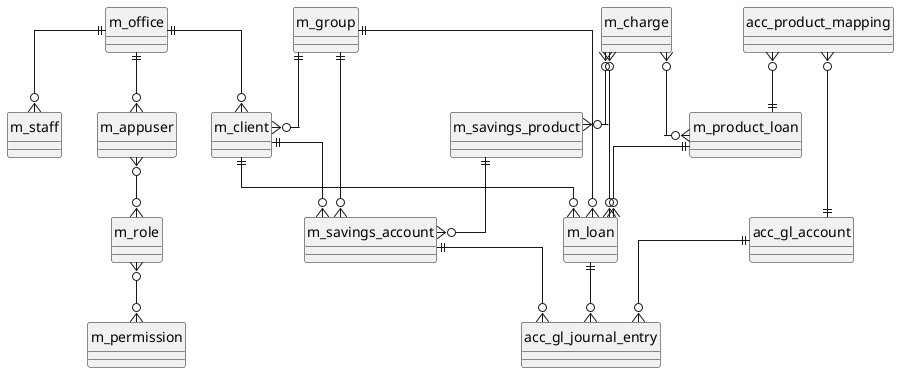

# Model danych

<strong>Skocz do dowolnego dokumentu</strong>

**[Indeks](../README.md)**

**Biznesowe:** [01 Podsumowanie wykonawcze](../business/01-executive-summary.md) · [02 Przegląd produktu](../business/02-product-overview.md) · [03 Procesy biznesowe](../business/03-business-processes.md) · [04 Słownik domenowy](../business/04-domain-glossary.md) · [05 Reguły biznesowe](../business/05-business-rules.md) · [06 Integracje i interesariusze](../business/06-integrations-and-stakeholders.md) · [07 Ryzyka i luki](../business/07-risks-and-gaps.md)

**Techniczne:** [01 Przegląd architektury](01-architecture-overview.md) · [02 Stos technologiczny](02-tech-stack.md) · [03 Mapa repozytorium](03-repository-map.md) · **04 Model danych** · [05 Referencja API](05-api-reference.md) · [06 Przepływy uruchomieniowe](06-runtime-flows.md) · [07 Infrastruktura i wdrożenie](07-infrastructure-and-deployment.md) · [08 Konfiguracja i flagi funkcji](08-configuration-and-feature-flags.md) · [09 Model bezpieczeństwa](09-security-model.md) · [10 Podręcznik operacyjny](10-operational-runbook.md) · [11 Strategia testowania](11-testing-strategy.md) · [12 Dziennik decyzji](12-decision-log.md)

> Schematy, tabele i kluczowe encje pochodzące z changelogów Liquibase i klas JPA.

Fineract utrzymuje **dwa schematy fizyczne** na klastrze wdrożeniowym:

- Schemat **tenant store** — rejestr baz danych najemców (tenantów).
- Jeden schemat **tenant** **na każdego najemcę** — właściwe dane bankowe (klienci, pożyczki, oszczędności, księga główna itp.).

Orkiestracja uruchamiania:

`fineract-provider/src/main/resources/db/changelog/db.changelog-master.xml:30-44` uruchamia Liquibase w następującej kolejności:

1. `tenant-store/initial-switch-changelog-tenant-store.xml`, a następnie `tenant-store/changelog-tenant-store.xml` (kontekst `tenant_store_db`).
2. `tenant/initial-switch-changelog-tenant.xml`, a następnie `tenant/changelog-tenant.xml` (kontekst `tenant_db`).
3. Changelogi modułów w kolejności: `loan` → `investor` → `savings` → niestandardowe → `progressiveloan` → `loanorigination` → `command` → `workingcapitalloan`. Dodanie nowego modułu dopisuje go na **końcu** tej listy, aby zachować zakresy auto-inkrementacji.
4. `tenant/final-changelog-tenant.xml` (poprawki po modułach).

Schemat najemcy posiada obecnie **218** części changelogów w `db/changelog/tenant/parts/` (liczba plików w momencie pisania). Changelogi na poziomie modułów są przechowywane w każdym module: np. `fineract-loan/.../db/changelog/tenant/module/loan/parts/` (34 części).

## Schemat tenant store

Zdefiniowany w `fineract-provider/src/main/resources/db/changelog/tenant-store/`. Zawiera tylko kilka tabel; części changelogów są wymienione w kolejności w poniższej tabeli.

| Migracja | Cel |
| --- | --- |
| `0001_initial_schema.xml` | Tabele rejestru najemców (`tenant_server_connections`, `tenants` itp.). |
| `0002_initial_data.xml` | Inicjuje domyślnego najemcę danymi początkowymi. |
| `0003_reset_postgresql_sequences.xml` | Resetowanie sekwencji specyficzne dla PostgreSQL. |
| `0004_readonly_database_connection.xml` | Dodaje kolumny repliki tylko do odczytu (RO) dla najemców w trybie odczytu. |
| `0005_jdbc_connection_string.xml` | Przełącza połączenie na pojedyncze pole URL JDBC. |
| `0006_drop_retry_parameter_columns.xml` | Usuwa przestarzałe kolumny. |
| `0007_encrypt_existing_tenant_passwords.xml`, `0008_encrypt_existing_ro_tenant_passwords.xml`, `0009_set_and_encrypt_ro_if_not_exists.xml` | Szyfruje przechowywane dane uwierzytelniające DB. |
| `0010_set_datetime_precision.xml`, `0011_standardize_character_set_and_collation.xml` | Spójność typów danych pomiędzy silnikami baz danych. |

Obowiązujący kontrakt: każdy wiersz w rejestrze generuje wpis `RoutingDataSource`; szyfrowanie używa `fineract.tenant.master-password` oraz `fineract.tenant.encrytion=AES/CBC/PKCS5Padding` (`application.properties:53-54`).

## Schemat najemcy — konwencje nazewnictwa

| Prefiks | Znaczenie |
| --- | --- |
| `m_*` | Główne tabele domenowe (klienci, pożyczki, oszczędności, produkty, konta księgi głównej). Prefiks `m_` jest odziedziczony z MIFOS. |
| `acc_*` | Tabele księgowe (księga główna). |
| `c_*` | Konfiguracja / pamięć podręczna (cache). |
| `r_*`, `ref_*` | Dane referencyjne / wyliczeniowe (enum) / wyszukiwania. |
| `x_*` | Tabele rozszerzeń (datatables, zarejestrowane tabele). |
| `mix_*` | Taksonomia MIX / raportowanie. |
| `ppi_*` | Wskaźnik Progress-out-of-Poverty (prawdopodobieństwa, wyniki). |
| `oauth_*` | Magazyn tokenów OAuth2. |
| `notification_*`, `topic*` | Powiadomienia. |
| `scheduled_email_*`, `sms_*` | Wychodzące e-maile/SMS-y. |
| `stretchy_report*` | Raporty "Stretchy" oparte na szablonach SQL. |
| `twofactor_*` | Tokeny i konfiguracja uwierzytelniania dwuskładnikowego. |
| `request_audit_table` | Log audytu API. |
| `glim_*`, `gsim_*` | Indywidualny monitoring pożyczek i oszczędności grupowych. |
| `interop_*` | Identyfikatory interoperacyjności w stylu Mojaloop. |
| `job`, `job_parameters`, `job_run_history` | Metadane Quartz/Spring-Batch. |

### Grupy encji domenowych (wybrane fragmenty)

Te tabele pochodzą z początkowego schematu (`db/changelog/tenant/parts/0001_initial_schema.xml`) oraz changelogów modułów.

#### Tożsamość i dostęp

`m_appuser`, `m_appuser_role`, `m_appuser_previous_password`, `m_role`, `m_permission`, `m_role_permission` *(wywnioskowane z `0001_initial_schema.xml`)*; `oauth_access_token`, `oauth_client_details`, `oauth_refresh_token`; `twofactor_access_token`, `twofactor_configuration`.

#### Organizacja

`m_office`, `m_office_transaction` *(wywnioskowane)*, `m_staff`, `m_holiday`, `m_holiday_office`, `m_working_days`, `m_calendar`, `m_calendar_history`, `m_calendar_instance`, `m_tellers`, `m_cashiers`, `m_cashier_transactions`.

#### Klienci i grupy

`m_client`, `m_client_address`, `m_client_attendance`, `m_client_charge`, `m_client_charge_paid_by`, `m_client_collateral_management`, `m_client_identifier`, `m_client_non_person`, `m_client_transaction`, `m_client_transfer_details`, `m_family_members`, `m_address`, `m_group`, `m_group_client`, `m_group_level`, `m_group_roles`.

#### Portfel pożyczkowy (początkowy schemat providera)

`m_loan` (nagłówek), `m_loan_charge`, `m_loan_repayment_schedule`, `m_loan_transaction`, `m_loan_recalculation_details`, `m_product_loan` (produkt pożyczkowy), `m_loan_status_change_history` (dodane później), oraz `m_collateral_management`, `m_guarantor`, `m_guarantor_funding_details`, `m_guarantor_transaction`.

`fineract-loan` dodaje:
`m_loan_credit_allocation_rule`, `m_loan_payment_allocation_rule`, `m_loan_product_credit_allocation_rule`, `m_loan_product_payment_allocation_rule`, `m_loan_delinquency_action`, `m_loan_installment_delinquency_tag_history`, `m_loan_reage_parameter`, `m_loan_reamortization_parameter`.

#### Oszczędności i depozyty

`m_savings_account` (oraz poprzez depozyty: `m_deposit_account_on_hold_transaction`, `m_deposit_account_recurring_detail`, `m_deposit_account_term_and_preclosure`, `m_deposit_product_interest_rate_chart`, `m_deposit_product_recurring_detail`, `m_deposit_product_term_and_preclosure`).

#### Opłaty, podatki, stawki, waluty

`m_charge`, `m_currency`, `m_fund`, `m_floating_rates`, `m_floating_rates_periods`, `m_tax_component`, `m_tax_component_history`, `m_tax_group`, `m_tax_group_mappings`.

#### Księgowość (księga główna)

`acc_gl_account`, `acc_gl_journal_entry`, `acc_gl_closure`, `acc_gl_financial_activity_account`, `acc_accounting_rule`, `acc_product_mapping`, `acc_rule_tags`, `m_trial_balance`.

#### Raportowanie i mix-market

`stretchy_parameter`, `stretchy_report`, `stretchy_report_parameter`, `mix_taxonomy`, `mix_taxonomy_mapping`, `mix_xbrl_namespace`, `rpt_sequence`.

#### Powiadomienia i wiadomości

`notification_generator`, `notification_mapper`, `topic`, `topic_subscriber`, `scheduled_email_campaign`, `scheduled_email_configuration`, `scheduled_email_messages_outbound`, `sms_campaign`, `sms_messages_outbound`.

#### Datatables (rozszerzenie)

`x_registered_table`, `x_table_column_code_mappings`. Datatables to zdefiniowane przez użytkownika tabele rozszerzeń zarejestrowane przez `/v1/datatables` (`DatatablesApiResource`).

#### Operacyjne

`job`, `job_parameters`, `job_run_history`, `c_configuration` (konfiguracja globalna), `c_cache`, `c_account_number_format`, `c_external_service`, `c_external_service_properties`, `request_audit_table`, `m_entity_datatable_check`, `m_entity_to_entity_access`, `m_entity_to_entity_mapping`, `m_entity_relation`, `m_field_configuration`.

#### Inne

`m_collateral_management`, `m_creditbureau`, `m_creditbureau_configuration`, `m_creditbureau_loanproduct_mapping`, `m_creditbureau_token`, `m_creditreport`, `m_hook` *(wywnioskowane)*, `m_hook_configuration`, `m_hook_registered_events`, `client_device_registration`, `glim_accounts`, `gsim_accounts`, `interop_identifier`, `m_account_transfer_details`, `m_account_transfer_transaction`, `m_account_transfer_standing_instructions`, `m_account_transfer_standing_instructions_history`, `m_address`, `m_adhoc`.

> Pełna liczba unikalnych odniesień `tableName=` w `0001_initial_schema.xml` to 614 wystąpień (większość to zmiany/indeksy); schemat obejmuje około 250 odrębnych tabel w samej tylko początkowej migracji.

## Changelogi modułów

| Moduł | Główny changelog |
| --- | --- |
| `fineract-loan` | `fineract-loan/src/main/resources/db/changelog/tenant/module/loan/module-changelog-master.xml` |
| `fineract-loan-origination` | `fineract-loan-origination/.../module/loanorigination/module-changelog-master.xml` |
| `fineract-progressive-loan` | `fineract-progressive-loan/.../module/progressiveloan/module-changelog-master.xml` |
| `fineract-working-capital-loan` | `fineract-working-capital-loan/.../module/workingcapitalloan/module-changelog-master.xml` |
| `fineract-savings` | `fineract-savings/.../module/savings/parts/module-changelog-master.xml` |
| `fineract-investor` | `fineract-investor/.../module/investor/module-changelog-master.xml` |
| `fineract-charge` | `fineract-charge/src/main/resources/jpa/charge/db/changelog/tenant/module/charge/module-changelog-master.xml` |
| `fineract-rates` | `fineract-rates/src/main/resources/jpa/rates/db/changelog/tenant/module/rates/module-changelog-master.xml` |
| `fineract-accounting` | `fineract-accounting/src/main/resources/jpa/accounting/db/changelog/tenant/module/accounting/module-changelog-master.xml` |
| `fineract-branch` | `fineract-branch/.../module/branch/module-changelog-master.xml` |
| `fineract-command` | `fineract-command/.../module/command/module-changelog-master.xml` |

## Szybka mapa ER (poziom wysoki)

## Schematy zdarzeń Avro

`fineract-avro-schemas` dostarcza definicje `.avsc` konsumowane zarówno przez producenta (`fineract.events.external.producer.kafka.topic.name=external-events`), jak i zewnętrznych konsumentów. Wtyczka `com.github.davidmc24.gradle.plugin.avro-base` (`build.gradle:124`) generuje klasy Java; moduł jest publikowany jako SDK.

> DO ZROBIENIA (wymaga potwierdzenia eksperta dziedzinowego): skonsolidowana lista zdarzeń Avro (jedno na operację domenową pożyczek/oszczędności/księgowości). Schematy istnieją jako pliki w `fineract-avro-schemas/src/main/resources/avro/**/*.avsc`, ale zestawiony katalog nie znajduje się jeszcze w tym zestawie dokumentacji.

## Datatables (rozszerzenie zdefiniowane przez użytkownika)

Najemcy mogą rozszerzać dowolną zarejestrowaną encję poprzez `x_registered_table`. API Datatables (`/v1/datatables/{datatable}`) odczytuje/zapisuje wiersze w tabelach zdefiniowanych przez użytkownika; wartości są walidowane względem `m_field_configuration` i mapowań kodów kolumn (`x_table_column_code_mappings`). Jest to podstawowy mechanizm rozszerzeń do przechwytywania danych specyficznych dla najemcy bez zmiany generatora schematu.

---

← Poprzedni: [Mapa repozytorium](03-repository-map.md) · ↑ [Indeks](../README.md) · Następny: [Referencja API](05-api-reference.md) →
