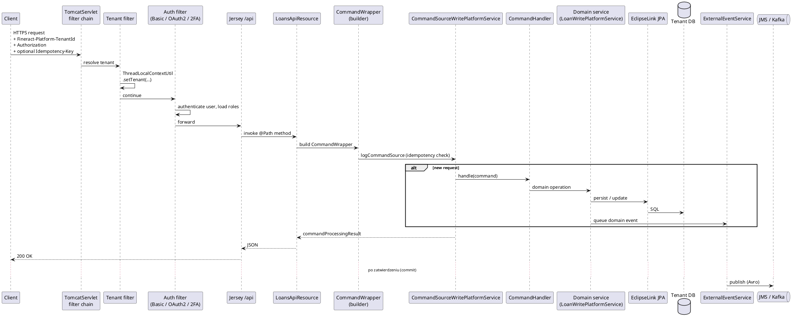
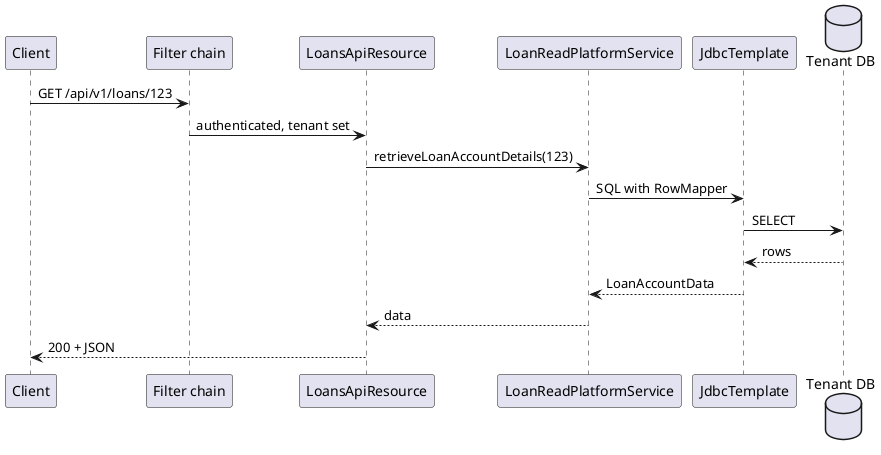
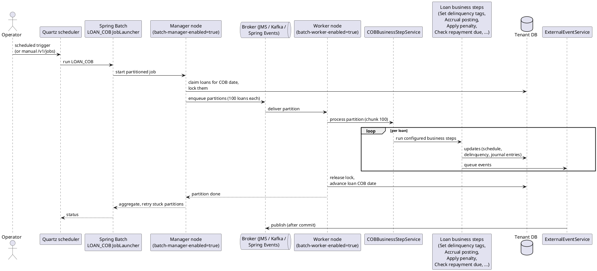
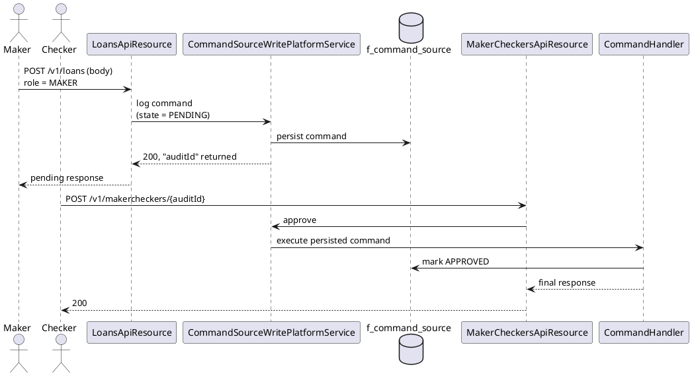
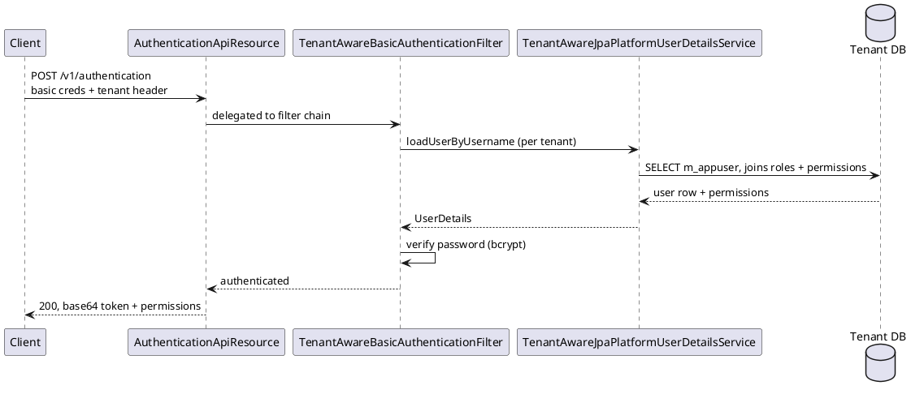
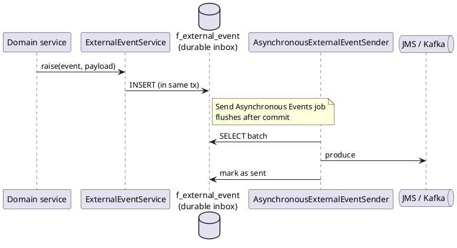
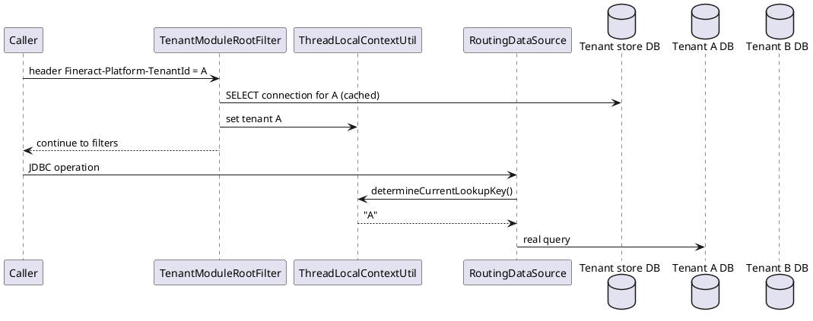
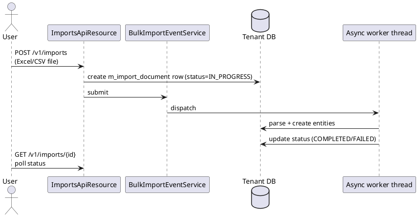
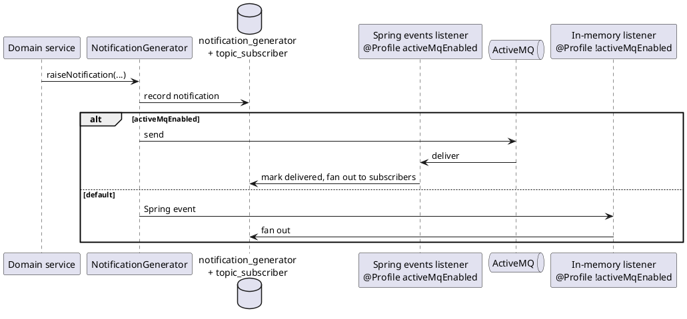

# Przepływy wykonawcze (Runtime Flows)

<strong>Skocz do dowolnego dokumentu</strong>

**[Indeks](../README.md)**

**Biznesowe:** [01 Podsumowanie menedżerskie](../business/01-executive-summary.md) · [02 Przegląd produktu](../business/02-product-overview.md) · [03 Procesy biznesowe](../business/03-business-processes.md) · [04 Słownik domenowy](../business/04-domain-glossary.md) · [05 Reguły biznesowe](../business/05-business-rules.md) · [06 Integracje i interesariusze](../business/06-integrations-and-stakeholders.md) · [07 Ryzyka i luki](../business/07-risks-and-gaps.md)

**Techniczne:** [01 Przegląd architektury](01-architecture-overview.md) · [02 Stos technologiczny](02-tech-stack.md) · [03 Mapa repozytorium](03-repository-map.md) · [04 Model danych](04-data-model.md) · [05 Referencja API](05-api-reference.md) · **06 Przepływy wykonawcze** · [07 Infrastruktura i wdrożenie](07-infrastructure-and-deployment.md) · [08 Konfiguracja i flagi funkcji](08-configuration-and-feature-flags.md) · [09 Model bezpieczeństwa](09-security-model.md) · [10 Podręcznik operacyjny](10-operational-runbook.md) · [11 Strategia testowania](11-testing-strategy.md) · [12 Dziennik decyzji](12-decision-log.md)

> Diagramy sekwencji dla najważniejszych ścieżek wykonawczych.

Konwencje: nazwy aktorów odzwierciedlają nazwy klas Java. Szczegóły wewnętrzne zostały uproszczone do poziomu niezbędnego do zrozumienia współpracy między warstwami.

## 1. Uwierzytelnione żądanie REST — podstawowe uwierzytelnianie (basic auth), komenda zapisu

Używane dla dowolnego API zapisu, np. `POST /api/v1/loans/{loanId}/transactions/{commandTransactionId}`.

Kluczowe punkty:

- Nagłówek najemcy (tenant) jest obowiązkowy; żądanie zostanie odrzucone, jeśli nie można go rozpoznać (`TenantAwareBasicAuthenticationFilter`).
- Maker-checker: komenda zapisu może zostać **utrwalona jako oczekująca (pending)**, jeśli rola wywołująca ma tylko uprawnienia "maker"; inny użytkownik z uprawnieniami "checker" zatwierdza ją następnie przez `/v1/makercheckers`.
- Zdarzenia zewnętrzne są emitowane **po** zatwierdzeniu transakcji (commit) za pośrednictwem `ExternalEventService`, dzięki czemu konsumenci widzą tylko trwały stan. Można to przełączyć przez `fineract.events.external.enabled`.

## 2. API odczytu — `GET /api/v1/loans/{loanId}`

Usługi odczytu używają bezpośrednio Spring `JdbcTemplate` z ręcznie przygotowanym SQL (CQRS-lite); zapisy przechodzą przez JPA i szynę komend.

## 3. Zakończenie dnia dla pożyczek (LOAN_COB)

Najbardziej złożony regularny przepływ. Domyślne wartości: rozmiar paczki (chunk size) 100, rozmiar partycji 100, 5 wątków roboczych (`application.properties:88-95`).

Konfigurowalne kroki znajdują się w `fineract-provider/src/main/java/org/apache/fineract/cob/loan/` i obejmują (przykładowo):

- `CheckLoanRepaymentDueBusinessStep` (sprawdzenie terminu spłaty pożyczki)
- `CheckLoanRepaymentOverdueBusinessStep` (sprawdzenie zaległości w spłacie pożyczki)
- `CheckDueInstallmentsBusinessStep` (sprawdzenie wymagalnych rat)
- `SetLoanDelinquencyTagsBusinessStep` (ustawienie tagów opóźnień)
- `ApplyChargeToOverdueLoansBusinessStep` (naliczenie opłat dla pożyczek z zaległościami)
- `AccrualActivityPostingBusinessStep` (księgowanie naliczeń)
- `AddPeriodicAccrualEntriesBusinessStep` (dodawanie okresowych wpisów naliczeń)
- `CapitalizedIncomeAmortizationBusinessStep` (amortyzacja skapitalizowanego dochodu)
- `BuyDownFeeAmortizationBusinessStep` (amortyzacja opłaty buy-down)
- `LoanInterestRecalculationCOBBusinessStep` (ponowne przeliczenie odsetek pożyczki COB)
- `UpdateLoanArrearsAgingBusinessStep` (aktualizacja starzenia się zaległości)

Najemcy włączają / ustalają kolejność kroków poprzez `m_batch_business_step_configuration` (`db/changelog/tenant/parts/0022_add_batch_business_step_configuration_table.xml`). Punkty końcowe nadrabiania zaległości pod adresem `/v1/internal/cob` pozwalają na ponowne uruchomienie COB dla dni, w których najemca ma luki.

## 4. Zatwierdzenie Maker-checker (na cztery oczy)

Checker może również odrzucić operację (`/v1/makercheckers/{auditId} DELETE`). Magazyn komend przetrwa restarty serwera.

## 5. Logowanie i sesja — podstawowe uwierzytelnianie (basic auth)

Kolejne żądania mogą ponownie przesyłać ten sam nagłówek `Authorization: Basic` — domyślnie nie ma sesji po stronie serwera.

## 6. Tryb serwera zasobów OAuth2

Gdy `FINERACT_SECURITY_OAUTH_ENABLED=true` (`application.properties:25`), filtr basic-auth jest zastępowany przez serwer zasobów OAuth2 ze Spring Security. Ta sama klasa `SecurityConfig` konfiguruje oba tryby; aktywne ziarna (beans) zależą od właściwości. `AuthorizationServerConfig` konfiguruje **wewnętrzny** serwer autoryzacji używany przez przykładową rejestrację "frontend-client" (`application.properties:38-42`).

> DO ZROBIENIA (wymaga potwierdzenia przez eksperta): czy we wdrożeniach produkcyjnych używany jest dołączony serwer autoryzacji, czy zalecany jest zewnętrzny IdP (Keycloak itp.)? Przykładowa rejestracja sugeruje, że serwer w pamięci jest dostarczany głównie do samodzielnego programowania.

## 7. Publikowanie zdarzeń zewnętrznych

Semantyka Outbox: zdarzenia są zapisywane **wewnątrz** tej samej transakcji DB co zmiana domenowa, a następnie zadanie Quartz (`SEND_ASYNCHRONOUS_EVENTS` w `JobName`) przesyła je do brokera. Pozwala to uniknąć problemu podwójnego zapisu (dual-write).

## 8. Routing żądań wielonajemcowych (multi-tenant)

`AbstractRoutingDataSource` zamienia bazowe źródło danych (`DataSource`) dla każdego żądania w oparciu o identyfikator najemcy w `ThreadLocalContextUtil`.

## 9. Przepływ importu masowego

## 10. Rozsyłanie powiadomień (fan-out)

Jest to konfigurowane w `notification/eventandlistener` i przełączane przez profil Spring `activeMqEnabled`.

---

Informacje na temat komponentów i pakietów wymienionych powyżej można znaleźć w `01-architecture-overview.md` i `03-repository-map.md`.

---

← Poprzedni: [Referencja API](05-api-reference.md) · ↑ [Indeks](../README.md) · Następny: [Infrastruktura i wdrożenie](07-infrastructure-and-deployment.md) →
