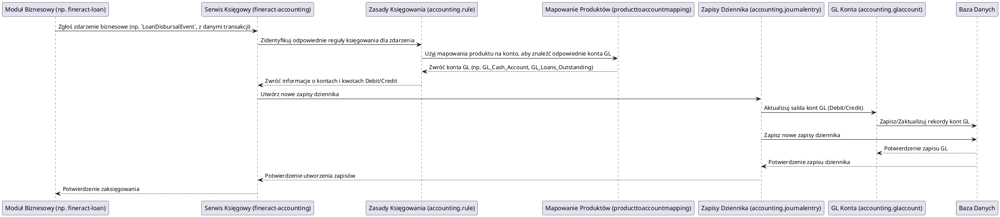

# Moduł: fineract-accounting

## Przegląd

Moduł `fineract-accounting` stanowi serce finansowe systemu Apache Fineract. Jego głównym zadaniem jest zapewnienie kompleksowej obsługi księgowej wszystkich operacji finansowych, które zachodzą w systemie. Implementuje on zasadę podwójnego zapisu księgowego (double-entry bookkeeping) i jest odpowiedzialny za tworzenie, zarządzanie i persystencję wszystkich zapisów na kontach Głównej Księgi (General Ledger - GL). Moduł ten umożliwia śledzenie przepływów finansowych, generowanie sprawozdań finansowych oraz zapewnia audytowalność wszystkich transakcji.

## Kluczowe komponenty

Moduł `fineract-accounting` jest zorganizowany wokół kluczowych pojęć księgowych:

*   **org.apache.fineract.accounting.accrual**: Obsługuje mechanizmy naliczania (accrual) dla operacji finansowych, które są rozpoznawane w księgach przed faktycznym przepływem środków (np. naliczanie odsetek).
*   **org.apache.fineract.accounting.closure**: Zarządza procesami zamykania okresów księgowych (np. dziennego, miesięcznego, rocznego), co jest kluczowe dla generowania dokładnych sprawozdań finansowych i bilansu.
*   **org.apache.fineract.accounting.common**: Zawiera wspólne klasy pomocnicze, stałe i narzędzia używane w całym module księgowości.
*   **org.apache.fineract.accounting.financialactivityaccount**: Definiuje mapowanie pomiędzy specyficznymi działaniami finansowymi (np. wypłata pożyczki, spłata kapitału) a odpowiednimi kontami w Głównej Księdze. Umożliwia automatyczne generowanie zapisów księgowych na podstawie zdarzeń biznesowych.
*   **org.apache.fineract.accounting.glaccount**: Zarządza definicjami kont Głównej Księgi, w tym ich hierarchią, typami (aktywa, pasywa, przychody, koszty, kapitał) i saldami.
*   **org.apache.fineract.accounting.journalentry**: Jest to centralny pakiet odpowiedzialny za tworzenie, modyfikowanie i zarządzanie zapisami dziennika (Journal Entries). Każda transakcja finansowa jest reprezentowana przez co najmniej jeden zapis dziennika, który równoważy operacje na kontach debit/credit.
*   **org.apache.fineract.accounting.producttoaccountmapping**: Definiuje, w jaki sposób produkty finansowe Fineract (np. konkretne rodzaje pożyczek, kont oszczędnościowych) są mapowane na konta Głównej Księgi. To umożliwia automatyczne księgowanie operacji związanych z tymi produktami.
*   **org.apache.fineract.accounting.provisioning**: Obsługuje księgowanie rezerw (provisioning) na pokrycie potencjalnych strat z tytułu np. niespłaconych pożyczek, zgodnie z regulacjami finansowymi.
*   **org.apache.fineract.accounting.rule**: Definiuje zestaw reguł księgowych, które automatycznie generują zapisy dziennika w odpowiedzi na zdarzenia biznesowe. To pozwala na elastyczne dostosowanie logiki księgowej do różnych wymagań.
*   **org.apache.fineract.accounting.trialbalance**: Odpowiada za generowanie zestawienia obrotów i sald (Trial Balance), podstawowego raportu księgowego, który weryfikuje równowagę debetów i kredytów w systemie.

## Przepływ danych

Przepływ danych w module `fineract-accounting` jest inicjowany przez zdarzenia biznesowe generowane w innych modułach (np. wypłata pożyczki, wpłata na konto oszczędnościowe). Moduł księgowy przetwarza te zdarzenia, generując odpowiednie zapisy dziennika.

### Uproszczony przepływ księgowania operacji biznesowej (np. wypłata pożyczki):

## Zależności wewnętrzne

Moduł `fineract-accounting` jest centralnym punktem dla wszystkich transakcji finansowych i ma kluczowe zależności z:

*   **fineract-core**: Wykorzystuje podstawowe komponenty infrastrukturalne, takie jak obsługa wyjątków, mechanizmy buforowania i narzędzia globalne.
*   **fineract-loan, fineract-savings, fineract-charge, fineract-tax** i inne moduły biznesowe: Wszystkie te moduły wywołują `fineract-accounting` w celu zaksięgowania zdarzeń finansowych, takich jak wypłaty, wpłaty, naliczenie opłat, spłaty itp.
*   **fineract-cob**: Procesy `Close of Business` w `fineract-cob` intensywnie komunikują się z `fineract-accounting` w celu wykonania operacji księgowych, takich jak naliczanie i księgowanie odsetek.
*   **fineract-report**: Moduł `fineract-report` polega na danych z `fineract-accounting` do generowania sprawozdań finansowych, takich jak bilans, rachunek zysków i strat oraz zestawienie obrotów i sald.

## Zależności zewnętrzne i integracje

*   **Baza Danych**: Fundamentalna zależność. Wszystkie definicje kont GL, zapisy dziennika, salda kont i konfiguracje księgowe są trwale przechowywane w relacyjnej bazie danych (MySQL/PostgreSQL).
*   **Spring Framework**: Wykorzystuje możliwości Springa do zarządzania transakcjami, wstrzykiwania zależności i konfiguracji.

## Zarządzanie stanem i baza Danych

Moduł `fineract-accounting` jest kluczowy dla zarządzania stanem finansowym systemu, co odbywa się poprzez:

*   **Główna Księga (GL)**: Definiuje i utrzymuje hierarchię kont GL oraz ich bieżące salda. Salda te są ciągle aktualizowane w odpowiedzi na nowe zapisy dziennika.
*   **Zapisy Dziennika (Journal Entries)**: Każda transakcja finansowa jest trwale zapisywana jako jeden lub więcej zapisów dziennika, co stanowi kompletną historię wszystkich operacji. Te zapisy są niezmienne.
*   **Bilansowanie**: Moduł zapewnia, że suma debetów zawsze odpowiada sumie kredytów, utrzymując równowagę księgową.
*   **Mapowania Księgowe**: Konfiguracje mapowania produktów na konta oraz zasady księgowania są trwale przechowywane w bazie danych, umożliwiając elastyczne zarządzanie logiką księgową.

Wszystkie te dane są przechowywane w bazie danych, a moduł zapewnia ich spójność i integralność zgodnie z zasadami księgowości.
