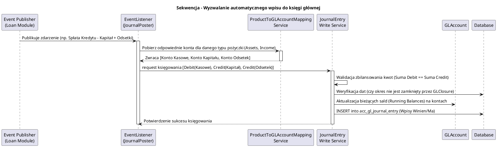

# Moduł Księgowości (fineract-accounting)

[Powrót do dokumentacji głównej](README.md)

## Opis
Moduł `fineract-accounting` to kompleksowy system finansowo-księgowy oparty na modelu księgowania podwójnego (Double-Entry Accounting). Pełni rolę Księgi Głównej (General Ledger - GL) dla instytucji finansowych i banków. 
Głównym zadaniem modułu jest agregacja i kategoryzacja wszystkich zdarzeń biznesowych (np. wypłata pożyczki, depozyt gotówkowy) do postaci niezmiennych wpisów w dzienniku księgowym (Journal Entries), co pozwala na precyzyjne śledzenie zasobów, pasywów, dochodów oraz wydatków instytucji. Wspiera wyliczanie Bilansu Próbnego (Trial Balance), rezerw (Provisioning) oraz przeprowadzanie cyklicznych zamknięć okresów obrachunkowych (GL Closures).

## Kluczowe komponenty

| Komponent (Pakiet/Klasa) | Odpowiedzialność biznesowa i techniczna |
| :--- | :--- |
| **`GLAccount`** (`glaccount`) | Model Konta Księgi Głównej (General Ledger Account). Może reprezentować Aktywa (Assets), Pasywa (Liabilities), Kapitał Własny (Equity), Przychody (Income) lub Koszty (Expense). Obsługuje strukturę hierarchiczną kont (rodzic-dziecko). |
| **`JournalEntry`** (`journalentry`) | Linia wpisu dziennika (zapis Winien/Ma, Debit/Credit). Zawsze tworzone są przynajmniej parami (wiele Debitów / wiele Creditów), które muszą się ostatecznie bilansować do zera. Rejestruje transakcje historyczne bez możliwości ich nadpisywania (immutability). |
| **`ProductToGLAccountMapping`** | Most pomiędzy produktami (Pożyczkowymi, Oszczędnościowymi, Udziałowymi) a Kontami Księgowymi. Wskazuje np. na jakie konto księgować "Kary za opóźnienia" dla produktu kredytowego typu X. |
| **`AccountingRule`** (`rule`) | Zdefiniowane reguły dla ręcznych księgowań. Pozwala pracownikom back-office'u tworzyć zestawy zatwierdzonych par kont księgowych dozwolonych do stosowania we wpisach z palca. |
| **`GLClosure`** (`closure`) | Zamykanie Okresu Księgowego. Zapobiega tworzeniu nowych, modyfikowaniu czy cofaniu transakcji (Journal Entries) wstecz przed datą zamknięcia (Closure Date). Zapewnia to integralność wyliczonych bilansów z wyciągami. |
| **`Provisioning`** (`provisioning`) | Definicje i proces odpisów aktualizujących na przewidywane straty pożyczkowe, oparty zazwyczaj na dniach opóźnienia spłaty (Ageing) oraz procencie kwoty narażonej na ryzyko (Provisioning Criteria). |

## Architektura modułu

Architektura `fineract-accounting` skupia się wokół sztywnego silnika transakcyjnego i raportowego, który komunikuje się asynchronicznie i synchronicznie z innymi modułami systemu (głównie poprzez Business Events).

```plantuml
@startuml
!include https://raw.githubusercontent.com/plantuml-stdlib/C4-PlantUML/master/C4_Component.puml
title Model C4 - Komponenty modułu fineract-accounting

Component(acc_api, "Accounting REST API", "Spring Web", "Udostępnia widoki do konfiguracji planu kont, księgowań ręcznych i raportów bilansu")
Component(je_write, "Journal Entry Engine", "Serwis Zapisujący", "Tworzy podwójne księgowania (Debit i Credit), sprawdza zbilansowanie i blokady zamknięć okresu")
Component(mapping_service, "GL Mapping Service", "Serwis Konfiguracyjny", "Dostarcza odpowiednie konto GL dla podanego zdarzenia portfelowego (np. Spłata Odsetek dla Pożyczki X)")
Component(closure_service, "Closure & Trial Balance", "Serwis Raportowy", "Blokuje okresy, oblicza Trial Balance oraz Running Balances")

System_Ext(portfolio, "Fineract Portfolio (Loan/Savings)", "Wyzwala zdarzenia domenowe (biznesowe), żądając księgowania wpłat/wypłat.")
SystemDb_Ext(db, "Relational Database", "Schemat bazy tenanta")

Rel(acc_api, je_write, "Wywołuje ręczne księgowania")
Rel(acc_api, closure_service, "Uruchamia zamknięcie okresu")
Rel(portfolio, mapping_service, "Pytanie o konto dla akcji")
Rel(portfolio, je_write, "Wyzwala księgowania z transakcji (Business Event)")
Rel(je_write, mapping_service, "Weryfikuje reguły i konta")
Rel(je_write, closure_service, "Sprawdza daty zamknięcia")
Rel(je_write, db, "Zapisuje dziennik (acc_gl_journal_entry)")
Rel(mapping_service, db, "Odczytuje mapowania")

@enduml
```

## Przepływ danych (Zautomatyzowane Księgowanie Zdarzenia)

Proces poniżej ukazuje ogólny zarys w jaki moduł `fineract-accounting` księguje operację nadesłaną np. z modułu pożyczek.



## Zależności wewnętrzne i Integracje

*   Moduł `fineract-accounting` stanowi absolutny fundament (Core) dla wszystkich poddomen finansowych Fineract. Zależy on jednak ideowo od pakietu powiadomień zdarzeń (Business Events) publikowanych z domen takich jak **`fineract-loan`** oraz **`fineract-savings`**.
*   **Agnostyczność produktowa**: `fineract-accounting` nie posiada wiedzy o logice pożyczek (harmonogramach). Dla niego liczy się jedynie "Zdarzenie" i przypisane do niego Mapowanie Kont (`ProductToGLAccountMapping`). Umożliwia to elastyczne definiowanie polityk dla każdej gałęzi banku lub instytucji.

## Zarządzanie stanem i baza danych

Najistotniejsze tabele w modelu to struktury zapisujące podwójne wpisy bez możliwości ich modyfikacji, bazujące na identyfikatorach `acc_`:

*   `acc_gl_account`: Słownik i hierarchia planu kont księgowych, zawiera typ konta, numer konta manualnego, stan (włączone/wyłączone) i walutę.
*   `acc_gl_journal_entry`: Zapis transakcji księgowych (Dziennik Księgowy). Rekord posiada kwotę, datę księgowania, typ operacji (Debit=1, Credit=2), powiązaną transakcję (np. `loan_transaction_id`) oraz identyfikator konta `account_id`.
*   `acc_product_mapping`: Wskazania, jakie rodzaje zdarzeń na danym `product_id` (np. kredytu hipotecznego) trafiają na konkretny `gl_account_id`.
*   `acc_accounting_rule`: Słownik reguł dozwolonych księgowań ręcznych z interfejsu GUI z dozwolonymi kombinacjami list kont Credit i Debit.
*   `acc_gl_closure`: Informacje o zakończonych i zamrożonych okresach sprawozdawczych w Księdze Głównej. Żaden wpis w `acc_gl_journal_entry` nie może posiadać daty wstecznej równej lub mniejszej dacie `closing_date` w tej tabeli.
