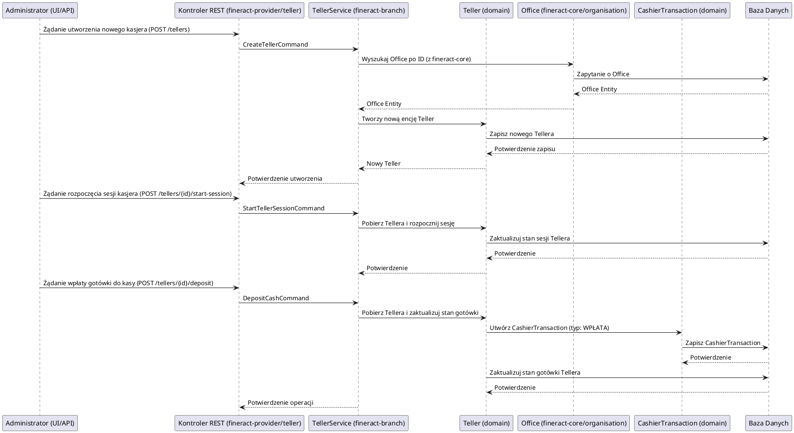

# Moduł: fineract-branch

## Przegląd

Moduł `fineract-branch`, w kontekście ogólnej struktury Apache Fineract, koncentruje się na zarządzaniu konkretnymi aspektami operacyjnymi w ramach jednostek organizacyjnych (oddziałów/biur). Ważne jest, aby zaznaczyć, że definicja i podstawowe zarządzanie jednostkami organizacyjnymi (Office) znajduje się w module `fineract-core` (w pakiecie `org.apache.fineract.organisation.office`). Moduł `fineract-branch` rozszerza tę funkcjonalność, dostarczając dedykowane komponenty do zarządzania `teller`ami (kasjerami) w ramach tych oddziałów.

Jego głównym celem jest umożliwienie zarządzania kasjerami, ich sesjami kasowymi oraz przepływem gotówki w obrębie danego oddziału, zapewniając kontrolę i audytowalność operacji gotówkowych.

## Kluczowe komponenty

Moduł `fineract-branch` zawiera głównie komponenty związane z zarządzaniem kasjerami:

*   **org.apache.fineract.organisation.teller**: Ten pakiet zawiera kluczowe komponenty do zarządzania kasjerami:
    *   **domain**: Definiuje encje domenowe związane z kasjerem (np. `Teller`, `CashierTransaction`), ich stanem i powiązanymi operacjami. Encja `Teller` reprezentuje kasjera, który jest przypisany do konkretnego biura (`Office`). `CashierTransaction` śledzi przepływy gotówki związane z kasjerem.
    *   **service**: Zawiera serwisy biznesowe odpowiedzialne za logikę tworzenia, aktualizowania, usuwania i zarządzania sesjami kasjerów oraz ich transakcjami gotówkowymi.
    *   **data**: Obiekty DTO (Data Transfer Objects) do przesyłania danych kasjerów i ich transakcji.
    *   **api**: Prawdopodobnie zawiera kontrolery REST do udostępniania funkcjonalności zarządzania kasjerami przez API.
    *   **exception**: Niestandardowe wyjątki związane z operacjami kasjerów.

## Przepływ danych

Przepływ danych w module `fineract-branch` koncentruje się na operacjach zarządzania kasjerami i ich sesjami gotówkowymi w ramach oddziału.

### Uproszczony przepływ dla zarządzania kasjerem i jego sesją gotówkową:

## Zależności wewnętrzne

Moduł `fineract-branch` jest silnie związany z:

*   **fineract-core**: Jest to kluczowa zależność, ponieważ `fineract-branch` operuje na encjach `Office` (biur/oddziałów) zdefiniowanych w `fineract-core/organisation/office`. Kasjerzy są zawsze przypisani do konkretnego biura. Wykorzystuje również ogólne komponenty infrastrukturalne.
*   **fineract-provider**: `fineract-provider` udostępnia API do zarządzania kasjerami, które deleguje wywołania do serwisów w `fineract-branch`.
*   **fineract-security**: Dla uwierzytelniania i autoryzacji operacji wykonywanych przez kasjerów lub administratorów zarządzających kasjerami.

## Zależności zewnętrzne i integracje

*   **Baza Danych**: Główna zależność. Wszystkie dane dotyczące kasjerów, ich przypisań do oddziałów, sesji i transakcji gotówkowych są trwale przechowywane w relacyjnej bazie danych.

## Zarządzanie stanem i baza Danych

Moduł `fineract-branch` zarządza stanem kasjerów i ich operacji gotówkowych w bazie danych:

*   **Teller**: Przechowuje informacje o kasjerach, ich przypisaniu do oddziałów, statusie (aktywny/nieaktywny) i bieżącym stanie gotówki w ich kasie.
*   **CashierTransaction**: Zapisuje każdą operację gotówkową wykonaną przez kasjera (wpłaty, wypłaty, przekazania), co pozwala na pełną audytowalność przepływów gotówki.
*   **Sesje Kasjerów**: Zarządza stanem sesji kasowych (rozpoczęta/zakończona), co jest kluczowe dla kontroli gotówki i rozliczeń.

Wszystkie te dane są modelowane jako encje JPA i trwale przechowywane w bazie danych, zapewniając spójność i integralność finansową.
