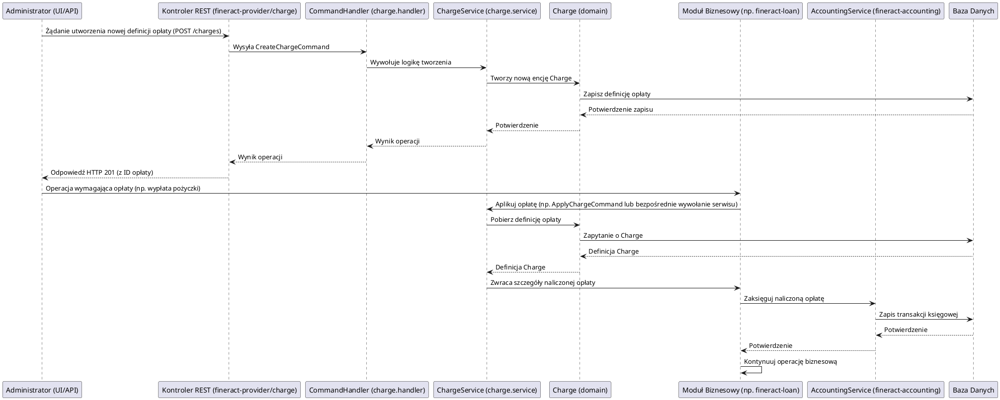

# Moduł: fineract-charge

## Przegląd

Moduł `fineract-charge` w Apache Fineract jest odpowiedzialny za definiowanie, zarządzanie i aplikowanie różnego rodzaju opłat (charges) na produktach finansowych (takich jak pożyczki, konta oszczędnościowe) i transakcjach. Obejmuje to opłaty administracyjne, karne, manipulacyjne itp. Moduł ten zapewnia elastyczne mechanizmy konfiguracji opłat, ich naliczania w odpowiednich momentach cyklu życia produktu oraz prawidłowe księgowanie. Jest to kluczowy komponent do zarządzania przychodami z opłat oraz egzekwowania warunków umownych.

## Kluczowe komponenty

Moduł `fineract-charge` jest zorganizowany wokół pakietu `org.apache.fineract.portfolio.charge`, który zawiera następujące podpakietu:

*   **org.apache.fineract.portfolio.charge.api**: Zawiera kontrolery REST lub interfejsy API do interakcji z modułem, umożliwiając tworzenie, aktualizowanie, usuwanie i aplikowanie opłat.
*   **org.apache.fineract.portfolio.charge.domain**: Zawiera encje domenowe, takie jak `Charge` (definiująca opłatę, jej typ, sposób naliczania, kwotę/procent) i `ChargeDistribution` (sposób dystrybucji opłaty). Logika biznesowa do zarządzania tymi encjami znajduje się również tutaj.
*   **org.apache.fineract.portfolio.charge.exception**: Niestandardowe wyjątki obsługujące błędy specyficzne dla zarządzania opłatami.
*   **org.apache.fineract.portfolio.charge.handler**: Implementacje `CommandHandler`ów, które przetwarzają komendy związane z opłatami (np. `CreateChargeCommand`, `ApplyChargeCommand`).
*   **org.apache.fineract.portfolio.charge.request**: Obiekty DTO (Data Transfer Objects) używane do przesyłania danych w żądaniach związanych z opłatami.
*   **org.apache.fineract.portfolio.charge.serialization**: Obsługa serializacji i deserializacji danych opłat.
*   **org.apache.fineract.portfolio.charge.service**: Serwisy biznesowe implementujące główną logikę zarządzania opłatami, w tym ich tworzenie, aktualizację, usuwanie oraz faktyczne naliczanie i aplikowanie na produkty finansowe.

## Przepływ danych

Przepływ danych w module `fineract-charge` obejmuje definiowanie opłat, a następnie ich aplikowanie na konkretne produkty lub transakcje finansowe.

### Uproszczony przepływ definiowania i aplikowania opłaty:

## Zależności wewnętrzne

Moduł `fineract-charge` jest modułem wspierającym, który jest wykorzystywany przez główne moduły biznesowe Fineract:

*   **fineract-core**: Wykorzystuje ogólne komponenty infrastrukturalne i narzędzia.
*   **fineract-command**: Komendy do operacji na opłatach są przetwarzane przez ogólny mechanizm komend Fineract.
*   **fineract-provider**: Udostępnia punkty końcowe API, które wywołują funkcjonalności modułu `fineract-charge`.
*   **fineract-loan, fineract-savings**: Te moduły biznesowe odwołują się do `fineract-charge` w celu definiowania, aplikowania i naliczania opłat związanych z pożyczkami i kontami oszczędnościowymi.
*   **fineract-accounting**: Każda naliczona opłata musi zostać odpowiednio zaksięgowana, dlatego `fineract-charge` integruje się z modułem księgowości.

## Zależności zewnętrzne i integracje

*   **Baza Danych**: Główna zależność. Wszystkie definicje opłat, ich konfiguracje i rekordy naliczonych opłat są trwale przechowywane w relacyjnej bazie danych.
*   **Spring Framework**: Wykorzystuje mechanizmy Spring do zarządzania transakcjami, wstrzykiwania zależności i konfiguracji.

## Zarządzanie stanem i baza Danych

Moduł `fineract-charge` zarządza stanem opłat w bazie danych:

*   **Definicje Opłat (Charge Definitions)**: Przechowuje szczegółowe informacje o każdym typie opłaty (np. nazwa, kwota/procent, sposób naliczania, waluta, okres obowiązywania).
*   **Naliczone Opłaty (Applied Charges)**: Rejestruje każdą opłatę, która została naliczona na konkretny produkt finansowy lub transakcję, w tym jej kwotę, datę naliczenia i status (np. zapłacona, należna).
*   **Konfiguracja Opłat dla Produktów**: Mapowania, które określają, które opłaty są domyślnie aplikowane do jakich produktów finansowych.

Wszystkie te dane są modelowane jako encje JPA i trwale przechowywane w bazie danych, zapewniając spójność i audytowalność wszystkich transakcji związanych z opłatami.
