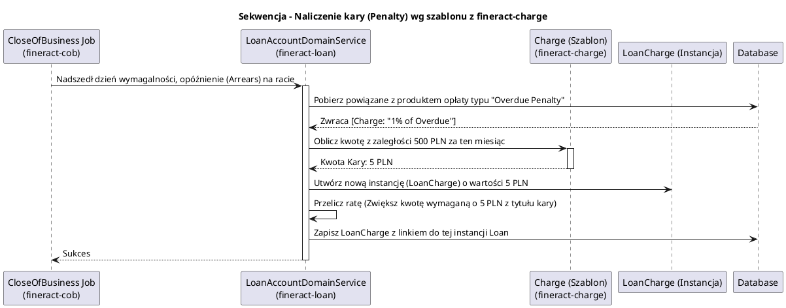

# Moduł Prowizji, Kar i Opłat (fineract-charge)

[Powrót do dokumentacji głównej](README.md)

## Opis
Moduł `fineract-charge` to centralny rejestr konfiguracji kosztów niefinansowych, jakie instytucja bankowa nakłada na swoich klientów i ich produkty. Fineract nie "hardkoduje" swoich opłat – każda jedna opłata (np. prowizja za udzielenie kredytu, opłata członkowska, miesięczna opłata za utrzymanie karty płatniczej, karna oplata za spóźnienie raty) ma swój zdefiniowany szablon (Charge Template) w tym module.

Instytucje mogą decydować czy opłaty te są stałymi kwotami (Flat fee), procentem od kapitału (np. 1% od kwoty pożyczki) czy zależą od kwoty zaległości (Penalty % of Overdue). Pobrane środki wpływają z opłat na specyficznie skonfigurowane w `fineract-accounting` konta zysków banku (Income).

## Kluczowe komponenty

| Komponent | Odpowiedzialność biznesowa i techniczna |
| :--- | :--- |
| **`Charge` (Szablon)** | Encja definiująca rodzaj opłaty. Obejmuje takie atrybuty jak waluta (Currency), typ przypisania (Loan / Savings / Client), moment naliczenia (np. Disbursement, Specified Due Date, Installment Fee) oraz zasady wyliczania kwoty. |
| **`ChargeCalculationType`** | Reguły matematyczne: Flat (płaska), % Kapitału (Percentage of Principal), % Zatwierdzonej Kwoty (Percentage of Approved Amount), itd. |
| **`ChargeTimeType`** | Określa wyzwalacz: przy Wypłacie Środków z pożyczki, co miesiąc (Annual/Monthly Fee na koncie), Ręczne nakładanie (Manual). |
| **`ChargeWritePlatformService`** | Zarządza dodawaniem i edycją tychże uniwersalnych szablonów prowizji, sprawdzając, czy mogą być one zaktualizowane (np. zabroniona jest edycja waluty na opłacie, która została już nałożona klientowi). |

## Architektura modułu

Moduł ten służy głównie jako słownik i kalkulator udostępniany do wykorzystania przez inne domeny (Pożyczki/Oszczędności).

```plantuml
@startuml
!include https://raw.githubusercontent.com/plantuml-stdlib/C4-PlantUML/master/C4_Component.puml
title Model C4 - Zależności modułu fineract-charge

Component(charge_api, "Charge REST API", "Spring Web", "Udostępnia końcówki do konfiguracji (np. /charges)")
Component(charge_domain, "Charge Definitions", "Słownik Zasad", "Tworzenie i odczyt metadanych opłat")
Component(loan_module, "fineract-loan", "Moduł Wypożyczania", "Kopiuje definicję opłaty w postaci nowej encji LoanCharge przyznanej konkretnej umowie")
Component(savings_module, "fineract-savings", "Moduł Depozytów", "Kopiuje definicję opłaty w postaci SavingsAccountCharge potrącającej środki z salda konta")
Component(accounting_module, "fineract-accounting", "Księgowość", "Wymaga zdefiniowania mappingów dla kont Przychodów (Income Account) przypisanych do opłaty")

SystemDb_Ext(db, "Baza Tenanta", "MySQL / PostgreSQL")

Rel(charge_api, charge_domain, "Dodanie nowej opłaty (np. Karta Płatnicza 10 PLN)")
Rel(loan_module, charge_domain, "Wnioskuje: Odczytaj kalkulację dla prowizji wejściowej 5%")
Rel(savings_module, charge_domain, "Wnioskuje: Dodaj roczną opłatę utrzymaniową do konta z definicji")
Rel(charge_domain, db, "Utrzymuje m_charge")

@enduml
```

## Przepływ danych (Nałożenie Kary)

Diagram przedstawia interakcję powiązania Kary (Penalty) do spóźnionej raty za pomocą wykorzystania szablonów.



## Zależności wewnętrzne i Integracje

*   **Fundament Kredytowania**: Koszty obsługi kredytowej niemal natychmiastowo klonują obiekt `Charge` do `LoanCharge` podczas przyznawania kredytu klientowi. Od tego momentu pożyczka wie, jaka była zasada policzenia tej kwoty i w jakiej racie (Installment) klient powinien ją pokryć.
*   **Podatki (`fineract-tax`)**: Prowizje i Opłaty (Charge) posiadają na sobie flagę, która pozwala podpiąć je pod `TaxGroup`. To sprawia, że jeśli opłata wejściowa do banku wynosi 100 zł netto, Fineract może automatycznie obliczyć na niej 23% VATu dając 123 zł brutto i odpowiednio to zaksięgować.

## Zarządzanie stanem i baza danych

Najważniejsza struktura leży w tabeli głównej słownika:

*   `m_charge`: Tabela posiadająca nazwę prowizji (name), kwotę nominalną lub wyjściową w procencie (`amount`), wskaźnik waluty (`currency_code`), wskaźnik typu zastosowania (`charge_applies_to_enum`), czy jest to kara narzutowa (`is_penalty`), mechanizm czasu nakładania opłaty (`charge_time_enum`). 
*   Encja ta bezpośrednio podpinana jest jako Foreign Key (klucz obcy) np. w tabeli `m_loan_charge` modułu pożyczek.
