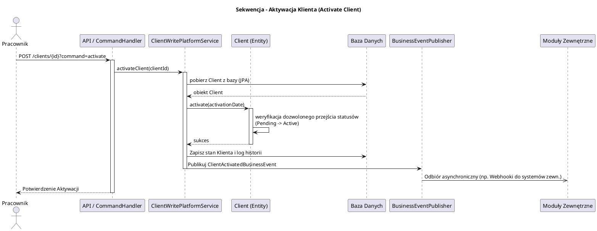

# Moduł Zarządzania Klientami (fineract-client / CRM)

[Powrót do dokumentacji głównej](README.md)

## Opis
Domena Klienta (Client) w Apache Fineract stanowi fundamentalny komponent CRM (Customer Relationship Management). Kod tego modułu znajduje się w głównym monolitycznym module `fineract-provider` (pakiet `org.apache.fineract.portfolio.client`). Odpowiada za rejestrację, weryfikację (KYC) i zarządzanie danymi osób fizycznych (Person) oraz podmiotów gospodarczych (Non-Person), które korzystają z usług finansowych banku. Bez istnienia rekordu Klienta niemożliwe jest otwarcie rachunku oszczędnościowego ani udzielenie pożyczki.

Główne funkcjonalności biznesowe to:
* Rejestracja i utrzymanie pełnego profilu Klienta.
* Obsługa procesów biznesowych (Aktywacja Klienta, Odrzucenie, Wycofanie, Zamknięcie).
* Przechowywanie dokumentów tożsamości (Identifiers) i weryfikacja unikalności.
* Strukturyzowanie adresów i powiązań rodzinnych (Family Members).
* Zarządzanie opłatami nakładanymi bezpośrednio na klienta (Client Charges), niezwiązanymi z konkretnym produktem kredytowym (np. opłata członkowska, opłata za wpisowe).

## Kluczowe komponenty

| Komponent (Pakiet/Klasa) | Odpowiedzialność biznesowa i techniczna |
| :--- | :--- |
| **`Client`** | Główna encja domenowa reprezentująca profil Klienta. Przechowuje dane osobowe, status (np. PENDING, ACTIVE, CLOSED), datę aktywacji oraz powiązanie z biurem/oddziałem (Office) i opiekunem (Staff). |
| **`ClientNonPerson`** | Rozszerzenie encji `Client` używane dla podmiotów gospodarczych (firm, NGO). Zawiera dane takie jak Numer Rejestracyjny, Forma Prawna, itp. |
| **`ClientIdentifier`** | Dokumenty tożsamości Klienta (np. PESEL, Paszport, Dowód Osobisty). System wymusza (w zależności od konfiguracji) unikalność tych identyfikatorów w skali bazy. |
| **`ClientWritePlatformService`** | Fasada zapisująca (Command Service) dla operacji takich jak Utworzenie Klienta, Aktywacja (która zmienia status i może wyzwalać kolejne akcje), Przypisanie pracownika. |
| **`ClientReadPlatformService`** | Serwis odczytujący, wykorzystujący zapytania JDBC, by optymalnie wyświetlać listy i szczegóły Klientów bez rzutu (overhead) całych struktur ORM na interfejs użytkownika. |
| **`ClientCharge`** i **`ClientTransaction`** | Reprezentacja opłat i powiązanych z nimi transakcji na poziomie profilu klienta, np. jednorazowe opłaty członkowskie dla unii kredytowej, płatne gotówkowo przed aktywacją pożyczek. |

## Architektura modułu

Architektura utrzymana jest w stylu CQRS (Command Query Responsibility Segregation) obsługiwanym w całym `fineract-provider`.

```plantuml
@startuml
!include https://raw.githubusercontent.com/plantuml-stdlib/C4-PlantUML/master/C4_Component.puml
title Model C4 - Komponenty domeny Client (CRM)

Component(client_api, "Client REST API", "Spring Web", "Przyjmuje operacje zarządzania klientami i pobierania ich danych (Endpoints np. /clients)")
Component(command_dispatcher, "Command Dispatcher", "Spring Component", "Kieruje żądania (POST/PUT) do odpowiednich Command Handlerów")
Component(client_handler, "Client Command Handlers", "Serwis (Handler)", "Logika aplikacyjna dla konkretnych komend (np. ActivateClientCommandHandler)")
Component(client_write, "ClientWritePlatformService", "Serwis Transakcyjny", "Logika biznesowa walidacji i zapisu danych o Klientach")
Component(client_read, "ClientReadPlatformService", "Serwis Odczytu (JDBC)", "Wykonywanie zapytań SQL odczytu i mapowania danych do DTO")

SystemDb_Ext(db, "Relational Database", "MySQL / PostgreSQL")

Rel(client_api, command_dispatcher, "Komenda z żądania HTTP")
Rel(client_api, client_read, "Pobiera dane klienta")
Rel(command_dispatcher, client_handler, "Przekierowuje komendę")
Rel(client_handler, client_write, "Wywyołuje reguły dziedzinowe i zapis")
Rel(client_write, db, "Aktualizuje wpisy w tabeli m_client za pomocą JPA")
Rel(client_read, db, "Odczytuje wprost z m_client via RowMapper")

@enduml
```

## Przepływ danych (Proces aktywacji Klienta)

Gdy Klient zostaje zarejestrowany, otrzymuje początkowo status "Oczekujący" (Pending). Rozpoczęcie usług bankowych (np. depozytów) wymaga z reguły "Aktywacji".



## Zależności wewnętrzne i Integracje

*   **Integracja Pożyczek i Oszczędności**: Klient (`m_client.id`) stanowi klucz obcy absolutnie centralny dla działania wszystkich modułów portfela inwestycyjnego (`fineract-loan`, `fineract-savings`). Moduły te przed otwarciem produktu sprawdzają walidację, np. czy Klient nie został zablokowany lub zamknięty (Closed).
*   **Instytucje Zewnętrzne (KYC/AML)**: Rejestracja `ClientIdentifier` (często asynchroniczna przez zewnętrzne API, powiązana z systemami autoryzacji Tożsamości - KYC). W otwartym Fineract realizowane przez budowę własnych rozszerzeń API lub webhooków nasłuchujących zdarzeń o tworzeniu klienta.

## Zarządzanie stanem i baza danych

Model danych domeny Klienta skupia się w głównej mierze w tabelach profilowych:

*   `m_client`: Reprezentuje profil klienta. Zawiera imię, nazwisko, datę urodzenia, numer konta klienta (`account_no`), status (`status_enum`), datę aktywacji, odniesienie do oddziału (`office_id`) i pracownika nadzorującego (`staff_id`).
*   `m_client_non_person`: Tabela relacji 1:1 z `m_client` (w przypadku gdy klient jest firmą), przechowująca rozszerzone atrybuty biznesowe.
*   `m_client_identifier`: Tabela 1:N z `m_client`. Dokumenty tożsamości klienta wraz z typem (np. typ dokumentu = Dowód Osobisty, wartość = XYZ123).
*   `m_client_address`: Relacja przechowująca adresy klienta (powiązane przez tabele asocjacyjne).
*   `m_client_charge` oraz `m_client_transaction`: Śledzenie dodatkowych, niezwiązanych z konkretnym rachunkiem obciążeń i płatności klienta.

```