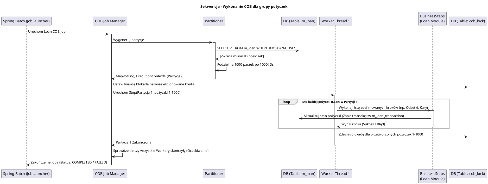

# Moduł Przetwarzania Wsadowego (fineract-cob / Close Of Business)

[Powrót do dokumentacji głównej](README.md)

## Opis
Moduł `fineract-cob` (Close of Business) to asynchroniczny, wysoce skalowalny silnik przetwarzania wsadowego (Batch Processing) wykorzystywany do zamykania dnia księgowego. W systemach bankowości centralnej (Core Banking) procesy końca dnia (EOD - End Of Day) są absolutnie krytyczne. Ich zadaniem jest naliczanie odsetek od depozytów i pożyczek, aktualizowanie statusów zaległości (Arrears/Delinquency), nakładanie kar (Penalties) za opóźnienia oraz generowanie wpisów księgowych na zamknięcie okresu.

Moduł ten został zaprojektowany z myślą o przetwarzaniu milionów aktywnych rachunków poprzez zastosowanie współbieżności, partycjonowania danych oraz wielowątkowości, opierając się na architekturze Spring Batch. Aby zapewnić spójność wyliczeń, `fineract-cob` nakłada twarde blokady (Locks) na konta w trakcie ich przetwarzania, uniemożliwiając klientom dokonywanie transakcji (np. wypłat w bankomacie) dokładnie w momencie, gdy system przelicza ich dzienne odsetki.

## Kluczowe komponenty

| Komponent | Odpowiedzialność biznesowa i techniczna |
| :--- | :--- |
| **Kroki Biznesowe COB (`BusinessStep`)** | Interfejsy (np. `LoanCOBBusinessStep`, `SavingsCOBBusinessStep`) definiujące pojedyncze logiczne jednostki pracy do wykonania na pojedynczym koncie w trakcie zamykania dnia (np. Krok 1: Naliczenie Kar, Krok 2: Naliczenie Odsetek, Krok 3: Aktualizacja wskaźnika Delinquency). |
| **Partycjoner (`Partitioner`)** | Mechanizm Spring Batch dzielący całą pulę pożyczek/kont oszczędnościowych na mniejsze "paczki" (Chunks). Przydziela je do oddzielnych wątków roboczych (Workers) w celu równoległego przetwarzania, maksymalizując utylizację procesora i bazy danych. |
| **`ThreadLocalContext` i Menadżer Blokad** | Elementy zarządzające cyklem życia blokady konta (`Account Lock`). Jeśli konto jest w trakcie procesu COB, transakcje online odbijają się z błędem `Account is locked for COB`. |
| **Menadżer Wyjątków COB** | Funkcjonalność łapiąca wyjątki biznesowe (np. błąd naliczenia odsetek na jednym konkretnym koncie). Upewnia się, że awaria na jednym rachunku nie przerywa (nie wywala) całego wielogodzinnego procesu dla setek tysięcy innych rachunków, lecz loguje błąd w tabelach audytowych. |

## Architektura modułu

Architektura `fineract-cob` bazuje na ekosystemie **Spring Batch** oraz strukturze wielowątkowej. Każda partycja otrzymuje swój własny kontekst transakcyjny JPA.

```plantuml
@startuml
!include https://raw.githubusercontent.com/plantuml-stdlib/C4-PlantUML/master/C4_Component.puml
title Model C4 - Komponenty modułu fineract-cob

Component(scheduler, "COB Scheduler API", "REST / Cron", "Wyzwalacz uruchamiający zadanie zamknięcia dnia")
Component(batch_manager, "COB Job Manager", "Spring Batch", "Inicjalizuje proces, zarządza krokami, partycjonuje i zleca zadania workerom")
Component(partitioner, "Loan/Savings Partitioner", "Partitioner", "Dzieli np. 1 mln aktywnych pożyczek na partycje po 1000 sztuk")
Component(workers, "COB Workers (Thread Pool)", "Wątki", "Pobierają partycje i uruchamiają na nich sekwencje BusinessSteps")
Component(business_steps, "Business Steps", "Spring Bean", "Pojedyncza czynność, np. ApplyPenalty, PostInterest")
Component(lock_service, "Account Lock Service", "Serwis", "Nakłada blokady przed przetworzeniem i zwalnia je po udanym/nieudanym kroku")

SystemDb_Ext(db, "Baza Danych Dzierżawcy", "MySQL / PostgreSQL")

Rel(scheduler, batch_manager, "Uruchomienie COB Job")
Rel(batch_manager, lock_service, "Zablokuj przetwarzane konta (Hard Lock)")
Rel(batch_manager, partitioner, "Zapytanie do DB o IDs kont i ich podział")
Rel(partitioner, workers, "Dystrybucja identyfikatorów")
Rel(workers, business_steps, "Wywołanie po kolei dla każdego konta w partycji")
Rel(business_steps, db, "Aktualizacja sald, kar, odsetek, zapis logów")
Rel(batch_manager, lock_service, "Odblokowanie przetworzonych kont")

@enduml
```

## Przepływ danych (Zamykanie Dnia na przykładzie Pożyczek)

Diagram prezentuje asynchroniczny przepływ zamykania dnia dla wyselekcjonowanej paczki kredytów (Loans).



## Zależności wewnętrzne i Integracje

*   **Zależność od Portfela (`fineract-loan`, `fineract-savings`)**: Moduł COB sam w sobie nie wie, jak policzyć karę czy odsetki. Rejestruje on jedynie (wstrzykuje) implementacje interfejsów typu `BusinessStep` dostarczanych przez poszczególne domeny. Stanowi orkiestratora – "uruchamiacza" logiki biznesowej z innych pakietów.
*   **Wielowątkowość i CQRS (`fineract-command`)**: Błędy podczas COB są przechwytywane, a transakcje wstrzymywane na poziomie pojedynczego konta, bez wpływania na kolejkę główną. Po wykonaniu kroków COB zlecane mogą być odpowiednie `Command` do modułu księgowego.

## Zarządzanie stanem i baza danych

Rozwiązanie to korzysta z wbudowanych mechanizmów Spring Batch do śledzenia stanów zadań oraz dedykowanych tabel konfiguracyjnych COB w Fineract:

*   `batch_job_instance`, `batch_job_execution`, `batch_step_execution`: Natywne tabele Spring Batch służące do śledzenia historii uruchomień zadań, restartowania po awarii sprzętowej (Recovery) i audytu czasów wykonania (Metryki wydajności).
*   `m_cob_business_step`: Konfiguracja wyznaczająca kolejność (Sequence) uruchamiania poszczególnych kroków biznesowych (np. "Najpierw nalicz kary z opóźnienia, a dopiero potem kapitał").
*   `loan_cob_worker`, `savings_cob_worker`: Robocze tabele statusowe dla poszczególnych wątków.
*   `m_loan_cob_lock` / `m_savings_cob_lock`: Tabele kontroli współbieżności. Jeśli rekord pożyczki znajduje się w tej tabeli, jakiekolwiek próby zapisania transakcji na nim z poziomu zewnętrznego API są odrzucane z kodem HTTP 409 (Conflict).
