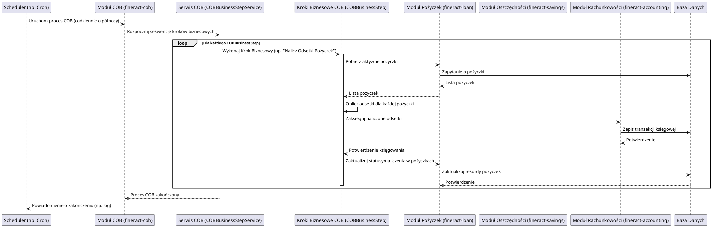

# Moduł: fineract-cob

## Przegląd

Moduł `fineract-cob` (Close of Business) jest odpowiedzialny za orkiestrację i wykonanie krytycznych procesów biznesowych, które muszą być realizowane cyklicznie, zazwyczaj po zakończeniu dnia operacyjnego. Obejmuje to takie operacje jak naliczanie odsetek od pożyczek i oszczędności, aktualizowanie statusów rachunków, generowanie raportów cyklicznych, przetwarzanie zaległości i inne operacje wsadowe. Celem modułu jest zapewnienie spójności i aktualności danych finansowych w systemie po zakończeniu transakcji w ciągu dnia.

## Kluczowe komponenty

Moduł `fineract-cob` jest strukturyzowany wokół procesów wsadowych, a jego kluczowe komponenty to:

*   **org.apache.fineract.cob.common**: Wspólne klasy pomocnicze i narzędzia wykorzystywane w procesach COB.
*   **org.apache.fineract.cob.conditions**: Prawdopodobnie zawiera definicje warunków, które muszą być spełnione przed lub w trakcie wykonywania określonych kroków COB.
*   **org.apache.fineract.cob.converter**: Klasy odpowiedzialne za konwersję danych pomiędzy różnymi formatami lub reprezentacjami w ramach procesów COB.
*   **org.apache.fineract.cob.data**: Obiekty DTO (Data Transfer Objects) używane do przenoszenia danych w ramach procesów wsadowych.
*   **org.apache.fineract.cob.domain**: Encje domenowe i logika biznesowa specyficzna dla procesów COB, takie jak definicje kroków biznesowych COB, ich statusy i konfiguracje.
*   **org.apache.fineract.cob.exceptions**: Niestandardowe wyjątki obsługujące błędy występujące podczas wykonywania procesów COB.
*   **org.apache.fineract.cob.listener**: Implementacje słuchaczy (listeners) dla zdarzeń Spring Batch lub wewnętrznych zdarzeń COB, które mogą logować, monitorować lub reagować na postęp procesów.
*   **org.apache.fineract.cob.processor**: Klasy przetwarzające dane, np. obliczające odsetki, aktualizujące statusy. Są to rdzenne komponenty, które wykonują faktyczną logikę biznesową w ramach kroku COB.
*   **org.apache.fineract.cob.resolver**: Klasy odpowiedzialne za rozwiązywanie (resolving) zależności lub kontekstu w ramach procesów COB.
*   **org.apache.fineract.cob.service**: Serwisy biznesowe orkiestrujące poszczególne kroki COB i zarządzające ich wykonaniem. Przykłady to `COBBusinessStepService` oraz `COBBusinessStepServiceImpl`, które zarządzają krokami biznesowymi COB.
*   **org.apache.fineract.cob.tasklet**: Implementacje zadań (tasklets) Spring Batch, które wykonują pojedyncze, atomowe operacje w ramach kroku COB.

Dodatkowo, bezpośrednio w pakiecie `org.apache.fineract.cob` znajdują się:
*   `COBBusinessStep.java`: Interfejs lub klasa bazowa definiująca krok biznesowy w procesie COB.
*   `COBConstant.java`: Stałe używane w module COB.

## Przepływ danych

Przepływ danych w module `fineract-cob` koncentruje się na cyklicznym przetwarzaniu dużych wolumenów danych finansowych. Typowy scenariusz obejmuje iterację przez konta pożyczkowe lub oszczędnościowe i wykonywanie na nich predefiniowanych operacji.

### Uproszczony przepływ wykonania procesu COB:

## Zależności wewnętrzne

Moduł `fineract-cob` ma kluczowe zależności od innych modułów Fineract:

*   **fineract-core**: Wykorzystuje podstawowe komponenty infrastrukturalne, takie jak obsługa zdarzeń, buforowanie, konfiguracje i ogólne narzędzia.
*   **fineract-loan**: `fineract-cob` jest odpowiedzialny za przetwarzanie danych związanych z pożyczkami, takich jak naliczanie odsetek, aktualizacja statusów, generowanie harmonogramów spłat. Bezpośrednio modyfikuje lub odczytuje dane z modułu pożyczek.
*   **fineract-savings**: Analogicznie do `fineract-loan`, `fineract-cob` przetwarza operacje związane z kontami oszczędnościowymi, takie jak naliczanie odsetek.
*   **fineract-accounting**: Wszystkie operacje finansowe wykonywane przez `fineract-cob` (np. naliczanie odsetek, księgowanie opłat) muszą być odpowiednio zaksięgowane, dlatego `fineract-cob` intensywnie komunikuje się z modułem księgowości.
*   **fineract-report**: Po przetworzeniu danych, `fineract-cob` może inicjować generowanie raportów podsumowujących operacje dnia.

## Zależności zewnętrzne i integracje

*   **Spring Batch**: Moduł `fineract-cob` w dużym stopniu opiera się na frameworku Spring Batch do orkiestracji i zarządzania złożonymi procesami wsadowymi, zapewniając funkcje takie jak restartowalność, logowanie i monitorowanie zadań.
*   **Baza Danych**: Jest to centralna zależność, ponieważ wszystkie dane finansowe, statusy kont i konfiguracje procesów COB są przechowywane i modyfikowane w relacyjnej bazie danych.
*   **Scheduler Zadań**: Zewnętrzny scheduler (np. systemowy cron, Quartz Scheduler, wbudowany scheduler Springa) jest wymagany do cyklicznego uruchamiania procesów COB.

## Zarządzanie stanem i baza Danych

`fineract-cob` aktywnie zarządza stanem kluczowych danych w bazie danych:

*   **Statusy Pożyczek/Oszczędności**: Zmienia statusy pożyczek (np. z `ACTIVE` na `OVERDUE`) i kont oszczędnościowych.
*   **Saldo Kont**: Aktualizuje salda kont pożyczkowych i oszczędnościowych po naliczeniu odsetek, opłat itp.
*   **Transakcje Księgowe**: Generuje i zapisuje nowe transakcje księgowe odzwierciedlające operacje biznesowe wykonane w ramach COB.
*   **Historia COB**: Przechowuje historię wykonania procesów COB, w tym informacje o sukcesie/niepowodzeniu, czasie trwania i przetworzonych elementach, co jest kluczowe dla audytu i monitorowania.
*   **Konfiguracja Procesów COB**: Definicje kroków biznesowych, ich kolejność i parametry są przechowywane w bazie danych, umożliwiając elastyczną konfigurację.

Moduł ten zapewnia, że wszystkie zmiany stanu są trwałe i zgodne z zasadami ACID, dzięki wykorzystaniu transakcji bazodanowych.
