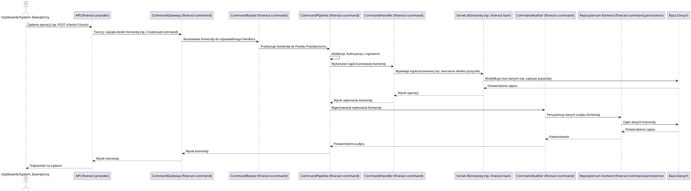

# Moduł: fineract-command

## Przegląd

Moduł `fineract-command` implementuje wzorzec projektowy Command, stanowiąc serce przetwarzania operacji biznesowych w systemie Apache Fineract. Jego głównym celem jest hermetyzacja żądania (operacji biznesowej) w obiekcie, co pozwala na parametryzowanie klientów różnymi żądaniami, kolejkowanie lub logowanie żądań oraz obsługę operacji, które można cofnąć. Dzięki temu moduł ten zapewnia atomowość, audytowalność i spójność transakcji, a także otwiera drogę do bardziej zaawansowanych wzorców, takich jak Event Sourcing czy CQRS (Command Query Responsibility Segregation).

## Kluczowe komponenty

Moduł `fineract-command` jest zorganizowany wokół koncepcji komend i ich obsługi:

*   **org.apache.fineract.command.core**: Zawiera podstawowe interfejsy i klasy definiujące wzorzec Command:
    *   `Command.java`: Interfejs bazowy lub klasa abstrakcyjna dla wszystkich komend w systemie. Komenda reprezentuje pojedynczą operację biznesową (np. `CreateLoanCommand`, `ApproveClientCommand`).
    *   `CommandHandler.java`: Interfejs dla obiektów, które wiedzą, jak wykonać określoną komendę. Każda konkretna komenda ma zazwyczaj swój dedykowany `CommandHandler`.
    *   `CommandExecutor.java`: Odpowiada za orkiestrację wykonania komend, często delegując zadania do `CommandPipeline`.
    *   `CommandPipeline.java`: Definiuje sekwencję kroków, przez które przechodzi komenda, zanim zostanie wykonana przez `CommandHandler` (np. walidacja, autoryzacja, logowanie, wykonanie, persystencja).
    *   `CommandRouter.java`: Służy do mapowania i routingu komendy do odpowiedniego `CommandHandler`, zazwyczaj na podstawie typu komendy.
    *   `CommandAuditor.java`: Odpowiada za rejestrowanie szczegółów każdej wykonanej komendy, co jest kluczowe dla śledzenia zmian w systemie i spełniania wymagań audytowych.
    *   `CommandConstants.java`: Stałe używane w kontekście komend.
    *   `CommandProperties.java`: Klasa do przechowywania właściwości konfiguracyjnych modułu Command.
    *   `exception`: Niestandardowe wyjątki specyficzne dla modułu Command.
*   **org.apache.fineract.command.implementation**: Prawdopodobnie zawiera konkretne implementacje `CommandHandler` dla różnych komend biznesowych z innych modułów Fineract.
*   **org.apache.fineract.command.persistence**: Odpowiada za trwałe przechowywanie informacji o komendach (np. ich status, dane wejściowe, wynik). Jest to kluczowe dla audytowalności, odtwarzalności i ewentualnego wzorca Event Sourcing.
*   **org.apache.fineract.command.starter**: Zawiera klasy auto-konfiguracji Spring Boot, ułatwiające integrację modułu `fineract-command` z innymi modułami Fineract.

## Przepływ danych

Przepływ danych w module `fineract-command` jest scentralizowany wokół koncepcji wysyłania, przetwarzania i persystowania komend.

### Uproszczony przepływ wykonania komendy:

## Zależności wewnętrzne

Moduł `fineract-command` jest centralnym punktem, od którego zależy sposób inicjowania i przetwarzania operacji biznesowych w innych modułach Fineract:

*   **fineract-core**: Wykorzystuje podstawowe komponenty infrastrukturalne i globalne narzędzia, np. do obsługi wyjątków, konfiguracji.
*   **fineract-provider**: API systemu Fineract (znajdujące się w `fineract-provider`) jest głównym konsumentem modułu `fineract-command`, przekształcając żądania HTTP w obiekty Komend i wysyłając je do przetworzenia.
*   **Wszystkie moduły biznesowe (np. fineract-loan, fineract-savings, fineract-accounting)**: Implementują one własne Komendy i `CommandHandler`y, które są zarządzane i wykonywane przez mechanizmy z `fineract-command`. Moduły te dostarczają logikę biznesową, która jest aktywowana przez Command Handlery.

## Zależności zewnętrzne i integracje

*   **Spring Framework**: `fineract-command` w pełni wykorzystuje możliwości Springa do zarządzania zależnościami (Dependency Injection), konfiguracji oraz zarządzania transakcjami.
*   **Baza Danych**: Niezbędna do persystencji stanu systemu po wykonaniu komend oraz do przechowywania historii komend (`CommandAuditor`, `CommandRepo`).
*   **Event Bus/Message Broker (potencjalnie)**: Chociaż nie jest to bezpośrednio widoczne, architektura oparta na komendach często jest pierwszym krokiem do integracji z systemami kolejkowania wiadomości (np. Kafka, RabbitMQ) w celu asynchronicznego przetwarzania komend lub publikowania zdarzeń.

## Zarządzanie stanem i baza Danych

`fineract-command` ma kluczowe znaczenie dla zarządzania stanem systemu:

*   **Zmiana Stanu**: Każda komenda reprezentuje intencję zmiany stanu w systemie. Po jej pomyślnym wykonaniu, stan danych biznesowych (np. status pożyczki, saldo konta) w bazie danych ulega aktualizacji.
*   **Audytowalność**: Poprzez persystencję każdej wykonanej komendy (zawierającej metadane, dane wejściowe, datę, użytkownika), moduł tworzy kompleksowy dziennik zmian. Ten dziennik jest niezwykle cenny dla audytu, śledzenia błędów, a także dla rekonstrukcji stanu systemu w dowolnym momencie.
*   **Idempotencja**: Dzięki zapisywaniu i śledzeniu komend, można implementować mechanizmy zapewniające, że wielokrotne wykonanie tej samej komendy (np. z powodu problemów z siecią) nie prowadzi do wielokrotnych zmian stanu.
*   **Baza Danych**: Używana jest do trwałego przechowywania zarówno danych biznesowych zmienionych przez komendy, jak i samych rekordów komend (historii). W ten sposób baza danych staje się zarówno źródłem prawdy dla stanu systemu, jak i archiwum jego ewolucji.
