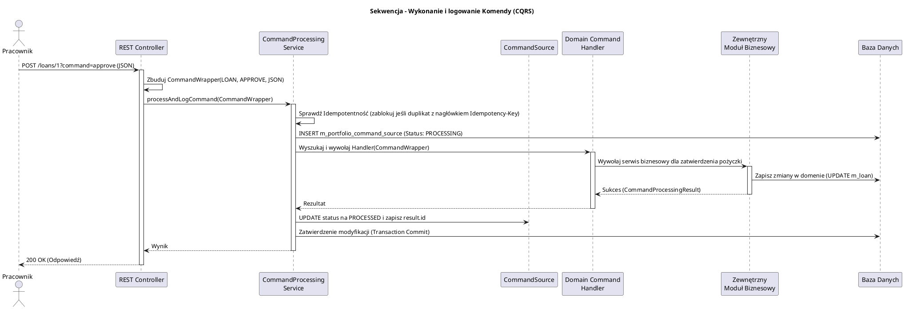

# Moduł Przetwarzania Poleceń i Audytu (fineract-command)

[Powrót do dokumentacji głównej](README.md)

## Opis
Moduł `fineract-command` implementuje wzorzec projektowy CQRS (Command Query Responsibility Segregation) rozdzielający odpowiedzialności związane ze stanem w systemie Apache Fineract. Moduł ten pełni funkcję centralnej magistrali dla wszystkich operacji modyfikujących dane (POST, PUT, DELETE) – od utworzenia klienta, przez nałożenie opłaty, aż po zatwierdzenie pożyczki. Oprócz trasowania (Routing) tych wywołań do właściwych "Zarządców" (Command Handlers), kluczową rolą tego modułu jest rejestrowanie absolutnie każdego żądania (nawet tego zakończonego błędem) w bazie danych na potrzeby szczegółowego audytu zdarzeń (Event Sourcing) oraz mechanizmów Maker-Checker.

Główne funkcjonalności biznesowe to:
* Rejestrowanie historii operacji (Auditing): Kto wykonał czynność, kiedy, z jakimi parametrami i jaki był jej rezultat.
* Maker-Checker (Cztery Oczy): Architektura ta pozwala na to, aby jeden pracownik (Maker) zainicjował "Komendę", a inny (Checker) ją zatwierdził, zanim na stałe zmieni ona stan bazy danych.
* Idempotentność (Idempotency): Moduł radzi sobie z ponowieniami tego samego zapytania z powodu np. niestabilnego internetu, blokując powielone komendy (np. "Wypłać podwójnie tę samą kwotę").

## Kluczowe komponenty

| Komponent | Odpowiedzialność biznesowa i techniczna |
| :--- | :--- |
| **`CommandWrapper`** | Obiekt stanowiący opakowanie żądania REST. Posiada on nazwę encji (np. `LOAN`), akcję (np. `APPROVE`) oraz ładunek (Payload w formacie JSON). |
| **`SynchronousCommandProcessingService`** | Główny silnik procesujący komendy synchronicznie. Przyjmuje wygenerowany `CommandWrapper`, przeprowadza na nim walidację uprawnień, a następnie przekazuje go do adekwatnego Handlera. Na końcu loguje proces (sukces lub wycofanie) do audytu. |
| **`CommandSource`** | Tabela/Encja agregująca wszelkie istotne dane o komendzie. Posiada pole określające czy komenda była `PROCESSING`, `FAILED`, czy `PROCESSED`. To tu lądują zatwierdzone i niezatwierdzone działania dla Maker-Checker. |
| **`CommandProcessingService`** i *Rollbacki* | Mechanizm wycofujący operacje (Rollback), jeśli podczas przetwarzania komendy wystąpi błąd na poziomie bazy danych. Transakcja oznaczana jest wtedy stosowną flagą i wycofywana w tle. |

## Architektura modułu

Architektura oparta o sztywne i rozdzielne warstwy: REST -> Wrapper -> CommandProcessingService -> Domain Service (poprzez CommandHandler).

```plantuml
@startuml
!include https://raw.githubusercontent.com/plantuml-stdlib/C4-PlantUML/master/C4_Component.puml
title Model C4 - Komponenty modułu fineract-command

Component(api_controller, "REST API Controller", "Spring Web", "Odbiera JSONa i generuje z niego CommandWrapper")
Component(command_service, "SynchronousCommandProcessingService", "Spring Service", "Silnik autoryzujący i audytujący dla wszystkich poleceń w systemie")
Component(command_source_repo, "CommandSourceRepository", "JPA / Hibernate", "Zapisuje i odczytuje logi o wykonanych komendach")
Component(domain_handlers, "Command Handlers (w innych modułach)", "Component", "Specjalizowane mikro-usługi odbierające komendę, wykonujące logikę dziedzinową i modyfikujące encje biznesowe (np. Loan, Client)")

SystemDb_Ext(db, "Baza Danych Dzierżawcy", "Zapis zdarzeń do bazy")

Rel(api_controller, command_service, "Deleguje CommandWrapper")
Rel(command_service, command_source_repo, "Zapisuje (INSERT) do m_portfolio_command_source")
Rel(command_service, domain_handlers, "Odszukuje po nazwie (np. APPROVELOAN) i wywołuje handler")
Rel(domain_handlers, db, "Aktualizacje Domenowe (UPDATE/INSERT)")
Rel(command_source_repo, db, "Odczyt/Zapis (Logi systemowe)")

@enduml
```

## Przepływ danych (Wykonanie i Rejestracja Komendy)

Poniższy diagram ilustruje, jak system przetwarza żądanie modyfikacji stanu od momentu wywołania API do ostatecznego zalogowania operacji.



## Zależności wewnętrzne i Integracje

*   **Fundament Zmian Stanu**: Każdy moduł posiadający encje i reguły biznesowe modyfikujące bazę danych (`fineract-loan`, `fineract-client`, `fineract-savings`) integruje ten moduł, dostarczając implementacje interfejsu (Command Handlery). Brak tego modułu uniemożliwiłby zapisywanie jakichkolwiek informacji o użytkownikach czy kredytach.
*   **Wielodzierżawność i Autoryzacja (`fineract-security`)**: Przed rozpoczęciem wywoływania jakiegokolwiek handlera, `CommandProcessingService` sprawdza w `PlatformSecurityContext`, czy obecnie zalogowany użytkownik ma uprawnienie dokładnie do akcji, którą reprezentuje przekazana mu komenda (np. `APPROVE_LOAN`).

## Zarządzanie stanem i baza danych

Główna tabela operacyjna do której zapisywany jest ruch to `m_portfolio_command_source`. Składa się na nią:

*   **`m_portfolio_command_source`**: Tabela w bazie dzierżawcy będąca swoistym dziennikiem zdarzeń całego systemu (Audit Trail). Przechowuje JSON z żądaniem wejściowym (parametry komendy). Wskazuje na identyfikator zasobu `resource_id` (np. ID klienta), datę zdarzenia, `maker_id` (kto rozpoczął zdarzenie) oraz, jeżeli wymaga tego zasada Maker-Checker, status oczekiwania i `checker_id` (kto autoryzował komendę i pozwolił jej zmodyfikować bazę danych). 
*   **`m_permission`**: Bezpośrednia powiązana tabela w kontekście reguł zabezpieczeń (Każdy `CommandWrapper` tworzy unikalny string uprawnień, który weryfikowany jest w tej tabeli).

```