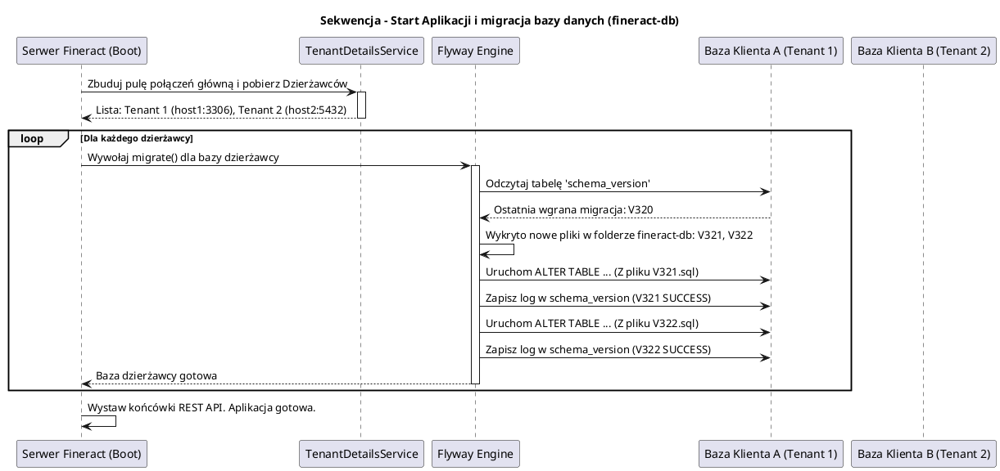

# Zarządzanie Schematem Bazy Danych (fineract-db)

[Powrót do dokumentacji głównej](README.md)

## Opis
Moduł `fineract-db` to dedykowany pod-projekt odpowiedzialny za utrzymanie definicji, struktury i bezkolizyjnych aktualizacji schematów relacyjnych baz danych dla systemu Apache Fineract. Biorąc pod uwagę fakt, że Fineract jest systemem ERP/Core Banking, zmiany w modelach danych są skrajnie wrażliwe. W architekturze Multi-Tenant, każda wdrożona baza musi przejść identyczną, niezawodną ewolucję po uaktualnieniu wersji serwera.

Moduł ten porzucił czyste, nakładane ręcznie skrypty SQL na rzecz w pełni zautomatyzowanych silników wersjonowania schematu bazy danych (np. Flyway / Liquibase).

## Kluczowe mechanizmy

| Funkcja | Opis implementacji |
| :--- | :--- |
| **Główny schemat startowy** | System pozwala na inicjalizację bazy z całkowitego "zera" (Clean Install) za pomocą skompilowanych skryptów startowych DDL wprowadzających całe dziesiątki tabel `m_*` (portfolio) i `acc_*` (accounting). |
| **Migracje Wersjonowane (Flyway)** | Każda nowa tabela lub kolumna wprowadzana w kodzie przez programistę posiada odpowiadający jej plik migracji `V___opis_zmiany.sql`. Podczas startu aplikacji (Spring Boot Startup), mechanizm Flyway skanuje bazę dzierżawcy i zaciąga / wykonuje brakujące skrypty po kolei, aktualizując ją np. z wersji 1.7 do 1.8. |
| **Multi-Tenant DB Initialization** | Oddzielne pule skryptów definiują bazę konfiguracji nadrzędnej `fineract_default` (w której zarejestrowani są nowi dzierżawcy), od izolowanych skryptów dla konkretnego dzierżawcy `fineract_tenants`. |

## Procedura aktualizacji

## Znaczenie architektoniczne
Oddzielenie kodu DDL (Data Definition Language) do tego modułu pozwala również inżynierom DevOps na niezależne podnoszenie baz danych bez angażowania aplikacji Fineract (np. uruchamiając jedynie specjalny obraz Docker Flyway w procesach CI/CD przed startem rzeczywistych kontenerów serwerowych).
