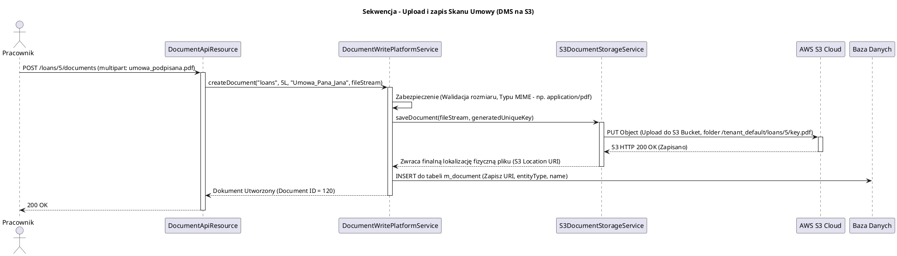

# Moduł Zarządzania Dokumentami (fineract-document)

[Powrót do dokumentacji głównej](README.md)

## Opis
Moduł `fineract-document` odpowiada za wbudowany w Apache Fineract system przechowywania plików, załączników, dowodów osobistych oraz zdjęć sygnatur przypisywanych do głównych encji domenowych. Przepisy compliance instytucji finansowych wymagają rygorystycznego archiwizowania wersji podpisanych papierowo bądź elektronicznie umów pożyczkowych, czy skanów dowodów tożsamości podczas rejestracji klienta (KYC - Know Your Customer).

Fineract nie magazynuje plików BLOB wielkogabarytowych bezpośrednio w wierszach tabeli relacyjnej, aby nie "rozdychać" bazy danych do olbrzymich rozmiarów, co spowolniłoby odczyty systemów pożyczkowych. W tym module udostępniono warstwy abstrakcji dla Systemów Zarządzania Dokumentami (DMS) – umożliwiające odkładanie plików natywnie na systemie plików dysku serwera (File System) lub bezpiecznie w chmurze obiektu np. Amazon S3 (Simple Storage Service).

## Kluczowe komponenty

| Komponent | Odpowiedzialność biznesowa i techniczna |
| :--- | :--- |
| **`DocumentManagementService`** | Fasada (Service) nad procesami uploadu (wgrywania) i dowloadu (pobierania) pików. Automatycznie mapuje załącznik i wpis do bazy danych z dowolną inną domeną w systemie (np. `entityType=loans`, `entityId=15`). |
| **`DocumentStorageService`** | Wzorzec strategii (Strategy Pattern) umożliwiający definiowanie w środowisku lokalizacji fizycznego pliku. Obsługiwane silniki to `FileSystem` oraz `S3`. |
| **Zarządzanie Obrazami (Images)** | Dedykowane endpoints (`/images`) dla zdjęć profilowych klientów i ich fizycznych podpisów. Umożliwiają szybsze pobieranie zdjęć w formacie Base64 lub natywnych strumieni binarnych ze wsparciem przeglądarkowym. |
| **Walidator Wgrywanych Plików** | Klasy zabezpieczające wgrywanie m.in. złośliwych skryptów do serwera. Filtracja plików MIME na dozwolone formaty bankowe (np. `.pdf`, `.jpg`, `.png`, `.tiff`). |

## Architektura modułu

Architektura jest silnie nastawiona na strumieniowanie wejścia-wyjścia (I/O) minimalizując załadowanie dużego pliku bezpośrednio do pamięci RAM aplikacji Fineract (Heap).

```plantuml
@startuml
!include https://raw.githubusercontent.com/plantuml-stdlib/C4-PlantUML/master/C4_Component.puml
title Model C4 - Zależności modułu fineract-document

Component(doc_api, "Document REST API", "Spring Web", "Odbiera zapytania multipart/form-data lub base64 z plikiem użytkownika")
Component(doc_manager, "DocumentManagementService", "Serwis (Transaction)", "Zapisuje ścieżkę do pliku i nazwę jako metadane do relacyjnej bazy dzierżawcy")
Component(storage_strategy, "DocumentStorageService", "Wzorzec Strategii", "Posiada dwie wbudowane implementacje (File / S3). Przekazuje strumień I/O")

SystemDb_Ext(db, "Baza Danych Dzierżawcy", "MySQL / PostgreSQL")
SystemDb_Ext(local_fs, "Lokalny System Plików", "Dysk (SSD/HDD) kontenera lub maszyny")
System_Ext(amazon_s3, "Amazon S3", "Zewnętrzny, tani i nielimitowany Cloud Storage obiektowy")

Rel(doc_api, doc_manager, "Przesyła poświadczenie pliku i bajty")
Rel(doc_manager, storage_strategy, "Żąda fizycznego zapisu strumienia")
Rel(storage_strategy, local_fs, "Zapis jako FileOutputStream (jeśli config=local)")
Rel(storage_strategy, amazon_s3, "Przesyła plik przez sieć jako S3Object (jeśli config=S3)")
Rel(doc_manager, db, "Zapisuje rekord w m_document z unikalnym adresem lokalizatora (URI)")

@enduml
```

## Przepływ danych (Wgranie Skanu Umowy)

Diagram pokazuje wgrywanie np. podpisanej umowy w PDF do rekordu pożyczkowego, przy ustawionym silniku AWS S3.



## Zależności wewnętrzne i Integracje

*   **Zależności Infrastrukturalne (Amazon SDK)**: Moduł posiada dodatkowe zależności od oficjalnych paczek SDK chmury, co musi być uwzględniane w paczce wdrożeniowej (np. poświadczenia AWS Credentials Provider, parametry regionu konfigurowane na poziomie zmiennych środowiskowych kontenera).
*   **Powiązania "Polimorficzne"**: Moduł w bazie danych i API nie ma twardych relacji (`Foreign Key` do Loan/Client). W zamian mapowanie obiektu tworzone jest miękko po zmiennych String `entity_type_enum` i Long `entity_id`. Dzięki temu po podpięciu całkowicie nowego w przyszłości modułu biznesowego (np. Zgłoszenia Reklamacyjne), weryfikator może bez ruszania modułu `fineract-document` w locie podpiąć mu możliwość dodawania załączników.

## Zarządzanie stanem i baza danych

Główne metadane dokumentów logowane są w bazach danych w tablicach:

*   **`m_document`**: Tabela indeksująca pliki. Przechowuje nazwę pliku, rodzaj obiektu powiązanego `parent_entity_type` (klient, pożyczka, grupa, wydatek), identyfikator encji docelowej `parent_entity_id`, rozmiar w bajtach, typ pliku oraz `location` – dokładną fizyczną lub sieciową ścieżkę absolutną pozwalającą serwerowi go odtworzyć przy odczycie (Download).
*   **`m_image`**: Odpowiednik specjalizowany pod obrazy (zdjęcia z kamerek pracowniczych, zdjęcia profili). Zawsze konwertowane są jako base64 cacheowane, oddzielone ze względów wydajnościowych front-endu do wyświetlania awatarów.
