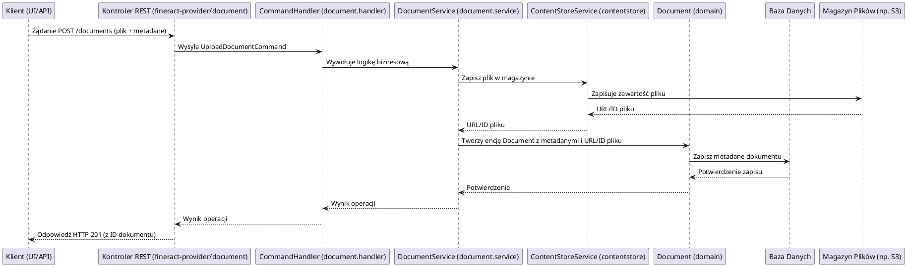

# Moduł: fineract-document

## Przegląd

Moduł `fineract-document` jest odpowiedzialny za kompleksowe zarządzanie dokumentami w systemie Apache Fineract. Umożliwia on przechowywanie, kategoryzowanie, powiązywanie i pobieranie dokumentów (takich jak skany, umowy, dowody tożsamości, zdjęcia) dla różnych encji biznesowych, takich jak klienci, pożyczki, konta oszczędnościowe czy pracownicy. Moduł ten zapewnia, że wszystkie istotne pliki są bezpiecznie przechowywane i łatwo dostępne w kontekście powiązanych obiektów biznesowych, wspierając tym samym procesy weryfikacji i audytu.

## Kluczowe komponenty

Moduł `fineract-document` jest zorganizowany w pakiet `org.apache.fineract.infrastructure.documentmanagement`, który zawiera następujące podpakietu:

*   **org.apache.fineract.infrastructure.documentmanagement.api**: Prawdopodobnie zawiera kontrolery REST lub interfejsy API do interakcji z systemem zarządzania dokumentami, umożliwiając ładowanie, pobieranie, aktualizowanie i usuwanie dokumentów.
*   **org.apache.fineract.infrastructure.documentmanagement.command**: Definiuje struktury komend używanych do inicjowania operacji na dokumentach (np. `UploadDocumentCommand`, `UpdateDocumentCommand`, `DeleteDocumentCommand`).
*   **org.apache.fineract.infrastructure.documentmanagement.data**: Obiekty DTO (Data Transfer Objects) reprezentujące metadane dokumentów oraz dane przesyłane w żądaniach i odpowiedziach API.
*   **org.apache.fineract.infrastructure.documentmanagement.domain**: Zawiera encje domenowe, takie jak `Document` (reprezentująca metadane dokumentu, takie jak nazwa pliku, typ, rozmiar, identyfikator powiązanej encji) i `DocumentCategory` (kategorie dokumentów). Logika biznesowa związana z dokumentami znajduje się również tutaj.
*   **org.apache.fineract.infrastructure.documentmanagement.exception**: Niestandardowe wyjątki obsługujące błędy specyficzne dla zarządzania dokumentami (np. `DocumentNotFoundException`, `DocumentStorageException`).
*   **org.apache.fineract.infrastructure.documentmanagement.handler**: Implementacje `CommandHandler`ów, które przetwarzają komendy związane z dokumentami, wykonując odpowiednią logikę biznesową i wywołując serwisy do interakcji z magazynem plików.
*   **org.apache.fineract.infrastructure.documentmanagement.mapping**: Klasy odpowiedzialne za mapowanie obiektów pomiędzy warstwami (np. DTO na encje domenowe).
*   **org.apache.fineract.infrastructure.documentmanagement.service**: Serwisy biznesowe implementujące główną logikę zarządzania dokumentami, w tym interakcje z bazą danych (dla metadanych) i systemem przechowywania plików (dla zawartości dokumentów).

Ponadto, w module `fineract-document/src/main/java/org/apache/fineract/infrastructure/` znajdują się:

*   **contentstore**: Prawdopodobnie zawiera interfejsy i implementacje do różnych strategii przechowywania faktycznych plików dokumentów (np. system plików lokalny, S3, Azure Blob Storage).
*   **event**: Definicje zdarzeń związanych z operacjami na dokumentach (np. `DocumentUploadedEvent`).

## Przepływ danych

Przepływ danych w module `fineract-document` obejmuje zarówno przechowywanie metadanych dokumentu w bazie danych, jak i zarządzanie samą zawartością pliku w dedykowanym magazynie.

### Uproszczony przepływ ładowania dokumentu:

## Zależności wewnętrzne

Moduł `fineract-document` jest modułem infrastrukturalnym, który jest wykorzystywany przez inne moduły biznesowe:

*   **fineract-core**: Wykorzystuje ogólne komponenty infrastrukturalne i narzędzia.
*   **fineract-command**: Komendy do operacji na dokumentach są przetwarzane przez ogólny mechanizm komend Fineract.
*   **fineract-provider**: Udostępnia punkty końcowe API, które wywołują funkcjonalności modułu `fineract-document`.
*   **fineract-client, fineract-loan, fineract-savings, fineract-organisation (staff)**: Te moduły biznesowe wymagają możliwości dołączania dokumentów do swoich encji (np. skan dowodu klienta, umowa pożyczki, zdjęcie pracownika). Wywołują one serwisy z `fineract-document` w celu zarządzania tymi dokumentami.

## Zależności zewnętrzne i integracje

*   **Baza Danych**: Niezbędna do przechowywania metadanych dokumentów (np. ID, nazwa, typ, rozmiar, data, ID powiązanej encji).
*   **System przechowywania plików (Content Store)**: Może integrować się z różnymi systemami przechowywania plików, takimi jak:
    *   Lokalny system plików serwera.
    *   Usługi przechowywania obiektów w chmurze (np. Amazon S3, Azure Blob Storage).
*   **Spring Framework**: Wykorzystuje mechanizmy Spring do zarządzania transakcjami, wstrzykiwania zależności.

## Zarządzanie stanem i baza Danych

Moduł `fineract-document` zarządza stanem dokumentów w dwóch aspektach:

*   **Metadane Dokumentów**: Informacje o dokumencie (takie jak nazwa, typ, rozmiar, ścieżka/URL do pliku, data utworzenia, ID użytkownika, ID powiązanej encji) są przechowywane jako encje w relacyjnej bazie danych. Są to kluczowe dane, które pozwalają na wyszukiwanie i zarządzanie dokumentami.
*   **Zawartość Dokumentów**: Rzeczywista zawartość plików dokumentów jest przechowywana w zewnętrznym systemie przechowywania plików (Content Store), a nie bezpośrednio w bazie danych. W bazie danych przechowywane jest jedynie odwołanie do tej zawartości (np. ścieżka do pliku, URL lub identyfikator obiektu w chmurze).

Takie rozdzielenie pozwala na efektywne zarządzanie dużymi plikami i skalowalność rozwiązania.
