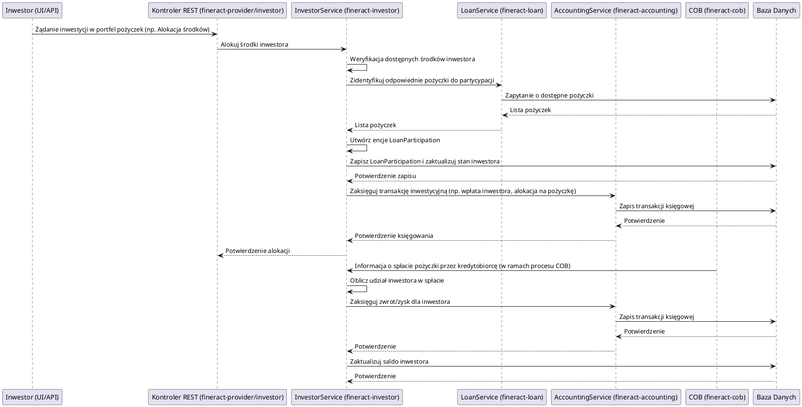

# Moduł: fineract-investor

## Przegląd

Moduł `fineract-investor` jest odpowiedzialny za zarządzanie inwestorami i ich zaangażowaniem w portfelach kredytowych systemu Apache Fineract. Umożliwia instytucjom finansowym pozyskiwanie środków od inwestorów, którzy chcą wspierać mikrofinansowanie lub inne inicjatywy kredytowe. Moduł ten obsługuje cały cykl życia inwestycji, od rejestracji inwestora, przez alokację środków w portfelach pożyczkowych, zarządzanie zwrotami, aż po rozliczenia z inwestorami. Jest to kluczowy komponent dla modeli biznesowych opartych na udziale kapitału zewnętrznego w finansowaniu działalności kredytowej.

## Kluczowe komponenty

Moduł `fineract-investor` posiada rozbudowaną strukturę odzwierciedlającą jego złożoną funkcjonalność:

*   **org.apache.fineract.investor.accounting**: Integracja z modułem księgowości (`fineract-accounting`) w celu prawidłowego księgowania wszystkich transakcji związanych z inwestorami i ich inwestycjami (np. wpłaty, wypłaty, zwroty, zyski/straty z partycypacji).
*   **org.apache.fineract.investor.api**: Prawdopodobnie zawiera kontrolery REST lub inne interfejsy API do interakcji z modułem, umożliwiając zarządzanie inwestorami, ich kontami inwestycyjnymi i partycypacją w pożyczkach.
*   **org.apache.fineract.investor.cob**: Integracja z procesami `Close of Business` (`fineract-cob`). Obejmuje to procesy wsadowe, takie jak naliczanie zysków dla inwestorów, aktualizowanie ich sald inwestycyjnych, przetwarzanie spłat pożyczek na rzecz inwestorów.
*   **org.apache.fineract.investor.config**: Konfiguracje specyficzne dla modułu inwestora, takie jak parametry produktów inwestycyjnych, domyślne zasady alokacji.
*   **org.apache.fineract.investor.data**: Obiekty DTO (Data Transfer Objects) reprezentujące dane inwestorów, ich portfeli, transakcji inwestycyjnych i wyników.
*   **org.apache.fineract.investor.domain**: Zawiera kluczowe encje domenowe, takie jak `Investor` (reprezentujący samego inwestora), `Investment` (pojedyncza inwestycja), `LoanParticipation` (szczegóły partycypacji inwestora w konkretnej pożyczce lub jej części) oraz powiązaną logikę biznesową.
*   **org.apache.fineract.investor.enricher**: Komponenty odpowiedzialne za wzbogacanie danych inwestorów lub związanych z nimi obiektów biznesowych o dodatkowe informacje (np. statystyki portfela, prognozy zwrotów).
*   **org.apache.fineract.investor.exception**: Niestandardowe wyjątki obsługujące błędy specyficzne dla modułu inwestora.
*   **org.apache.fineract.investor.internal**: Wewnętrzne klasy pomocnicze lub komponenty niewystawiane bezpośrednio na zewnątrz modułu.
*   **org.apache.fineract.investor.serialization**: Obsługa serializacji i deserializacji danych związanych z inwestorami, np. do/z formatu JSON.
*   **org.apache.fineract.investor.service**: Serwisy biznesowe implementujące główną logikę zarządzania inwestorami i ich inwestycjami, w tym alokację środków, przetwarzanie spłat, zarządzanie zyskami i stratami.

## Przepływ danych

Przepływ danych w module `fineract-investor` jest ściśle powiązany z cyklem życia pożyczek i wymaga koordynacji z modułami `fineract-loan` i `fineract-accounting`.

### Uproszczony przepływ partycypacji inwestora w pożyczce:

## Zależności wewnętrzne

Moduł `fineract-investor` posiada silne zależności od kilku kluczowych modułów Fineract:

*   **fineract-core**: Wykorzystuje globalne usługi, narzędzia i konfiguracje.
*   **fineract-accounting**: Fundamentalna zależność dla wszystkich operacji finansowych. Każda transakcja związana z inwestorem (wpłaty, wypłaty, zwroty z pożyczek, zyski) musi być prawidłowo zaksięgowana.
*   **fineract-cob**: Współpracuje z procesami `Close of Business` w celu automatycznego przetwarzania zdarzeń związanych z inwestycjami, takich jak naliczanie zysków i aktualizacja sald.
*   **fineract-loan**: Kluczowa zależność, ponieważ inwestorzy partycypują w portfelach pożyczkowych. Moduł `fineract-investor` musi móc identyfikować i wiązać inwestycje z konkretnymi pożyczkami oraz przetwarzać spłaty pochodzące z modułu `fineract-loan`.
*   **fineract-provider**: Udostępnia API, które pozwalają na interakcję z funkcjonalnościami modułu `fineract-investor`.

## Zależności zewnętrzne i integracje

*   **Baza Danych**: Główna zależność. Wszystkie dane dotyczące inwestorów, ich kont, inwestycji, partycypacji w pożyczkach oraz historii transakcji są trwale przechowywane w relacyjnej bazie danych.
*   **Spring Framework**: Wykorzystuje mechanizmy Spring do zarządzania transakcjami, wstrzykiwania zależności i konfiguracji.

## Zarządzanie stanem i baza Danych

Moduł `fineract-investor` zarządza krytycznym stanem systemu finansowego:

*   **Inwestorzy**: Przechowuje dane identyfikacyjne inwestorów, status ich kont inwestycyjnych.
*   **Inwestycje i Partycypacje Pożyczkowe**: Zarządza szczegółami każdej inwestycji, w tym alokacją środków na konkretne pożyczki, procentowym udziałem inwestora w pożyczce, aktualnym statusem partycypacji.
*   **Salda Inwestorów**: Śledzi bieżące salda inwestycyjne każdego inwestora, uwzględniając wpłaty, wypłaty i zwroty/zyski z partycypacji.
*   **Transakcje Inwestycyjne**: Zapisuje każdą transakcję związaną z inwestycjami, co jest kluczowe dla audytu i sprawozdawczości.

Wszystkie te dane są modelowane jako encje JPA i trwale przechowywane w bazie danych, co zapewnia spójność i możliwość dokładnego śledzenia historii inwestycji.
