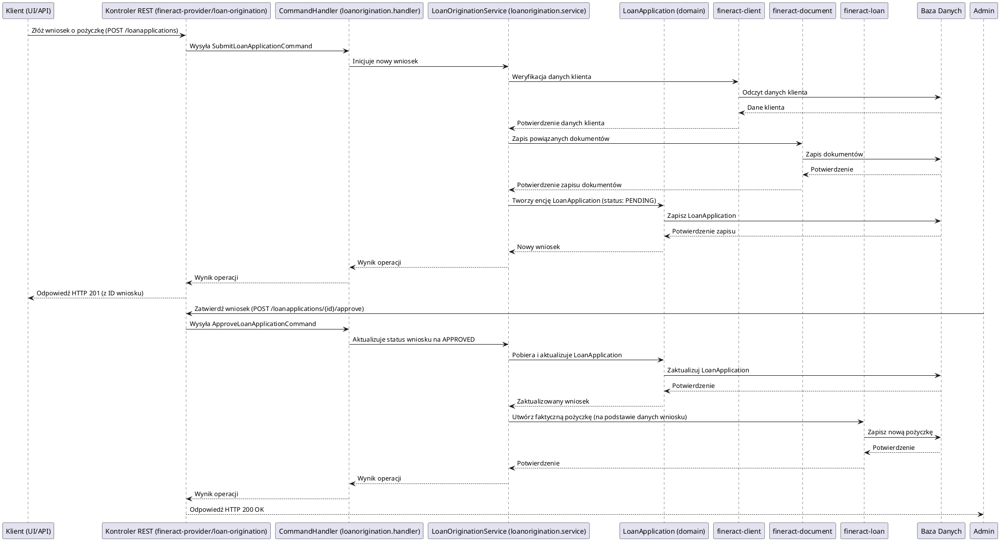

# Moduł: fineract-loan-origination

## Przegląd

Moduł `fineract-loan-origination` jest odpowiedzialny za zarządzanie całym procesem pozyskiwania i udzielania pożyczek (loan origination). Obejmuje to etapy od momentu złożenia wniosku o pożyczkę, przez gromadzenie danych, ocenę zdolności kredytowej, decyzję kredytową, aż po formalne zatwierdzenie i przygotowanie do wypłaty środków. Moduł ten wspiera workflowy, które mogą być konfigurowane w celu dostosowania do różnych produktów pożyczkowych i wewnętrznych polityk instytucji finansowej. Jego celem jest automatyzacja i usprawnienie procesu decyzyjnego, minimalizacja ryzyka oraz zapewnienie zgodności z regulacjami.

## Kluczowe komponenty

Moduł `fineract-loan-origination` jest zorganizowany wokół pakietu `org.apache.fineract.portfolio.loanorigination`, który zawiera następujące podpakietu:

*   **org.apache.fineract.portfolio.loanorigination.api**: Zawiera kontrolery REST lub interfejsy API do interakcji z modułem, umożliwiając składanie wniosków, śledzenie ich statusu, podejmowanie decyzji i zarządzanie workflowem.
*   **org.apache.fineract.portfolio.loanorigination.config**: Konfiguracje specyficzne dla procesu pozyskiwania pożyczek, np. definicje workflowów, reguły decyzyjne.
*   **org.apache.fineract.portfolio.loanorigination.data**: Obiekty DTO (Data Transfer Objects) reprezentujące wnioski o pożyczki, ich statusy, historię workflow oraz dane wejściowe/wyjściowe dla operacji API.
*   **org.apache.fineract.portfolio.loanorigination.domain**: Zawiera encje domenowe, takie jak `LoanApplication` (reprezentująca wniosek o pożyczkę), `LoanOriginationWorkflow` (definicje kroków i stanów workflow) oraz powiązaną logikę biznesową.
*   **org.apache.fineract.portfolio.loanorigination.enricher**: Komponenty odpowiedzialne za wzbogacanie danych wniosku o pożyczkę o dodatkowe informacje (np. dane kredytowe z zewnętrznych źródeł, dane klienta).
*   **org.apache.fineract.portfolio.loanorigination.exception**: Niestandardowe wyjątki obsługujące błędy specyficzne dla procesu pozyskiwania pożyczek.
*   **org.apache.fineract.portfolio.loanorigination.handler**: Implementacje `CommandHandler`ów, które przetwarzają komendy związane z wnioskami o pożyczki (np. `SubmitLoanApplicationCommand`, `ApproveLoanApplicationCommand`, `RejectLoanApplicationCommand`).
*   **org.apache.fineract.portfolio.loanorigination.mapper**: Klasy odpowiedzialne za mapowanie obiektów pomiędzy warstwami (np. DTO na encje domenowe) dla danych wniosków.
*   **org.apache.fineract.portfolio.loanorigination.serialization**: Obsługa serializacji i deserializacji danych wniosków o pożyczki.
*   **org.apache.fineract.portfolio.loanorigination.service**: Serwisy biznesowe implementujące główną logikę zarządzania procesem pozyskiwania pożyczek, w tym zarządzanie workflowem, podejmowanie decyzji i interakcje z innymi modułami.

## Przepływ danych

Przepływ danych w module `fineract-loan-origination` jest zorientowany na zarządzanie stanem wniosku o pożyczkę i jego przechodzeniem przez zdefiniowany workflow.

### Uproszczony przepływ obsługi wniosku o pożyczkę:

## Zależności wewnętrzne

Moduł `fineract-loan-origination` jest silnie zintegrowany z wieloma innymi modułami Fineract:

*   **fineract-core**: Wykorzystuje globalne usługi, narzędzia i konfiguracje.
*   **fineract-command**: Komendy związane z wnioskami o pożyczki są przetwarzane przez ogólny mechanizm komend Fineract.
*   **fineract-provider**: Udostępnia punkty końcowe API, które wywołują funkcjonalności modułu `fineract-loan-origination`.
*   **fineract-client**: Moduł ten pobiera i weryfikuje dane klientów w trakcie procesu składania wniosku.
*   **fineract-document**: Umożliwia dołączanie i zarządzanie dokumentami (np. skanami dowodów, zaświadczeniami o dochodach) do wniosków o pożyczki.
*   **fineract-loan**: Po pomyślnym zatwierdzeniu wniosku, `fineract-loan-origination` inicjuje utworzenie rzeczywistej pożyczki w module `fineract-loan`.
*   **fineract-validation**: Wykorzystywany do walidacji danych wejściowych w trakcie składania wniosku.

## Zależności zewnętrzne i integracje

*   **Baza Danych**: Główna zależność. Wszystkie dane dotyczące wniosków o pożyczki, ich statusów, historii workflow i powiązanych informacji są trwale przechowywane w relacyjnej bazie danych.
*   **Spring Framework**: Wykorzystuje mechanizmy Spring do zarządzania transakcjami, wstrzykiwania zależności i konfiguracji.
*   **Systemy oceny zdolności kredytowej (potencjalnie)**: Chociaż nie jest to bezpośrednio widoczne, w bardziej złożonych implementacjach moduł ten może integrować się z zewnętrznymi systemami do oceny zdolności kredytowej.

## Zarządzanie stanem i baza Danych

Moduł `fineract-loan-origination` zarządza stanem wniosków o pożyczki i ich workflowem w bazie danych:

*   **Wnioski o Pożyczki (LoanApplication)**: Przechowuje szczegółowe dane dotyczące każdego wniosku, w tym informacje o kliencie, wnioskowanej kwocie, produkcie pożyczkowym, statusie wniosku (np. `PENDING`, `APPROVED`, `REJECTED`).
*   **Historia Workflow**: Rejestruje każdy etap i zmianę statusu wniosku w procesie workflow, co zapewnia pełną audytowalność i możliwość śledzenia historii.
*   **Powiązane Dane**: Przechowuje odwołania do powiązanych danych (np. ID klienta, ID dokumentów), które są przechowywane w innych modułach.

Wszystkie te dane są modelowane jako encje JPA i trwale przechowywane w bazie danych, co zapewnia spójność, audytowalność i możliwość wznowienia procesów pożyczkowych w dowolnym momencie.
