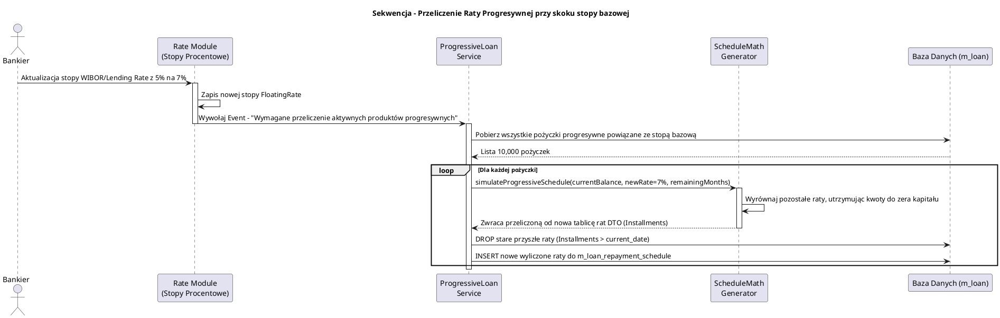

# Moduły Wnioskowania Pożyczkowego i Progresywnego (fineract-loan-origination & progressive-loan)

[Powrót do dokumentacji głównej](README.md)

## Opis
Moduły `fineract-loan-origination`, `fineract-progressive-loan` oraz dołączony silnik generacji i `fineract-working-capital-loan` są jednymi z nowszych ewolucyjnie poddomen portfela w systemie Apache Fineract, odpowiadającymi za udoskonalony i nowoczesny proces udzielania oraz konfiguracji pożyczek.

1.  **Loan Origination (Wnioskowanie)**: Reprezentuje etap przed staniem się de facto pożyczkobiorcą. W tradycyjnym procesie Fineract pożyczkę otwierano tworząc wprost rekord `Loan`. W nowym modelu wprowadzono pełnoprawny proces Origination – weryfikacji zdolności kredytowej klienta, cyklów i analizy kredytowej (często we współpracy z zewnętrznymi algorytmami Credit Scoring i Decision Engines).
2.  **Progressive Loan (Raty Progresywne / Zmienne Harmonogramy)**: Klasyczny moduł `fineract-loan` miał duże trudności i "betonował" równe ułożenie rat w harmonogramach (np. Równe raty kapitałowo-odsetkowe, równe kapitałowe). Klienci detaliczni we współczesnych bankach potrzebują wyliczania harmonogramów podatnych np. na drastyczne skoki wskaźników referencyjnych stóp procentowych (np. WIBOR, Euribor), lub możliwości dynamicznego przeliczania całych rat po częściowych wpłatach / zawieszeniach wakacji kredytowych z całkowitym nowym generowaniem kalendarza spłat. "Progressive Loan" stanowi ewolucyjny skok z re-architekturą interfejsów kalkulacji (Embeddable Schedule Generator).

## Kluczowe komponenty biznesowe

| Komponent | Odpowiedzialność biznesowa i techniczna |
| :--- | :--- |
| **Loan Decisioning / Origination** | Etapy i logiki w trakcie procesu decyzyjnego. Wprowadza model wielostopniowego zatwierdzania i rewizji decyzji pod kątem ryzyka finansowego zanim pożyczka w ogóle zostanie oficjalnie otworzona. |
| **Współczynnik Cyklu Życia Kredytobiorcy (Borrower Cycle)** | Funkcjonalność ograniczająca ryzyko po stronie MFI i nagradzająca stałych klientów (np. "Jeśli klient pomyślnie spłacił u nas 3 pożyczki (Cycle 3), przy pożyczce Cycle 4 automatycznie udostępnij mu wyższy limit kredytowy i niższe RRSO"). |
| **Schedule Generator (Embeddable)** | Nowoczesny, odseparowany matematyczny moduł wyliczający daty spłat i kwoty. "Embeddable" oznacza to, że cała biblioteka matematyczno-algorytmiczna nie jest zakopana w transakcjach relacyjnych JPA, ale może być użyta w locie bez zapisu do bazy np. przez Front-End UI, by wyświetlić symulację kredytu w locie przy suwakach. |
| **Progressive Interest Calculation** | Zaawansowana matematyka "odsetek progresywnych" (odsetki od malejącego bilansu powiązane ze skomplikowanymi opłatami wyrównawczymi). |

## Architektura modułu

Architektura z racji bycia ewolucją, opiera się mocno na starych wskaźnikach bazy danych `fineract-loan` po uprzednio przeprowadzonych migracjach, ale wyłącza starsze handlery (CommandHandlers) dla wybranych produktów na rzecz nowych algorytmów.

```plantuml
@startuml
!include https://raw.githubusercontent.com/plantuml-stdlib/C4-PlantUML/master/C4_Component.puml
title Model C4 - Zależności nowej origincaji i pożyczek progresywnych

Component(api_channels, "Internet Banking / Wnioski", "Zewnętrzne Kanały", "Zbierają wnioski od klientów")
Component(origination_svc, "LoanOrigination API", "fineract-loan-origination", "Weryfikuje limity portfela i wyznaczniki ryzyka (Borrower Cycles, Kredyt odrzucony/zaakceptowany)")
Component(decision_engine, "External Decision Engine", "Zewnętrzna Analiza Ryzyka (Opcjonalnie)", "Autoryzuje ryzyko (Scoring API)")
Component(progressive_module, "Progressive Loan Service", "fineract-progressive-loan", "Rejestruje pożyczkę jeśli uzyskała Aprobatę w Origination jako progresywną")
Component(schedule_math, "Embeddable Schedule Generator", "Moduł Matematyczny", "Przelicza natychmiastowo nowy, uelastyczniony kształt harmonogramu pod modyfikacje stóp bazowych w systemie")

SystemDb_Ext(db, "Baza Danych Dzierżawcy", "Model Pożyczkowy")

Rel(api_channels, origination_svc, "Wysyłanie formularza wniosku")
Rel(origination_svc, decision_engine, "Wysyłanie danych kandydata (Score Check)")
Rel(origination_svc, progressive_module, "Zlecenie otworzenia zweryfikowanej umowy")
Rel(progressive_module, schedule_math, "Generowanie Harmonogramu (In-memory array)")
Rel(progressive_module, db, "Aktualizacja m_loan_repayment_schedule o zrewidowane w locie dane")

@enduml
```

## Przepływ danych (Zmienne Oprocentowanie Progresywne)

Proces ten pokazuje moc zmiennych harmonogramów, które były barierą do wdrożenia w Fineract w krajach europejskich, gdzie kredyty hipoteczne miały raty modyfikowane dynamicznie w trakcie trwania umowy.



## Zależności wewnętrzne i Integracje

*   Moduły Progressive oraz Origination są ściśle powiązane architektonicznie wstecz (Backward Compatibility) z bazowym modułem `fineract-loan`. Operują one wręcz na tych samych tabelach `m_loan` oraz generują identyczne `BusinessEvents`, po to aby moduł Księgowości (`fineract-accounting`) nie odczuł żadnej różnicy miedzy zaksięgowaniem spłaty starego i nowego algorytmu.

## Zarządzanie stanem i baza danych

System bazuje głównie na poszerzonych kolumnach i starych strukturach.
*   Zmianie w bazie ulegają definicje samego schematu spłat (dodatkowe wskaźniki dla kapitału postępującego i odsetek zakumulowanych), by odróżnić nową metodę rozliczeń ułatwiając np. szybkie wcześniejsze zamknięcia całego rachunku przez klienta (Early Repayment bez kar). Oznacza to m.in. trzymanie stanów stóp referencyjnych (zmienne `m_floating_rates`) aktualizowanych centralnie i propagowanych na wszystkie powiązane rachunki pożyczkowe w momencie przeliczania (COB lub ad-hoc).

```