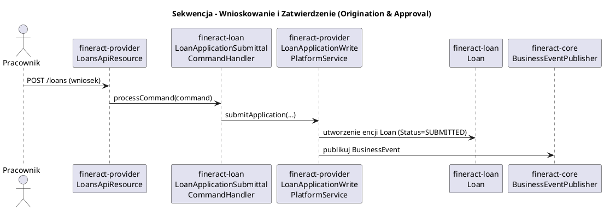
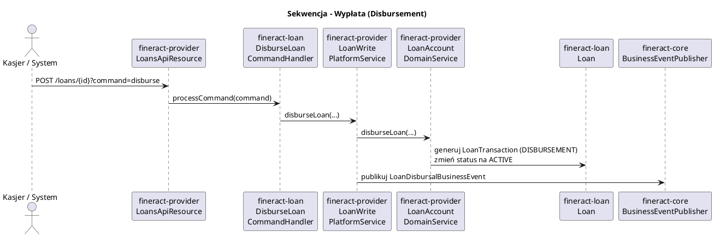
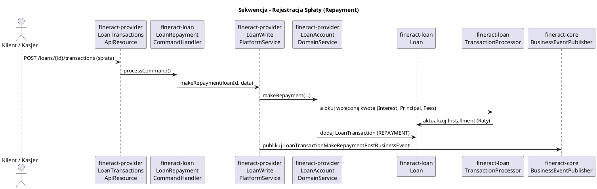

# Moduł Pożyczek (fineract-loan)

[Powrót do dokumentacji głównej](README.md)

## Opis
Moduł `fineract-loan` jest jednym z najważniejszych i największych komponentów systemu Apache Fineract. Odpowiada on za pełny cykl życia pożyczki (Loan) i kredytu, od momentu jego zaakceptowania, przez wypłatę (Disbursement), naliczanie odsetek i harmonogramowanie (Scheduling), po spłaty (Repayment) oraz zamknięcie pożyczki (lub odpisanie w straty - Charge-Off/Write-Off). 

Moduł ten realizuje kluczowe zasady biznesowe dla produktów kredytowych w tym:
* Generowanie różnych typów harmonogramów (raty równe, malejące, odsetki płatne z góry/z dołu).
* Obsługę prowizji i kar (Charges & Penalties).
* Wyliczanie zaległości i śledzenie wskaźników Delinquency (opóźnienia w spłacie).
* Przewalutowania, reschedulowanie i renegocjacje warunków (Reschedule, Re-aging, Re-amortization).
* Zarządzanie zabezpieczeniami (Collateral).

## Kluczowe komponenty

| Komponent (Pakiet/Klasa) | Odpowiedzialność biznesowa i techniczna | Lokalizacja (Moduł) |
| :--- | :--- | :--- |
| **`Loan`**, **`LoanTransaction`**, **`LoanRepaymentScheduleInstallment`** | Encje domenowe JPA stanowiące rdzeń danych pożyczki. Przechowują odpowiednio: główny rekord kredytu, każdą operację finansową i niefinansową, oraz definję rat harmonogramu. | `fineract-loan` |
| **`LoanProduct`** (`portfolio.loanproduct`) | Definicja szablonu pożyczki (np. Oprocentowanie, Typ Amortyzacji, Strategia księgowania). Instancje pożyczek są tworzone na podstawie konfiguracji `LoanProduct`. | `fineract-loan` |
| **`LoanWritePlatformService`** | Interfejs dla głównego serwisu domenowego do operacji zmieniających stan pożyczki (np. Wypłata, Spłata). Implementacja znajduje się w `fineract-provider`. | `fineract-loan` (Interfejs) |
| **`LoanApplicationWritePlatformService`** | Zarządzanie cyklem życia wniosku pożyczkowego przed wypłatą. Implementacja znajduje się w `fineract-provider`. | `fineract-loan` (Interfejs) |
| **`LoanReadPlatformService`** | Serwis odpowiedzialny za szybki odczyt danych pożyczki i zwracanie obiektów DTO. Implementacja znajduje się w `fineract-provider`. | `fineract-loan` (Interfejs) |
| **`LoanChargeService`** | Zarządzanie wszelkimi opłatami (Charge) oraz karami (Penalty) dla pożyczki, m.in. nakładanie, zwalnianie, spłata i kalkulacja ich wartości. | `fineract-loan` |
| **`LoanArrearsAgingService`** | Klasyfikowanie pożyczek pod kątem opóźnień w spłacie oraz przeliczanie przeterminowanych rat w cyklicznych procesach (COB). | `fineract-loan` |
| **`LoanRepaymentScheduleTransactionProcessor`** | Wzorzec strategii określający, w jakiej kolejności alokowane są środki ze spłaty (np. MifosStandard, Creocore, RBIIndia). | `fineract-loan` |
| **`LoanScheduleGenerator`** | Interfejs i implementacje (Cumulative) generowania oraz przeliczania harmonogramów spłat bazujących na matematyce finansowej. | `fineract-loan` |
| **`Delinquency`** (`portfolio.delinquency`) | Pakiet usług określający w jaki sposób system rozpoznaje i kategoryzuje opóźnienia w spłatach (Delinquency Buckets). | `fineract-loan` |
| **`LoanCollateral`** | Zarządzanie zabezpieczeniami przypisanymi do pożyczki. | `fineract-loan` |
| **`LoanRescheduleRequest`** | Obsługa wniosków o zmianę harmonogramu spłat (restrukturyzacja). | `fineract-loan` |

## Architektura modułu

Architektura modułu `fineract-loan` opiera się na separacji logiki domenowej (encje, procesory matematyczne) od orkiestracji wysokopoziomowej. Moduł `fineract-loan` definiuje kontrakty (interfejsy), które są implementowane w `fineract-provider` ze względu na zależności od innych, jeszcze nie zmodularyzowanych części systemu (np. Savings, Notes, Calendar).

```plantuml
@startuml
!include https://raw.githubusercontent.com/plantuml-stdlib/C4-PlantUML/master/C4_Component.puml
title Model C4 - Komponenty i warstwy modułu fineract-loan

Container_Boundary(loan_mod, "fineract-loan") {
    Component(loan_entities, "Loan Domain Entities", "JPA Entities", "Loan, LoanTransaction, LoanCharge, etc.")
    Component(loan_math, "Loan Math & Logic", "Services", "LoanScheduleGenerator, TransactionProcessor, LoanChargeService")
    Component(delinquency_service, "Delinquency Service", "Service", "Zarządzanie opóźnieniami")
    Component(loan_interfaces, "Loan Service Interfaces", "Interfaces", "LoanWritePlatformService, LoanReadPlatformService")
    Component(command_handlers, "Command Handlers", "Spring Handlers", "Obsługa komend (np. Repayment, Disburse)")
}

Container_Boundary(provider_mod, "fineract-provider") {
    Component(loan_impls, "Loan Service Implementations", "Services (JPA/JDBC)", "Implementacje orkiestrujące Loan z innymi modułami")
    Component(loan_api, "Loan REST API", "JAX-RS", "LoansApiResource, LoanTransactionsApiResource")
}

Component(fineract_core, "fineract-core", "Core Module", "Shared entities (Client, User), Security, Events")

Rel(loan_api, command_handlers, "Wysyła komendy")
Rel(command_handlers, loan_impls, "Wywołuje serwisy")
Rel(loan_impls, loan_math, "Używa logiki biznesowej")
Rel(loan_impls, loan_entities, "Zarządza stanem (JPA)")
Rel(loan_math, loan_entities, "Operuje na danych")
Rel(loan_impls, fineract_core, "Zależność od Core (np. Client)")
Rel(loan_mod, fineract_core, "Używa BusinessEventPublisher")

@enduml
```

## Przepływ danych

W module `fineract-loan` zidentyfikowano główne przepływy biznesowe (Data Flows) odzwierciedlające cykl życia pożyczki i operacje na niej wykonywane. Poniżej zaprezentowano diagramy sekwencji dla każdego z nich:

### 1. Wnioskowanie i Zatwierdzenie Pożyczki (Origination & Approval)

Przepływ obejmujący utworzenie wniosku kredytowego i jego zatwierdzenie. Zmianie ulega status pożyczki (np. PENDING -> APPROVED).



### 2. Wypłata Pożyczki (Disbursement)

Przepływ realizujący wypłatę środków na konto klienta. Zmienia status pożyczki na ACTIVE i generuje zdarzenia księgowe.



### 3. Spłata Pożyczki (Repayment)

Główny przepływ rejestracji wpływu środków od klienta. Obejmuje alokację środków na kapitał, odsetki, opłaty i kary.



## Zależności wewnętrzne i Integracje

Poniższy diagram obrazuje powiązania modułu `fineract-loan` z innymi kluczowymi modułami systemu Fineract.

```plantuml
@startuml
!include https://raw.githubusercontent.com/plantuml-stdlib/C4-PlantUML/master/C4_Component.puml
title Diagram Zależności - fineract-loan

Component(fineract_loan, "fineract-loan", "Moduł Pożyczek", "Silnik logiki, encje i interfejsy")
Component(fineract_provider, "fineract-provider", "Moduł Główny", "API, Implementacje orkiestrujące")

Component(fineract_accounting, "fineract-accounting", "Moduł Księgowości", "Księga Główna (GL)")
Component(fineract_charge, "fineract-charge", "Moduł Opłat", "Definicje opłat i kar")
Component(fineract_cob, "fineract-cob", "Moduł COB", "Zarządzanie zamknięciem dnia")
Component(fineract_core, "fineract-core", "Moduł Core", "Szyna zdarzeń, dane wspólne (Client)")
Component(fineract_rates, "fineract-rates", "Moduł Stóp", "Zarządzanie stopami procentowymi")
Component(fineract_tax, "fineract-tax", "Moduł Podatków", "Zarządzanie konfiguracją podatkową")

Rel_D(fineract_provider, fineract_loan, "Implementuje interfejsy i wywołuje logikę")
Rel_D(fineract_loan, fineract_core, "Zależność od Core (Client, Events)")
Rel_R(fineract_loan, fineract_charge, "Używa definicji opłat")
Rel_L(fineract_loan, fineract_rates, "Używa stóp procentowych")
Rel_D(fineract_loan, fineract_tax, "Używa konfiguracji podatkowej")
Rel_U(fineract_cob, fineract_loan, "Uruchamia kroki COB (LoanCOBBusinessStep)")
Rel_L(fineract_core, fineract_accounting, "Przekazuje zdarzenia asynchronicznie")

@enduml
```

### Integracja z fineract-provider
`fineract-provider` zależy od `fineract-loan`. Pełni on rolę warstwy API oraz dostarcza implementacje dla interfejsów zdefiniowanych w `fineract-loan`, które wymagają dostępu do nielonowych części systemu (np. konta oszczędnościowe w procesach spłaty pożyczki z oszczędności).

### Integracja z innymi modułami pożyczkowymi
*   **`fineract-progressive-loan`**: Opcjonalny moduł rozszerzający logikę harmonogramowania o zaawansowane modele progresywne. `fineract-provider` orkiestruje współpracę między tymi modułami.
*   **`fineract-loan-origination`**: Moduł odpowiedzialny za zaawansowane procesy wnioskowania (workflow), które poprzedzają utworzenie właściwej pożyczki w `fineract-loan`.

## Zarządzanie stanem i baza danych

Model danych skupiony jest wokół tabel prefiksowanych najczęściej `m_loan`. Najważniejsze z nich to:

*   `m_loan`: Rekord główny instancji kredytu.
*   `m_product_loan`: Konfiguracja wybranego produktu pożyczkowego.
*   `m_loan_transaction`: Historia transakcji (Wypłaty, Spłaty, Korekty).
*   `m_loan_repayment_schedule`: Harmonogram spłat (Due vs Paid).
*   `m_loan_charge`: Obciążenia dla danej pożyczki.
*   `m_loan_collateral`: Zabezpieczenia pożyczki.
*   `m_loan_status_change_history`: Audyt przejść pożyczki w cyklu życia.
*   `m_loan_delinquency_tag_history`: Historia tagów opóźnień.
*   `m_loan_reschedule_request`: Wnioski o restrukturyzację.
*   `m_loan_officer_assignment_history`: Historia przypisań opiekunów pożyczki.
*   `m_loan_installment_charge`: Powiązanie opłat z konkretnymi ratami.
*   `m_loan_transaction_repayment_schedule_mapping`: Mapowanie transakcji na spłacone raty.
