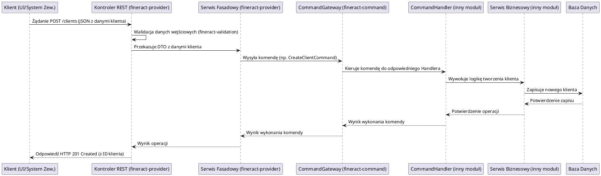

# Moduł: fineract-provider

## Przegląd

Moduł `fineract-provider` jest głównym modułem aplikacyjnym Apache Fineract i stanowi centralną bramę API (Application Programming Interface) dla całego systemu. Jego fundamentalną rolą jest agregowanie funkcjonalności dostarczanych przez pozostałe moduły biznesowe Fineract i udostępnianie ich na zewnątrz poprzez zestaw interfejsów RESTful API. Działa jako punkt integracji dla interfejsów użytkownika (UI), aplikacji mobilnych oraz innych systemów zewnętrznych, umożliwiając im interakcję z podstawowymi usługami bankowości centralnej. Jest to również moduł startowy aplikacji Spring Boot, zawierający główną klasę `ServerApplication.java`.

## Kluczowe komponenty

`fineract-provider` jako moduł agregujący, zawiera wiele podpakietów, które odzwierciedlają udostępniane przez niego funkcjonalności, często będące fasadami dla usług z innych modułów:

*   **org.apache.fineract.accounting**: Zawiera API REST i serwisy fasadowe do zarządzania operacjami księgowymi, delegując rzeczywistą logikę do modułu `fineract-accounting`.
*   **org.apache.fineract.adhocquery**: Udostępnia API do wykonywania ad-hoc zapytań do danych.
*   **org.apache.fineract.batch**: API do zarządzania i monitorowania procesów wsadowych.
*   **org.apache.fineract.cob**: Interfejsy do zarządzania i wyzwalania procesów `Close of Business`.
*   **org.apache.fineract.commands**: Fasady do wysyłania i zarządzania komendami, które są następnie przetwarzane przez moduł `fineract-command`.
*   **org.apache.fineract.infrastructure**: Zawiera interfejsy API i serwisy dla podstawowych funkcji infrastrukturalnych, takich jak zarządzanie konfiguracją, buforowaniem, dokumentami czy zadaniami, korzystając z funkcjonalności `fineract-core`.
*   **org.apache.fineract.interoperation**: API wspierające interoperacyjność z innymi systemami.
*   **org.apache.fineract.notification**: API do zarządzania powiadomieniami.
*   **org.apache.fineract.organisation**: API do zarządzania strukturą organizacyjną (np. oddziały, kasjerzy).
*   **org.apache.fineract.portfolio**: Agreguje API i serwisy dla kluczowych produktów finansowych, takich jak pożyczki (`fineract-loan`), oszczędności (`fineract-savings`), zarządzanie klientami i grupami. Jest to jeden z najbardziej rozbudowanych obszarów.
*   **org.apache.fineract.spm**: API dla Strategic Performance Management.
*   **org.apache.fineract.template**: API do zarządzania szablonami (np. dla dokumentów, raportów).
*   **org.apache.fineract.useradministration**: API do zarządzania użytkownikami i ich uprawnieniami, integrujące się z `fineract-security`.
*   `ServerApplication.java`: Główna klasa aplikacji Spring Boot, odpowiedzialna za uruchomienie serwera i konfigurację kontekstu aplikacji.

## Przepływ danych

Przepływ danych w `fineract-provider` rozpoczyna się od zewnętrznego żądania HTTP, które jest następnie walidowane, autoryzowane i kierowane do odpowiedniego serwisu, często uruchamiającego komendę, która jest przetwarzana przez inne moduły.

### Uproszczony przepływ danych dla żądania REST API (np. utworzenie nowego klienta):

## Zależności wewnętrzne

`fineract-provider` ma zależności od praktycznie wszystkich innych modułów biznesowych w ekosystemie Fineract. Działa jako warstwa prezentacji i orkiestracji, integrując i udostępniając ich funkcjonalności:

*   **fineract-core**: Wykorzystuje globalne usługi, narzędzia i konfiguracje.
*   **fineract-security**: Integruje mechanizmy uwierzytelniania i autoryzacji do ochrony punktów końcowych API.
*   **fineract-validation**: Służy do walidacji danych wejściowych w żądaniach REST.
*   **fineract-command**: Jest kluczowym konsumentem, wysyłając obiekty komend w celu wykonania operacji biznesowych.
*   **fineract-loan, fineract-savings, fineract-accounting** itd.: `fineract-provider` zawiera fasady lub kontrolery, które bezpośrednio lub pośrednio wywołują serwisy tych modułów w celu realizacji żądań API.

## Zależności zewnętrzne i integracje

*   **Spring Boot**: Cała aplikacja jest zbudowana na frameworku Spring Boot, który dostarcza środowisko do szybkiego tworzenia samodzielnych, produkcyjnych aplikacji.
*   **Serwer Aplikacji (Embedded Tomcat/Jetty)**: `fineract-provider` zawiera wbudowany serwer aplikacji, który obsługuje żądania HTTP.
*   **JSON/HTTP**: Główne protokoły komunikacji z zewnętrznymi klientami.
*   **Baza Danych**: Chociaż `fineract-provider` sam nie zawiera logiki biznesowej do bezpośredniego zarządzania danymi (delegując to do innych modułów), jest on ostatecznym punktem, przez który dane są odczytywane i modyfikowane w bazie danych, dzięki integracji z innymi modułami.

## Zarządzanie stanem i baza Danych

`fineract-provider` nie zarządza bezpośrednio trwałym stanem biznesowym systemu. Jego rola polega na **orkiestrowaniu** operacji, które zmieniają stan systemu. Kiedy żądanie przychodzi do `fineract-provider`, jest ono przekształcane w komendę lub wywołanie serwisu, które są następnie przekazywane do odpowiednich modułów biznesowych (np. `fineract-loan`, `fineract-savings`). Te moduły są odpowiedzialne za rzeczywiste zarządzanie stanem i persystencję danych w bazie danych.

`fineract-provider` udostępnia jednak API, które pozwala na:
*   Odczytywanie aktualnego stanu obiektów biznesowych (np. lista klientów, szczegóły pożyczki).
*   Wprowadzanie zmian w stanie systemu poprzez wysyłanie komend.

W ten sposób, moduł ten działa jako fasada, która synchronizuje widok klienta z aktualnym stanem bazy danych, ale sama nie jest odpowiedzialna za niskopoziomowe operacje na danych.
