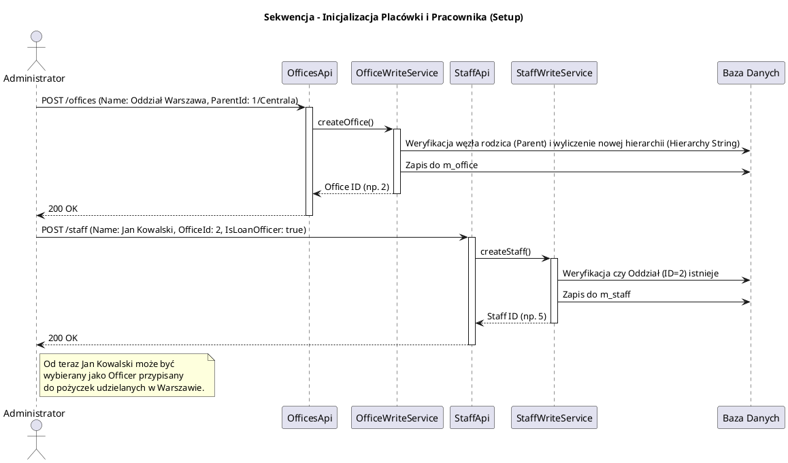

# Moduł Główny i Struktury Organizacyjnej (fineract-provider)

[Powrót do dokumentacji głównej](README.md)

## Opis
Moduł `fineract-provider` stanowi monolityczne serce (Core Engine) całego systemu Apache Fineract. To w nim znajduje się punkt startowy aplikacji Spring Boot (`ServerApplication.java`) oraz główna konfiguracja scalająca wszystkie pozostałe, odseparowane moduły (takie jak pożyczki, oszczędności, księgowość). 

Biznesowo, `fineract-provider` przechowuje fundamenty działania każdej instytucji finansowej, definiując jej **strukturę organizacyjną, personel oraz grupy wsparcia (Microfinance)**. Bez poprawnego skonfigurowania encji w tym module, system nie pozwoli na utworzenie ani jednego klienta, pożyczki czy wpisu księgowego. Zarządza on również konfiguracją systemu (Global Properties), powiadomieniami oraz kalendarzami dni roboczych/wolnych (Holidays, Working Days).

## Kluczowe komponenty biznesowe

| Komponent / Domena | Odpowiedzialność biznesowa i techniczna |
| :--- | :--- |
| **`Office`** (`organisation/office`) | Oddziały i biura. Reprezentują fizyczną lub logiczną strukturę placówek banku. Mają strukturę drzewiastą (np. Centrala -> Oddział Regionalny -> Placówka lokalna). Wpływają na Data Scoping (pracownik widzi tylko klientów swojego biura). |
| **`Staff`** (`organisation/staff`) | Personel banku/MFI (np. Analitycy, Oficerowie Kredytowi, Menedżerowie). Klient oraz Pożyczka w Fineract mogą (lub muszą) być przypisani do konkretnego oficera kredytowego z tej tabeli, odpowiedzialnego za jego nadzór. |
| **`Teller`** (`organisation/teller`) | Kasjerzy i zarządzenie Gotówką (Cash Management). Pozwala przypisać konkretnego pracownika (`Staff`) do Stanowiska Kasowego (`Teller`) na zadany okres czasu (Shift). Kasjerzy mają przypisane własne konta GL podpięte pod system księgowości. |
| **`Group` i `Center`** (`portfolio/group`) | Podstawa mikrofinansowania (Microfinance). Grupy solidarnościowe (Joint-Liability Groups). Jeśli klient A (będący w grupie) nie spłaca pożyczki, cała grupa traci wiarygodność. Obejmuje zbiorcze spotkania (Meetings) i zbiorcze zatwierdzanie wpłat. |
| **`UserAdministration`** | Zarządzanie loginami do systemu (`m_appuser`). Ścisła integracja z profilem `Staff` oraz rolami i uprawnieniami (wykorzystywanymi z kolei przez `fineract-security`). |
| **`GlobalConfiguration`** | Tabela globalnych parametrów włączających/wyłączających funkcje całego systemu w locie (np. wymuszanie weryfikacji haseł, włączanie modułu Maker-Checker, domyślna waluta). |

## Architektura modułu

Architektura jest wciąż oparta na warstwach (Controllers -> Services -> Repositories), gdzie `fineract-provider` ładuje i rejestruje (Auto-Configuration) wszystkie pozostałe pakiety.

```plantuml
@startuml
!include https://raw.githubusercontent.com/plantuml-stdlib/C4-PlantUML/master/C4_Component.puml
title Model C4 - Zależności modułu fineract-provider (Core)

Component(provider_core, "Fineract Provider (ServerApplication)", "Spring Boot App", "Wczytuje kontekst, pule wątków (Tomcat), konfiguruje źródła danych (DataSource) i ładuje Beans z innych modułów")
Component(org_domain, "Domena Organizacji", "Serwisy (Office, Staff, Teller)", "Utrzymuje hierarchie oddziałów, dni wolne banku i zarządzanie personelem")
Component(mfi_domain, "Domena MFI (Group/Center)", "Serwisy (Grupy)", "Utrzymuje relacje miedzy klientami na potrzeby JLG (Joint-Liability)")

System_Ext(loans, "fineract-loan", "Moduł pożyczek")
System_Ext(savings, "fineract-savings", "Moduł oszczędności")
System_Ext(accounting, "fineract-accounting", "Moduł księgowości")
SystemDb_Ext(db, "Relational Database", "Model tenanta")

Rel(provider_core, loans, "Inicjuje (ComponentScan, Dependencje)")
Rel(provider_core, savings, "Inicjuje (ComponentScan, Dependencje)")
Rel(provider_core, accounting, "Inicjuje (ComponentScan, Dependencje)")

Rel(loans, org_domain, "Odpytuje: 'Czy Staff ID=X istnieje i jest aktywny?'")
Rel(savings, org_domain, "Zapisuje transakcje kasjera powiązane z oddziałem (Office ID=Y)")
Rel(loans, db, "Sprawdzenie świąt z tabel (m_holiday) przy harmonogramach")

@enduml
```

## Przepływ danych (Utworzenie Hierarchii Organizacyjnej)

Diagram obrazuje prosty, acz kluczowy przepływ – konfigurację nowej placówki i zatrudnienie oficera. Bez tych kroków założenie Klienta i uruchomienie kredytu będzie niemożliwe.



## Zależności wewnętrzne i Integracje

*   **Fundament Aplikacji**: Z punktu widzenia budowania (Build) w systemie (np. `build.gradle`), `fineract-provider` to moduł zbierający (Aggregation Module). Definiuje zależność (`implementation project(':fineract-loan')`, itd.) do wszystkich kluczowych pod-modułów i odpowiada za ostateczne spakowanie ich do działającego pliku `.jar` lub instalacji kontenerowej w locie.
*   **Wpływ na harmonogramy rat (`fineract-loan`)**: Domena `organisation/holiday` ściśle integruje się z logiką generowania harmonogramów pożyczek (Loan Schedules). Silnik harmonogramów (w `fineract-loan`) pyta serwisy kalendarzowe (w `fineract-provider`) o `WorkingDays` i `Holidays` (Święta Bankowe), aby zdecydować, czy rata wypadająca w niedzielę ma być pobrana w piątek, czy przeniesiona na poniedziałek (Repayment Rescheduling).

## Zarządzanie stanem i baza danych

Najistotniejsze słowniki konfiguracji początkowej i strukturalnej bazy danych to m.in.:

*   `m_office`: Definicja i struktura biur. Kluczowa z racji hierarchii (`hierarchy` pole określające np. ".1.2." co ułatwia szukanie "wszystkich pod-oddziałów zapytań SQL typu LIKE").
*   `m_staff`: Osobowa lista pracowników (Mogą być `is_loan_officer = 1`, by byli wybieralni przy wnioskach kredytowych).
*   `m_group` / `m_group_client`: Centra mikrofinansowania i struktura asocjacji (Klient A znajduje się w Grupie B).
*   `m_holiday` i `m_working_days`: Kalendarz operacyjny banku. Daty wykluczone z księgowania i pobierania rat.
*   `m_currency`: Zdefiniowane i aktywowane dla danej instalacji/dzierżawcy waluty.
*   `c_configuration`: Tabela typu `name-value`, pozwalająca zarządzać flagami takimi jak `maker-checker-enabled`, `password-policy-regex`, `min-password-length`. Umożliwia administratorowi szybkie zablokowanie konkretnych zachowań systemu bez restartu.
