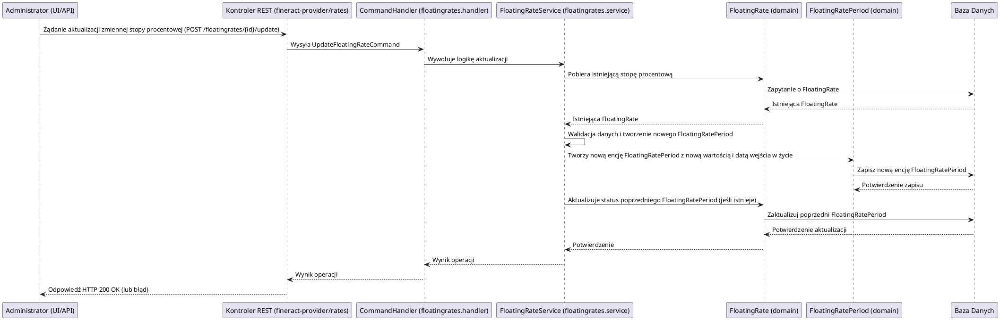

# Moduł: fineract-rates

## Przegląd

Moduł `fineract-rates` w Apache Fineract jest odpowiedzialny za zarządzanie zmiennymi stopami procentowymi (floating rates). Stopy te są dynamicznie dostosowywane do warunków rynkowych i mogą wpływać na oprocentowanie produktów finansowych, takich jak pożyczki czy konta oszczędnościowe. Moduł ten umożliwia definiowanie, aktualizowanie i śledzenie historii zmiennych stóp procentowych, zapewniając elastyczność i reagowanie na zmiany w otoczeniu ekonomicznym. Jego głównym celem jest dostarczenie aktualnych i historycznych danych o stopach procentowych, które są następnie wykorzystywane przez inne moduły systemu.

## Kluczowe komponenty

Moduł `fineract-rates` jest zorganizowany wokół pakietu `org.apache.fineract.portfolio.floatingrates`, który zawiera następujące podpakietu:

*   **org.apache.fineract.portfolio.floatingrates.api**: Zawiera kontrolery REST lub interfejsy API do interakcji z modułem, umożliwiając pobieranie, tworzenie, aktualizowanie i aktywowanie zmiennych stóp procentowych.
*   **org.apache.fineract.portfolio.floatingrates.data**: Obiekty DTO (Data Transfer Objects) reprezentujące dane zmiennych stóp procentowych, ich historię i powiązane parametry.
*   **org.apache.fineract.portfolio.floatingrates.domain**: Zawiera encje domenowe, takie jak `FloatingRate` (definiująca zmienną stopę procentową) i `FloatingRatePeriod` (reprezentującą konkretny okres obowiązywania danej wartości stopy). Logika biznesowa do zarządzania tymi encjami znajduje się również tutaj.
*   **org.apache.fineract.portfolio.floatingrates.exception**: Niestandardowe wyjątki obsługujące błędy specyficzne dla zarządzania zmiennymi stopami procentowymi.
*   **org.apache.fineract.portfolio.floatingrates.handler**: Implementacje `CommandHandler`ów, które przetwarzają komendy związane ze zmiennymi stopami procentowymi (np. `UpdateFloatingRateCommand`, `ActivateFloatingRateCommand`).
*   **org.apache.fineract.portfolio.floatingrates.serialization**: Obsługa serializacji i deserializacji danych zmiennych stóp procentowych.
*   **org.apache.fineract.portfolio.floatingrates.service**: Serwisy biznesowe implementujące główną logikę zarządzania zmiennymi stopami procentowymi, w tym ich tworzenie, aktualizację, pobieranie aktualnych wartości i historii.
*   **org.apache.fineract.portfolio.floatingrates.starter**: Klasa auto-konfiguracji Spring Boot dla modułu.

## Przepływ danych

Przepływ danych w module `fineract-rates` koncentruje się na zarządzaniu definicjami zmiennych stóp procentowych i udostępnianiu ich innym modułom.

### Uproszczony przepływ aktualizacji zmiennej stopy procentowej:

## Zależności wewnętrzne

Moduł `fineract-rates` jest modułem infrastrukturalnym, dostarczającym dane o stopach procentowych innym modułom:

*   **fineract-core**: Wykorzystuje ogólne komponenty infrastrukturalne i narzędzia.
*   **fineract-command**: Komendy do operacji na zmiennych stopach procentowych są przetwarzane przez ogólny mechanizm komend Fineract.
*   **fineract-provider**: Udostępnia punkty końcowe API, które wywołują funkcjonalności modułu `fineract-rates`.
*   **fineract-loan, fineract-savings**: Te moduły biznesowe odpytują `fineract-rates` o aktualne wartości zmiennych stóp procentowych w celu naliczania odsetek dla pożyczek i kont oszczędnościowych.

## Zależności zewnętrzne i integracje

*   **Baza Danych**: Główna zależność. Wszystkie definicje zmiennych stóp procentowych, ich historie i okresy obowiązywania są trwale przechowywane w relacyjnej bazie danych.
*   **Spring Framework**: Wykorzystuje mechanizmy Spring do zarządzania transakcjami, wstrzykiwania zależności i konfiguracji.

## Zarządzanie stanem i baza Danych

Moduł `fineract-rates` zarządza stanem zmiennych stóp procentowych w bazie danych:

*   **FloatingRate**: Przechowuje definicje zmiennych stóp procentowych (np. nazwa, czy jest aktywna).
*   **FloatingRatePeriod**: Przechowuje historyczne i aktualne wartości zmiennych stóp procentowych wraz z datami ich wejścia w życie i wygaśnięcia. To pozwala na precyzyjne odtworzenie wartości stopy w dowolnym punkcie w czasie.

Wszystkie te dane są modelowane jako encje JPA i trwale przechowywane w bazie danych, zapewniając spójność i możliwość śledzenia zmian w czasie.
