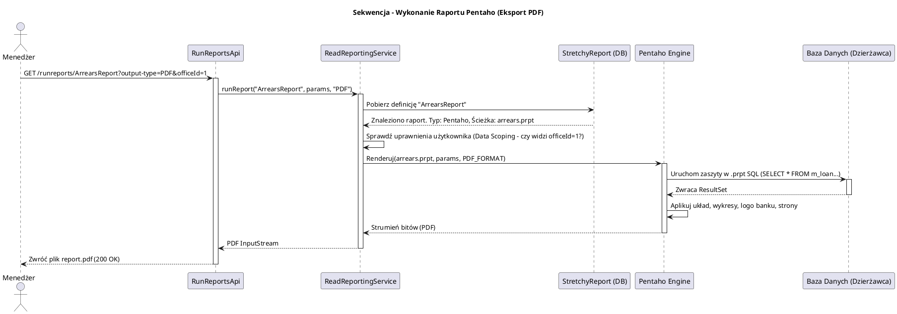

# Moduł Raportowania i Ekstrakcji Danych (fineract-report)

[Powrót do dokumentacji głównej](README.md)

## Opis
Moduł `fineract-report` odpowiada za generowanie, formatowanie i udostępnianie raportów biznesowych, analitycznych oraz operacyjnych w Apache Fineract. Instytucje finansowe (banki, MFI) potrzebują zaawansowanych mechanizmów ekstrakcji danych zarówno na potrzeby audytów wewnętrznych, jak i sprawozdawczości regulacyjnej (Regulatory Compliance). 

W przeciwieństwie do modułów transakcyjnych (jak `fineract-loan`), moduł raportowania jest zbudowany w architekturze niemal wyłącznie **odczytu (Read-Only)**. By zapewnić maksymalną wydajność i omijać narzut mapowania obiektowo-relacyjnego (ORM/JPA), moduł ten bazuje na bezpośrednich zapytaniach SQL (JDBC) oraz wspiera zewnętrzny silnik raportowy Pentaho. Pozwala to na swobodne definiowanie dynamicznych parametrów (np. "Pokaż pożyczki z oddziału X z opóźnieniem powyżej Y dni") z poziomu interfejsu bez konieczności re-kompilacji kodu źródłowego Fineract.

## Kluczowe komponenty

| Komponent | Odpowiedzialność biznesowa i techniczna |
| :--- | :--- |
| **Mechanizm `Stretchy Reports`** | Wbudowany elastyczny system raportowania w Fineract. Raporty definiowane są jako "surowe" zapytania SQL bezpośrednio w tabelach bazy danych. System potrafi renderować ich wynik w formacie JSON (dla UI) lub CSV. |
| **Integracja z Pentaho** | Zaawansowany silnik umożliwiający renderowanie predefiniowanych plików `.prpt` (Pentaho Report) z bogatym formatowaniem (wykresy, podsumowania), eksportujący wyniki do formatów PDF, Excel, HTML czy CSV. |
| **`ReadReportingService`** | Fasada (Service) zarządzająca wyszukiwaniem i odczytywaniem definicji raportów z bazy danych, podstawianiem parametrów wejściowych od użytkownika (np. Data od, Data do) pod zapytania SQL oraz zabezpieczeniami (sprawdzanie, czy użytkownik ma dostęp do danego raportu). |
| **`ReportExportService`** | Komponent odpowiedzialny za strumieniowanie (Streaming) gigantycznych zestawów danych bezpośrednio do odpowiedzi HTTP (np. eksport ogromnych baz klientów do pliku CSV bez wysycania pamięci RAM serwera). |

## Architektura modułu

Architektura `fineract-report` celowo omija obiekty encji z innych modułów i warstwę CommandHandlerów. Działa jako wydajna "rura" do odczytu bazy dzierżawcy.

```plantuml
@startuml
!include https://raw.githubusercontent.com/plantuml-stdlib/C4-PlantUML/master/C4_Component.puml
title Model C4 - Komponenty modułu fineract-report

Component(report_api, "Report REST API", "Spring Web", "Odbiera zapytania o listę raportów i żądania ich uruchomienia z parametrami (np. /runreports/MyReport)")
Component(report_service, "ReadReportingService", "Serwis (JDBC)", "Weryfikuje uprawnienia i wczytuje definicję SQL raportu (Stretchy) lub Pentaho")
Component(sql_executor, "SQL Executor", "Spring JdbcTemplate", "Wykonywanie surowych zapytań SQL z użyciem bind parameters")
Component(pentaho_engine, "Pentaho Engine", "Biblioteki Pentaho", "Renderowanie zaawansowanych raportów (PDF/XLS) na podstawie plików XML/PRPT")

SystemDb_Ext(db_readonly, "Read-Replica DB (Opcjonalnie)", "Relacyjna Baza Dzierżawcy", "Zapytania mogą (i powinny w dużych instalacjach) być kierowane do repliki odczytowej, by nie obciążać bazy Master")

Rel(report_api, report_service, "Przekazuje nazwę raportu i parametry")
Rel(report_service, pentaho_engine, "Deleguje renderowanie (jeśli typ = Pentaho)")
Rel(report_service, sql_executor, "Deleguje wykonanie SQL (jeśli typ = Table/Stretchy)")
Rel(pentaho_engine, db_readonly, "Wczytywanie danych (JDBC)")
Rel(sql_executor, db_readonly, "Odpytywanie o dane tabelaryczne (JDBC)")
Rel(pentaho_engine, report_api, "Zwraca gotowy plik PDF/XLS")

@enduml
```

## Przepływ danych (Generowanie Raportu Pentaho)

Diagram prezentuje proces generowania i pobierania bogato sformatowanego raportu bankowego, np. Raportu Kolekcji (Zaległości).



## Zależności wewnętrzne i Integracje

*   **Pasywna Zależność (Brak integracji kodowej)**: Moduł `fineract-report` nie zależy wprost od klas Javy (Encji/Serwisów) z modułów `fineract-loan` czy `fineract-savings`. Zależy on natomiast krytycznie od struktury tabelarycznej (Data Modelu) tych modułów. Jakakolwiek zmiana nazw kolumn w tabelach `m_loan` czy `m_client` może zepsuć raporty.
*   **Architektura Zabezpieczeń (Data Scoping)**: Zintegrowany z `fineract-security` – podczas budowania zapytań SQL, silnik raportowy automatycznie wstrzykuje filtry (tzw. Data Scoping), które doklejają warunki `WHERE office_id IN (...)` w oparciu o przypisanie obecnie zalogowanego użytkownika (AppUser) do konkretnych hierarchii oddziałów, aby kasjer z Warszawy nie wyciągnął raportu o klientach z Krakowa.

## Zarządzanie stanem i baza danych

Moduł do swojego funkcjonowania i konfiguracji używa specyficznych tabel "stretchy" w bazie dzierżawcy:

*   **`stretchy_report`**: Definicja każdego raportu w systemie. Zawiera nazwę (np. "Client Listing"), typ ("Table", "Pentaho", "Chart") oraz (dla typu Table) surowy string SQL realizujący wydobycie danych.
*   **`stretchy_parameter`**: Lista zdefiniowanych, uniwersalnych parametrów wejściowych (np. rozwijana lista Oddziałów (Offices), wybór zakresu dat, wybór oficera pożyczkowego). Są one budowane na podstawie zapytania SQL zawartego w tej tabeli, używanego do wyrenderowania odpowiednich kontrolek na interfejsie UI.
*   **`stretchy_report_parameter`**: Tabela asocjacyjna. Mapuje, jakich parametrów z `stretchy_parameter` oczekuje konkretny raport z `stretchy_report`.
