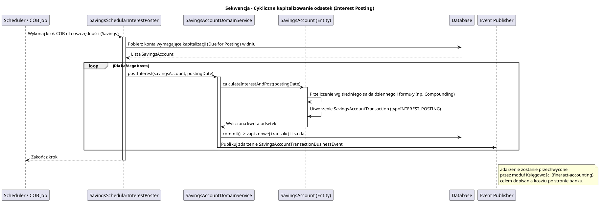

# Moduł Oszczędności i Depozytów (fineract-savings)

[Powrót do dokumentacji głównej](README.md)

## Opis
Moduł `fineract-savings` stanowi jeden z głównych filarów systemu Core Banking Apache Fineract, odpowiadający za pasywną część bankowości – pozyskiwanie kapitału od Klientów. W jego ramach realizowana jest pełna obsługa cyklu życia kont oszczędnościowych oraz terminowych depozytów inwestycyjnych (lokat).

Moduł wspiera trzy główne kategorie produktów:
1. **Savings Accounts** (Zwykłe konta oszczędnościowe): Konta z bieżącym dostępem do środków, możliwością dokonywania transakcji wpłat (Deposits), wypłat (Withdrawals) oraz naliczaniem odsetek na bazie salda bieżącego lub średniego.
2. **Fixed Deposits (FD)** (Lokaty Terminowe): Zamrożenie jednorazowej wpłaty na określony czas z predefiniowaną stopą procentową (często opartą o wykresy stóp procentowych zależące od kwoty i okresu).
3. **Recurring Deposits (RD)** (Lokaty Odnawialne/Cykliczne): Depozyty polegające na zobowiązaniu klienta do regularnych, cyklicznych wpłat (np. co miesiąc) przez określony czas celem osiągnięcia wyższego oprocentowania.

## Kluczowe komponenty

| Komponent (Pakiet/Klasa) | Odpowiedzialność biznesowa i techniczna |
| :--- | :--- |
| **`SavingsAccount`** i **`SavingsProduct`** | Główne encje bazodanowe (JPA). `SavingsProduct` określa parametry takie jak zasady kapitalizacji odsetek (Compounding), kalkulacji (Daily, Average Daily), wymogi minimalnego salda. `SavingsAccount` to konkretna instancja konta dla klienta. |
| **`FixedDepositAccount`** i **`RecurringDepositAccount`** | Modele specyficzne dla lokat terminowych i cyklicznych, dziedziczące lub kompozytowo korzystające z mechanik zwykłego konta, rozszerzone o parametry okresów trwania (Terms). |
| **`SavingsAccountTransaction`** | Reprezentuje operacje na koncie: np. Wpłata, Wypłata, Prowizja, Naliczanie Odsetek, Podatek od odsetek (Withhold Tax). |
| **`SavingsAccountDomainService`** | Enkapsuluje główne reguły biznesowe kalkulacji matematycznych dla wpłat, wypłat oraz aktualizacji sald bieżących (Running Balance). |
| **`SavingsAccountWritePlatformService`** | Serwis fasadowy wystawiający operacje na świat zewnętrzny. Przyjmuje komendy i orkiestruje weryfikację. |
| **`DepositAccountInterestRateChart`** | Modelowanie wykresów/tabel stóp procentowych (Interest Rate Charts). Pozwala na złożone definiowanie oprocentowania lokat np. "Jeśli kwota jest w przedziale 1000-5000 i okres wynosi 6-12 miesięcy to daj 5% + 1% bonusu dla seniorów". |
| **`SavingsSchedularInterestPoster`** | Komponent zadania wsadowego wywoływany w ramach zamykania dnia (Close of Business), który cyklicznie przelicza należne odsetki i je dopisuje (post). |

## Architektura modułu

```plantuml
@startuml
!include https://raw.githubusercontent.com/plantuml-stdlib/C4-PlantUML/master/C4_Component.puml
title Model C4 - Komponenty modułu fineract-savings

Component(savings_api, "Savings REST API", "Spring Web", "Przyjmuje wnioski o otwarcie konta, operacje wpłat/wypłat.")
Component(savings_write, "SavingsAccountWritePlatformService", "Serwis Zapisujący", "Steruje cyklem życia (Złożony wniosek -> Aktywacja -> Transakcje -> Zamknięcie)")
Component(savings_domain, "SavingsAccountDomainService", "Serwis Domenowy", "Utrzymuje spójność matematyczną transakcji, waliduje blokady sald i overdraft (debet)")
Component(interest_poster, "SavingsSchedularInterestPoster", "Batch Job", "Przelicza odsetki dla milionów kont podczas nocnego procesu COB")

SystemDb_Ext(db, "Relational Database", "Schemat bazy tenanta")
System_Ext(accounting, "Moduł Księgowości", "Generuje wpisy księgowe po udanych transakcjach na oszczędnościach")

Rel(savings_api, savings_write, "Wywołuje transakcje i zmiany stanu")
Rel(savings_write, savings_domain, "Egzekwuje logikę portfela")
Rel(savings_domain, db, "Aktualizuje m_savings_account i m_savings_account_transaction")
Rel(interest_poster, savings_domain, "Wyzwala proces kapitalizacji (Posting)")
Rel(savings_domain, accounting, "Publikuje zdarzenia (Events) dla Księgi Głównej")

@enduml
```

## Przepływ danych (Naliczanie Odsetek i Zamknięcie Dnia - COB)

Jednym z najważniejszych procesów w systemie oszczędności jest masowe przeliczanie kapitału.



## Zależności wewnętrzne i Integracje

*   **`fineract-cob` (Close of Business)**: Moduł posiada ścisłą integrację z mechanizmem blokad kont (`SavingsAccountLock`), co uniemożliwia dokonywanie ręcznych wpłat i wypłat z danego konta w momencie gdy silnik nocny właśnie przelicza jego odsetki.
*   **`fineract-accounting`**: Analogicznie do pożyczek, każde zasilenie konta (Deposit), wypłata (Withdrawal), odjęcie opłaty za prowadzenie konta (Fee) czy przyznanie odsetek (Interest) rzuca zdarzenie asynchroniczne, po którym moduł Księgowości tworzy wpisy na kontach *Cash*, *Liabilities* czy *Interest Expense*.
*   **Klient (`fineract-client`)**: Konieczna weryfikacja czy klient, do którego należy konto depozytowe, wciąż posiada status aktywny.

## Zarządzanie stanem i baza danych

Model zcentralizowany wokół koncepcji rachunku pasywnego (depozytowego).

*   `m_savings_product`: Parametry produktu oszczędnościowego (Kalkulacje, Typy).
*   `m_savings_account`: Indywidualne konto klienta. Zapisuje saldo bieżące `account_balance`, saldo zablokowane (On Hold), sumę wpłat itp.
*   `m_savings_account_transaction`: Zapis historii bilansu (Wpłaty, Wypłaty, Prowizje, Odsetki, Podatki). Posiada datę zdarzenia i datę księgowania, a także klucz obcy do `m_payment_detail` jeśli transakcja gotówkowa wymagała wpisania numeru czeku.
*   `m_deposit_account_term_and_preclosure`: Specyficzne rozszerzenie trzymane jako relacja do `m_savings_account` zawierające detale blokady czasowej dla Lokat Terminowych (Fixed Deposits) wraz z karą za wcześniejsze zerwanie lokaty (Preclosure Penalty).
*   `m_savings_account_charge`: Nakładane obciążenia konta (np. 10zł za prowadzenie konta per miesiąc). Często ściągane automatycznie przy odpowiednim wpływie z zewnątrz.
