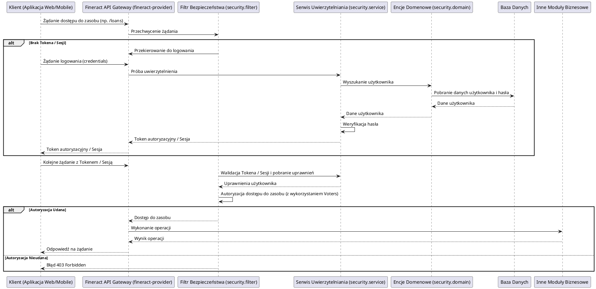

# Moduł: fineract-security

## Przegląd

Moduł `fineract-security` jest odpowiedzialny za zarządzanie wszystkimi aspektami bezpieczeństwa w systemie Apache Fineract, w tym uwierzytelnianiem (autentykacją) i autoryzacją użytkowników. Zapewnia mechanizmy kontroli dostępu, zarządzanie rolami i uprawnieniami, a także mechanizmy ochrony przed typowymi zagrożeniami bezpieczeństwa. Jest to kluczowy moduł, który gwarantuje, że tylko autoryzowani użytkownicy mają dostęp do odpowiednich zasobów i funkcji systemu.

## Kluczowe komponenty

Moduł `fineract-security` jest zorganizowany w pakiety, które odzwierciedlają różne aspekty zarządzania bezpieczeństwem:

*   **org.apache.fineract.infrastructure.security.api**: Prawdopodobnie zawiera kontrolery REST lub inne punkty końcowe API związane z uwierzytelnianiem (np. logowaniem), zarządzaniem sesjami i tokenami.
*   **org.apache.fineract.infrastructure.security.command**: Definicje komend związanych z operacjami bezpieczeństwa, np. zmiana hasła, przypisywanie ról.
*   **org.apache.fineract.infrastructure.security.constants**: Stałe używane w module, takie jak nazwy ról, uprawnienia, klucze konfiguracyjne.
*   **org.apache.fineract.infrastructure.security.converter**: Klasy odpowiedzialne za konwersję danych związanych z bezpieczeństwem, np. z obiektów domenowych na DTO i odwrotnie.
*   **org.apache.fineract.infrastructure.security.data**: Obiekty DTO (Data Transfer Objects) reprezentujące dane związane z bezpieczeństwem, takie jak dane logowania, informacje o użytkownikach czy rolach.
*   **org.apache.fineract.infrastructure.security.domain**: Definicje encji domenowych (np. `AppUser`, `Role`, `Permission`) i logiki biznesowej związanej z bezpieczeństwem. W tym miejscu definiowany jest model danych dla użytkowników, ich ról i uprawnień.
*   **org.apache.fineract.infrastructure.security.exception**: Niestandardowe wyjątki specyficzne dla modułu bezpieczeństwa, np. `AuthenticationFailedException`, `UserNotFoundException`, `PermissionDeniedException`.
*   **org.apache.fineract.infrastructure.security.filter**: Implementacje filtrów bezpieczeństwa (np. Spring Security Filters), odpowiedzialne za przechwytywanie żądań HTTP i wykonywanie operacji uwierzytelniania/autoryzacji (np. walidacja tokenów JWT, uwierzytelnianie podstawowe).
*   **org.apache.fineract.infrastructure.security.service**: Serwisy biznesowe odpowiedzialne za logikę bezpieczeństwa, np. `UserDetailsServiceImpl` (implementacja interfejsu Spring Security `UserDetailsService`), serwisy do zarządzania użytkownikami, rolami i uprawnieniami, serwisy do generowania i walidacji tokenów.
*   **org.apache.fineract.infrastructure.security.vote**: Mechanizmy głosowania (Voters) w Spring Security, które decydują o dostępie do zasobów na podstawie uprawnień.

## Przepływ danych

Typowy przepływ danych związany z uwierzytelnianiem i autoryzacją w module `fineract-security` przebiega następująco:

## Zależności wewnętrzne

Moduł `fineract-security` jest kluczowym elementem infrastruktury Fineract i jest silnie związany z:

*   **fineract-core**: Wykorzystuje ogólne klasy pomocnicze, konfiguracje i obsługę wyjątków z `fineract-core`. Często dzieli również komponenty infrastrukturalne, takie jak `fineract-core/infrastructure/codes` czy `fineract-core/infrastructure/configuration`.
*   **fineract-provider**: `fineract-provider` jest głównym punktem wejścia dla klientów i dlatego integruje filtry i serwisy uwierzytelniania/autoryzacji dostarczane przez `fineract-security` do ochrony swoich punktów końcowych API.
*   **Inne moduły biznesowe**: Wszystkie moduły biznesowe (np. `fineract-loan`, `fineract-savings`) polegają na `fineract-security` w celu zapewnienia, że operacje są wykonywane przez autoryzowanych użytkowników i zgodnie z ich uprawnieniami.

## Zależności zewnętrzne i integracje

*   **Spring Security Framework**: `fineract-security` jest zbudowany w oparciu o potężny framework Spring Security, który dostarcza podstawowe mechanizmy uwierzytelniania, autoryzacji i ochrony przed typowymi atakami.
*   **Baza Danych**: Przechowuje dane użytkowników, role, uprawnienia oraz informacje o sesjach lub tokenach (jeśli używane są tokeny odświeżające).
*   **JWT (JSON Web Tokens)**: Prawdopodobnie moduł wykorzystuje JWT do bezstanowej autoryzacji w architekturze RESTful, co jest powszechną praktyką w nowoczesnych aplikacjach.
*   **Protokoły uwierzytelniania**: Może integrować się z innymi protokołami, takimi jak OAuth2, LDAP lub innymi dostawcami tożsamości, w zależności od konfiguracji.

## Zarządzanie stanem i baza Danych

Moduł `fineract-security` zarządza kluczowymi danymi w bazie danych, które określają tożsamość i uprawnienia użytkowników:

*   **Użytkownicy (AppUser)**: Dane dotyczące użytkowników, w tym nazwy użytkowników, zaszyfrowane hasła, status konta (aktywne/nieaktywne), blokady kont.
*   **Role (Role)**: Definicje ról w systemie (np. administrator, menedżer kredytowy, kasjer).
*   **Uprawnienia (Permission)**: Szczegółowe uprawnienia, które mogą być przypisane do ról (np. `CREATE_LOAN`, `VIEW_CLIENT_DATA`).
*   **Mapowanie Ról do Użytkowników**: Tabela łącząca użytkowników z przypisanymi im rolami.
*   **Historia logowania/Audyt**: Może przechowywać historię logowania i prób dostępu dla celów audytowych i bezpieczeństwa.

Stan sesji (np. po uwierzytelnieniu) jest zazwyczaj zarządzany poprzez sesje HTTP (jeśli jest to aplikacja stanowa) lub poprzez tokeny (np. JWT) dla aplikacji bezstanowych, które są walidowane przy każdym żądaniu. Dane te są trwale przechowywane w bazie danych i dostępne za pośrednictwem komponentów warstwy `domain` i `service`.
