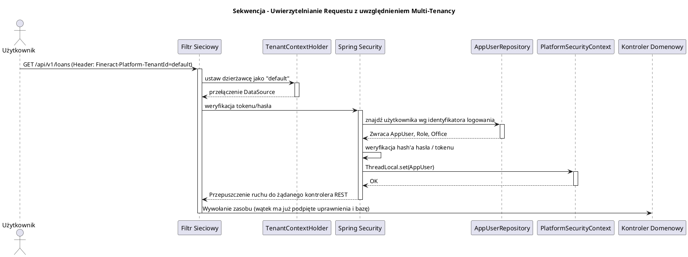

# Moduł Bezpieczeństwa i Wielodzierżawności (fineract-security)

[Powrót do dokumentacji głównej](README.md)

## Opis
Moduł `fineract-security` jest krytycznym komponentem infrastrukturalnym systemu Apache Fineract, odpowiadającym za zarządzanie autoryzacją (Authorization), uwierzytelnianiem (Authentication) oraz architekturą wielodzierżawną (Multi-Tenancy). 

Fineract to rozwiązanie typu SaaS (Software as a Service), z którego korzystać może wiele instytucji finansowych naraz, z których każda traktowana jest jako osobny dzierżawca (Tenant). Moduł ten odpowiada za wyizolowanie danych między poszczególnymi tenantami poprzez dynamiczne kierowanie zapytań do odpowiednich schematów baz danych w locie, w oparciu o nagłówki żądań HTTP. Ponadto, wdraża on skrupulatny model uprawnień Role-Based Access Control (RBAC), zapewniający, że użytkownicy (np. kasjerzy, menedżerowie) posiadają dostęp jedynie do przydzielonych im ról i placówek (Oddziałów / Branches).

## Kluczowe komponenty

| Komponent | Odpowiedzialność biznesowa i techniczna |
| :--- | :--- |
| **`PlatformSecurityContext`** | Kontekst bezpieczeństwa Springa przechowujący uwierzytelnionego użytkownika (`AppUser`). Daje globalny dostęp w kodzie Fineract do informacji: "Kto wywołał tę akcję?". |
| **`TenantAwareBasicAuthenticationFilter`** / **OAuth2 Filters** | Filtry w łańcuchu Spring Security. Najpierw rozpoznają dzierżawcę (odczytując nagłówek `Fineract-Platform-TenantId`), ustawiają połączenie do bazy danych, a dopiero potem uwierzytelniają użytkownika w bazie tego konkretnego dzierżawcy. |
| **`AppUser`**, **`Role`**, **`Permission`** | Encje domenowe opisujące model uprawnień (RBAC). Użytkownik (`AppUser`) przypisany jest do oddziału (`Office`), posiada Rolę, a Rola zawiera Uprawnienia na poziomie najdrobniejszych zapytań i komend (np. `CREATE_CLIENT`, `READ_LOAN`). |
| **`TwoFactorAuthentication`** | Wbudowane wsparcie dla uwierzytelniania dwuskładnikowego w celu zabezpieczenia krytycznych operacji (np. wypłata powyżej pewnego limitu) z możliwością generowania tokenów jednorazowych (OTP). |

## Architektura modułu

Architektura `fineract-security` oparta jest na systemie filtrów sieciowych, wkomponowanych w natywny mechanizm Spring Security.

```plantuml
@startuml
!include https://raw.githubusercontent.com/plantuml-stdlib/C4-PlantUML/master/C4_Component.puml
title Model C4 - Komponenty modułu fineract-security

Component(api_gateway, "REST API Client", "Nginx / Postman / App", "Wysyła zapytania uwierzytelniające wraz z nagłówkiem Fineract-Platform-TenantId")
Component(tenant_filter, "TenantFilter", "Servlet Filter", "Odczytuje nagłówek Tenanta i ustanawia kontekst wątku połączenia z bazą (DataSource)")
Component(auth_filter, "AuthenticationFilter", "Spring Security", "Odczytuje token JWT / Basic Auth i weryfikuje użytkownika")
Component(user_details, "UserDetailsService", "Serwis domenowy", "Pobiera z bazy Tenanta (m_appuser) użytkownika wraz z rolami i biurem")
Component(sec_context, "PlatformSecurityContext", "Singleton (ThreadLocal)", "Utrzymuje zautoryzowaną sesję użytkownika dla całej reszty aplikacji")

SystemDb_Ext(default_db, "fineract_default DB", "Baza główna", "Lista dzierżawców, ich adresy baz danych (JDBC)")
SystemDb_Ext(tenant_db, "tenant_XYZ DB", "Baza dzierżawcy", "Dane logowania, role użytkowników, hashe haseł (Bcrypt)")

Rel(api_gateway, tenant_filter, "Żądanie HTTP (Auth)")
Rel(tenant_filter, default_db, "Odpytuje o namiary na bazę dzierżawcy")
Rel(tenant_filter, auth_filter, "Przekazuje ruch po ustanowieniu połączenia JDBC")
Rel(auth_filter, user_details, "Wywołuje odczyt użytkownika")
Rel(user_details, tenant_db, "Pobiera AppUser, Role i Password Hash")
Rel(auth_filter, sec_context, "Ustanawia kontekst w wypadku sukcesu autoryzacji")

@enduml
```

## Przepływ danych (Logowanie i Ekstrakcja Kontekstu)

Poniższy diagram ilustruje, jak system przetwarza każde bezpieczne żądanie do API w środowisku wielodzierżawnym.



## Zależności wewnętrzne i Integracje

*   **Fundament dla innych modułów**: `fineract-security` wywoływany jest na samym początku przez wszystkie inne moduły odbierające ruch HTTP (`fineract-loan`, `fineract-savings`, `fineract-accounting`, `fineract-client`). Jeśli użytkownik nie ma uprawnień `READ_LOAN`, zapytanie zostanie przerwane przez adnotację `@PreAuthorize` jeszcze zanim dotrze do `fineract-loan`.
*   **Anotacje Security**: W modułach biznesowych nagminnie stosowana jest warstwa CQRS, gdzie w CommandHandlerach sprawdza się `PlatformSecurityContext.authenticatedUser()` w celu audytu - przypisania akcji do konkretnego pracownika (Maker/Checker).

## Zarządzanie stanem i baza danych

Autoryzacja rozbita jest na bazę główną serwera oraz bazy poszczególnych dzierżawców.

**W bazie głównej (`fineract_default`):**
*   `tenant_server_connections`: Definiuje parametry JDBC (host, port, użytkownik, hasło) dla każdej bazy dzierżawcy.
*   `tenants`: Tabela przechowująca identyfikator dzierżawcy (przesyłany w nagłówku HTTP), strefę czasową oraz odnośnik do jego bazy danych.

**W bazie dzierżawcy (`tenant_xyz`):**
*   `m_appuser`: Tabela użytkowników back-office. Przechowuje loginy, hasła (zakodowane), flagę usunięcia/zablokowania oraz identyfikator przypisanego oddziału banku (`office_id`).
*   `m_role`: Role (np. "SuperUser", "Cashier", "Manager").
*   `m_appuser_role`: Tabela asocjacyjna wielu-do-wielu (użytkownik przypisany do wielu ról).
*   `m_permission`: Tabela definiująca tysiące uprawnień wygenerowanych na podstawie API i dozwolonych komend (Command/Query). Każdy endpoint posiada unikalny identyfikator uprawnienia w tej tabeli.
*   `m_role_permission`: Przypisanie wybranych uprawnień do danej Roli.
