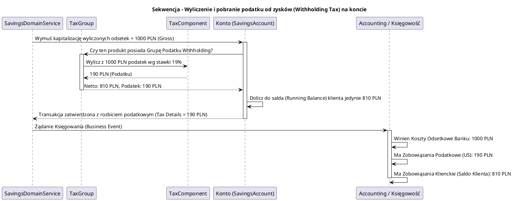

# Moduł Podatkowy (fineract-tax)

[Powrót do dokumentacji głównej](README.md)

## Opis
Moduł `fineract-tax` stanowi zaawansowany silnik nakładania podatków oraz odpisów pobieranych u źródła na rzecz agencji rządowych, stworzony dla wymogów compliance instytucji finansowych i MFI działających na globalnych rynkach. Regulacje prawne mogą wymagać odprowadzenia np. VAT-u (Value Added Tax) na pobrane przez bank prowizje kredytowe, lub odprowadzenia podatku od zysków kapitałowych tzw. Podatku U Źródła (Withholding Tax) na wygenerowanych odsetkach od oszczędności klientów.

System wspiera kaskadowanie komponentów podatkowych oraz wyznaczanie ich do konkretnych kont księgowych (na konto zobowiązań podatkowych "Tax Liability"). 

## Kluczowe komponenty

| Komponent | Odpowiedzialność biznesowa i techniczna |
| :--- | :--- |
| **`TaxComponent`** (Składnik Podatkowy) | Najbardziej podstawowy element (np. "VAT Podstawowy" - 23% z kontem księgowym docelowym X, albo "Podatek Lokalny" - 2% z kontem księgowym Y). Posiada zakresy dat obowiązywania (możliwość płynnej zmiany po nowym roku bez łamania historii). |
| **`TaxGroup`** (Grupa Podatkowa) | Wiele składowych może zostać połączonych w jedną Grupę, którą można przypisać m.in. na produkcie pożyczki, bądź na opłacie wejściowej (`Charge`). Podatki wewnątrz grupy nakładane są po kolei na daną kwotę u klienta. |
| **Integracja z Wypłatą Zysków (Withholding)** | Logika wywoływana w kodzie depozytów (Savings) podczas kapitalizacji odsetek (Posting Interest). Wyliczone dla klienta 100 PLN odsetek zostaje automatycznie rozbite np. na 81 PLN wpływające na saldo, i 19 PLN odprowadzane w podatku na osobne konto księgowe banku (by bank w imieniu klienta zapłacił podatek państwu). |

## Architektura modułu

Architektura jest analogiczna do modułu z prowizjami (Charges) – jest to słownik współdzielony między modułami operacyjnymi i wymuszający odpowiednie księgowania.

```plantuml
@startuml
!include https://raw.githubusercontent.com/plantuml-stdlib/C4-PlantUML/master/C4_Component.puml
title Model C4 - Zależności modułu fineract-tax

Component(tax_api, "Tax REST API", "Spring Web", "Zarządzanie składowymi oraz grupami podatkowymi (/taxes/components, /taxes/group)")
Component(tax_service, "TaxPlatformService", "Serwis domenowy", "Rejestruje definicje, asocjacje z kontami GL i kontroluje daty ważności (Valid From)")
Component(charge_module, "fineract-charge", "Moduł Opłat", "Zawiera klucz TaxGroup, by ustalić czy opłata jest opodatkowana")
Component(savings_module, "fineract-savings", "Moduł Oszczędności", "Przelicza wygenerowane odsetki w oparciu o przypisaną TaxGroup")
Component(accounting_module, "fineract-accounting", "Księgowość", "Generuje wpisy do Liability Account (Rozrachunki z Fiskusem)")

SystemDb_Ext(db, "Baza Tenanta", "MySQL / PostgreSQL")

Rel(tax_api, tax_service, "Tworzy komponenty VAT 23%")
Rel(charge_module, tax_service, "Pobiera reguły dla przypisanej grupy na Oplacie Zalozycielskiej")
Rel(savings_module, tax_service, "Pobiera reguły dla podatku 'Belki' od oszczędności 19%")
Rel(tax_service, db, "m_tax_component, m_tax_group")
Rel(tax_service, accounting_module, "Zwraca powiązane ID kont GL, żeby zaksięgować VAT")

@enduml
```

## Przepływ danych (Księgowanie Podatku Belki)



## Zależności wewnętrzne i Integracje

*   **`fineract-accounting` (Księgowość)**: Ten moduł jest całkowicie, na twardo powiązany z modułem księgowym. Składnik podatkowy nie istnieje sam z siebie, jest jedynie logicznym procentem pobierającym środki w celu przetransportowania ich bezpośrednio na wylistowane konto Księgi Głównej (Liability Account). 
*   **Wielokrotne opodatkowanie**: Fineract pozwala grupie podatkowej na składanie odliczeń kaskadowo - tzn. czy drugi podatek odciągany jest od kwoty pierwotnej (brutto) czy po potrąceniu pierwszego podatku.

## Zarządzanie stanem i baza danych

Kluczowe słowniki w bazie dla tego pakietu:

*   `m_tax_component`: Typ i wartość procentowa podatku. Definiuje od kiedy obowiązuje (start_date) i posiada bezpośredni dowiązany klucz obcy do `acc_gl_account` (`credit_account_id`).
*   `m_tax_group`: Nazwa zbiorczej grupy nakładanej na inne byty w systemie.
*   `m_tax_group_mappings`: Tabela asocjacyjna. Mapuje składniki (`tax_component_id`) do grupy (`tax_group_id`).
*   `m_savings_account_transaction_tax_details`: Tabela operacyjna podpięta pod transakcje na rachunkach oszczędnościowych, udowadniająca audytorom skarbowym, ile i jakiego podatku konkretnie ściągnięto na danej operacji kapitalizacyjnej.
