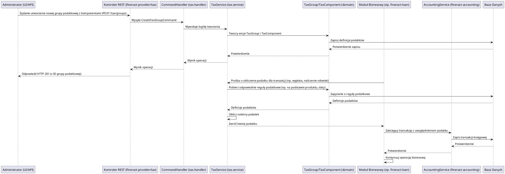

# Moduł: fineract-tax

## Przegląd

Moduł `fineract-tax` w Apache Fineract jest odpowiedzialny za definiowanie, obliczanie i aplikowanie różnych rodzajów podatków związanych z transakcjami finansowymi i produktami bankowymi. Zapewnia elastyczne mechanizmy konfiguracji reguł podatkowych, ich automatyczne stosowanie w odpowiednich momentach cyklu życia produktu oraz prawidłowe księgowanie naliczonych podatków. Jego głównym celem jest zapewnienie zgodności z lokalnymi przepisami podatkowymi oraz precyzyjne śledzenie i raportowanie zobowiązań podatkowych.

## Kluczowe komponenty

Moduł `fineract-tax` jest zorganizowany wokół pakietu `org.apache.fineract.portfolio.tax`, który zawiera następujące podpakietu:

*   **org.apache.fineract.portfolio.tax.api**: Zawiera kontrolery REST lub interfejsy API do interakcji z modułem, umożliwiając tworzenie, aktualizowanie, usuwanie definicji podatków i ich grup.
*   **org.apache.fineract.portfolio.tax.domain**: Zawiera encje domenowe, takie jak `TaxGroup` (grupy podatkowe), `TaxComponent` (poszczególne składniki podatku, np. stawka VAT) oraz `TaxGroupMappings` (mapowanie komponentów do grup). Logika biznesowa do zarządzania tymi encjami znajduje się również tutaj.
*   **org.apache.fineract.portfolio.tax.exception**: Niestandardowe wyjątki obsługujące błędy specyficzne dla zarządzania podatkami.
*   **org.apache.fineract.portfolio.tax.handler**: Implementacje `CommandHandler`ów, które przetwarzają komendy związane z podatkami (np. `CreateTaxGroupCommand`, `UpdateTaxComponentCommand`).
*   **org.apache.fineract.portfolio.tax.mapper**: Klasy odpowiedzialne za mapowanie obiektów pomiędzy warstwami (np. DTO na encje domenowe) dla danych podatkowych.
*   **org.apache.fineract.portfolio.tax.serialization**: Obsługa serializacji i deserializacji danych podatkowych.
*   **org.apache.fineract.portfolio.tax.service**: Serwisy biznesowe implementujące główną logikę zarządzania podatkami, w tym definiowanie, obliczanie i aplikowanie podatków na produkty finansowe i transakcje.

## Przepływ danych

Przepływ danych w module `fineract-tax` obejmuje definiowanie reguł podatkowych, a następnie ich aplikowanie podczas wykonywania transakcji finansowych.

### Uproszczony przepływ definiowania reguły podatkowej i jej zastosowania:

## Zależności wewnętrzne

Moduł `fineract-tax` jest modułem wspierającym, który jest wykorzystywany przez główne moduły biznesowe Fineract:

*   **fineract-core**: Wykorzystuje ogólne komponenty infrastrukturalne i narzędzia.
*   **fineract-command**: Komendy do operacji na podatkach są przetwarzane przez ogólny mechanizm komend Fineract.
*   **fineract-provider**: Udostępnia punkty końcowe API, które wywołują funkcjonalności modułu `fineract-tax`.
*   **fineract-loan, fineract-savings, fineract-charge**: Te moduły biznesowe odwołują się do `fineract-tax` w celu obliczania i aplikowania podatków związanych z pożyczkami, kontami oszczędnościowymi i opłatami.
*   **fineract-accounting**: Każdy naliczony podatek musi zostać odpowiednio zaksięgowany, dlatego `fineract-tax` integruje się z modułem księgowości.

## Zależności zewnętrzne i integracje

*   **Baza Danych**: Główna zależność. Wszystkie definicje reguł podatkowych, ich komponenty, grupy i rekordy naliczonych podatków są trwale przechowywane w relacyjnej bazie danych.
*   **Spring Framework**: Wykorzystuje mechanizmy Spring do zarządzania transakcjami, wstrzykiwania zależności i konfiguracji.

## Zarządzanie stanem i baza Danych

Moduł `fineract-tax` zarządza stanem definicji podatków i ich aplikacją w bazie danych:

*   **Definicje Podatków (Tax Groups/Components)**: Przechowuje szczegółowe informacje o każdym typie podatku (np. nazwa, stawka, sposób naliczania, zakres dat obowiązywania).
*   **Zastosowane Podatki**: Rejestruje każdy podatek, który został naliczony w ramach transakcji, w tym jego kwotę, datę naliczenia i powiązaną transakcję.
*   **Konfiguracja Podatków dla Produktów**: Mapowania, które określają, które reguły podatkowe są domyślnie aplikowane do jakich produktów finansowych.

Wszystkie te dane są modelowane jako encje JPA i trwale przechowywane w bazie danych, zapewniając spójność, audytowalność i zgodność z przepisami podatkowymi.
