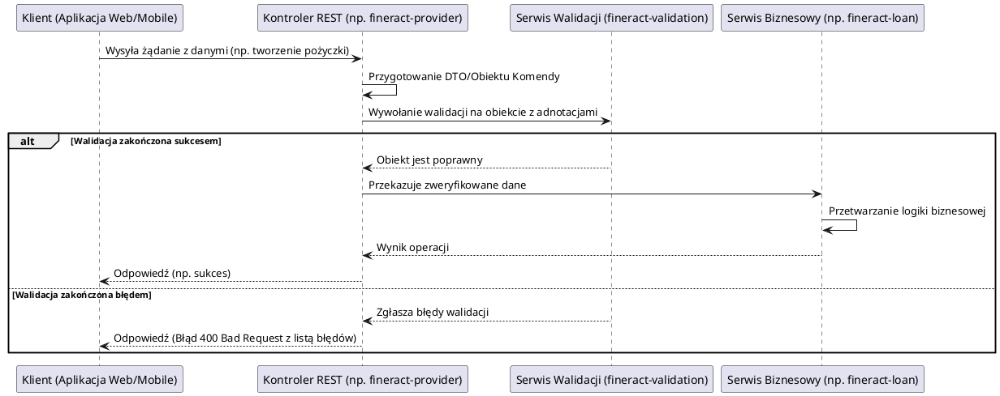

# Moduł: fineract-validation

## Przegląd

Moduł `fineract-validation` jest odpowiedzialny za dostarczanie centralizowanych i reużywalnych reguł walidacji danych wejściowych w całym systemie Apache Fineract. Jego głównym celem jest zapewnienie integralności i poprawności danych zanim zostaną one przetworzone lub zapisane w bazie danych. Moduł ten definiuje niestandardowe adnotacje walidacyjne oraz ich implementacje, co pozwala na spójne i efektywne egzekwowanie wymagań biznesowych dotyczących formatu i wartości danych.

## Kluczowe komponenty

Moduł `fineract-validation` skupia się na definiowaniu niestandardowych ograniczeń (constraints) walidacji, które rozszerzają standardowe możliwości Jakarta Bean Validation. Kluczowe komponenty to:

*   **org.apache.fineract.validation.constraints**: Pakiet zawierający niestandardowe adnotacje walidacyjne oraz ich implementacje (validatory):
    *   `EnumValue.java`: Adnotacja używana do walidacji, czy dana wartość jest jedną z predefiniowanych wartości w typie wyliczeniowym (enum). Zapewnia, że wartości tekstowe (np. statusy) są zgodne z oczekiwanymi enumeracjami w kodzie.
    *   `EnumValueValidator.java`: Implementacja logiki walidacyjnej dla adnotacji `EnumValue`, sprawdzająca, czy przekazana wartość tekstowa odpowiada istniejącej wartości w określonym typie wyliczeniowym.
    *   `LocalDate.java`: Adnotacja do walidacji obiektów `java.time.LocalDate`. Prawdopodobnie kontroluje, czy data jest w oczekiwanym formacie lub zakresie.
    *   `LocalDateValidator.java`: Implementacja logiki walidacyjnej dla adnotacji `LocalDate`.
    *   `Locale.java`: Adnotacja służąca do walidacji, czy wartość tekstowa reprezentuje prawidłowy kod lokalizacji (locale).
    *   `LocaleValidator.java`: Implementacja logiki walidacyjnej dla adnotacji `Locale`.

Te komponenty umożliwiają deweloperom łatwe stosowanie złożonych reguł walidacji w DTO (Data Transfer Objects) lub klasach komend poprzez proste adnotacje.

## Przepływ danych

Walidacja danych w systemie Fineract, wykorzystująca moduł `fineract-validation`, odbywa się zazwyczaj na wczesnym etapie przetwarzania żądania, najczęściej w warstwie API (kontrolery) lub zaraz po deserializacji danych wejściowych (np. z JSON do obiektu DTO/komendy).

### Uproszczony przepływ walidacji:

## Zależności wewnętrzne

Moduł `fineract-validation` jest używany przez wszystkie inne moduły biznesowe Fineract, które przetwarzają dane wejściowe. Najważniejsze zależności obejmują:

*   **fineract-provider**: Kontrolery w module `fineract-provider` (będące głównym interfejsem API) wykorzystują adnotacje walidacyjne z `fineract-validation` do automatycznego sprawdzania poprawności danych przesyłanych w żądaniach HTTP.
*   **fineract-command**: Obiekty komend (command objects), które reprezentują operacje biznesowe, często są adnotowane regułami walidacji z tego modułu.
*   **fineract-loan, fineract-savings, fineract-accounting** i inne moduły biznesowe: Każdy moduł, który akceptuje dane wejściowe od użytkownika lub innych systemów, może wykorzystywać te walidatory do zapewnienia spójności i poprawności danych.

## Zależności zewnętrzne i integracje

*   **Jakarta Bean Validation (JSR 380)**: Moduł `fineract-validation` jest zbudowany na specyfikacji Jakarta Bean Validation, rozszerzając ją o niestandardowe reguły. Wymaga implementacji tej specyfikacji (np. Hibernate Validator), która jest zazwyczaj dostarczana przez Spring Boot.
*   **Spring Framework**: Integruje się ze Spring Framework, który automatycznie wykrywa i stosuje walidatory do obiektów adnotowanych w kontrolerach i serwisach.

## Zarządzanie stanem i baza Danych

Moduł `fineract-validation` nie zarządza bezpośrednio trwałym stanem ani nie operuje na bazie danych. Jego rola polega na **zapewnieniu poprawności danych wejściowych przed ich zapisem**. W ten sposób, pośrednio przyczynia się do utrzymania integralności danych w bazie, zapobiegając zapisywaniu nieprawidłowych lub niespójnych informacji. Walidacja odbywa się w pamięci, na obiektach DTO lub komend, przed wywołaniem logiki biznesowej odpowiedzialnej za modyfikację stanu systemu.
