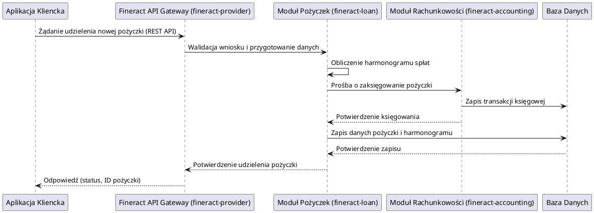

# Apache Fineract: Centralny System Bankowości i Mikrofinansowania

## Przegląd

Apache Fineract to otwarte oprogramowanie służące jako system bankowości centralnej (Core Banking System) oraz platforma do zarządzania mikrofinansami. Został zaprojektowany z myślą o instytucjach finansowych, które potrzebują elastycznego, skalowalnego i konfigurowalnego rozwiązania do obsługi różnorodnych operacji finansowych. Fineract wspiera zarządzanie portfelami kredytowymi, kontami oszczędnościowymi, rachunkowością oraz relacjami z klientami (CRM), umożliwiając dostarczanie usług finansowych szerokiemu gronu odbiorców, w tym społecznościom niedostatecznie obsłużonym przez tradycyjną bankowość.

System jest zbudowany na architekturze modułowej, z wykorzystaniem technologii Java, Spring Boot, Spring Data JPA oraz REST API, co zapewnia wysoką elastyczność i możliwość integracji z innymi systemami.

## Kluczowe komponenty (Moduły)

Projekt Apache Fineract składa się z wielu modułów, z których każdy odpowiada za specyficzny obszar funkcjonalny systemu. Poniżej przedstawiono ogólny przegląd głównych modułów:

*   **fineract-core**: Podstawowy moduł zawierający globalne klasy pomocnicze, wspólne wyjątki, konfiguracje, interfejsy API, funkcje uwierzytelniania, filtrowanie, obsługę baz danych, integrację z pocztą elektroniczną i inne komponenty używane przez inne moduły.
*   **fineract-security**: Zarządza bezpieczeństwem, uwierzytelnianiem i autoryzacją użytkowników w systemie.
*   **fineract-cob**: (Close of Business) Odpowiada za procesy end-of-day, takie jak naliczanie odsetek, aktualizacja statusów kredytów, generowanie raportów cyklicznych.
*   **fineract-validation**: Zapewnia zestaw reguł i mechanizmów do walidacji danych wejściowych w całym systemie.
*   **fineract-command**: Obsługuje mechanizm komend i zdarzeń, służący do wykonywania operacji biznesowych i rejestrowania ich historii.
*   **fineract-accounting**: Moduł księgowy, odpowiedzialny za zarządzanie zapisami finansowymi, księgowaniem transakcji i generowaniem sprawozdań finansowych.
*   **fineract-provider**: Główny moduł, który integruje wszystkie pozostałe moduły i udostępnia interfejsy API dla aplikacji klienckich.
*   **fineract-branch**: Zarządza informacjami o oddziałach banku lub punktach obsługi klienta.
*   **fineract-document**: Obsługuje zarządzanie dokumentami powiązanymi z klientami, pożyczkami czy kontami oszczędnościowymi.
*   **fineract-investor**: Wspiera zarządzanie inwestorami i ich udziałem w portfelach kredytowych.
*   **fineract-rates**: Zarządza definicjami stóp procentowych, opłat i innych parametrów finansowych.
*   **fineract-charge**: Obsługuje definiowanie i naliczanie różnego rodzaju opłat.
*   **fineract-tax**: Zarządza obliczaniem i naliczaniem podatków związanych z operacjami finansowymi.
*   **fineract-loan-origination**: Moduł wspierający proces wnioskowania i udzielania pożyczek.
*   **fineract-loan**: Centralny moduł do zarządzania całym cyklem życia pożyczki, od uruchomienia do spłaty, w tym harmonogramami spłat, naliczaniem odsetek i windykacją.
*   **fineract-savings**: Moduł do zarządzania kontami oszczędnościowymi, wpłatami, wypłatami i naliczaniem odsetek.
*   **fineract-report**: Odpowiada za generowanie różnorodnych raportów biznesowych i analitycznych.
*   **fineract-mix**: Prawdopodobnie moduł integrujący lub wspierający inne funkcjonalności, wymaga głębszej analizy.
*   **fineract-war**: Moduł do pakowania aplikacji w formacie WAR, gotowy do wdrożenia na serwerze aplikacji.
*   **fineract-client**: Generowany klient API, ułatwiający integrację z Fineract.
*   **fineract-client-feign**: Klient Feign dla Fineract API.
*   **fineract-doc**: Moduł do generowania dokumentacji technicznej i API.
*   **fineract-avro-schemas**: Definicje schematów Avro dla danych wymienianych w systemie.
*   **fineract-progressive-loan**: Rozszerzenie funkcjonalności pożyczek o mechanizmy progresywne.
*   **fineract-progressive-loan-embeddable-schedule-generator**: Generator harmonogramów spłat dla pożyczek progresywnych.
*   **fineract-working-capital-loan**: Wsparcie dla pożyczek obrotowych.

## Przepływ danych

W Apache Fineract, przepływ danych jest zazwyczaj inicjowany przez zewnętrzne aplikacje (np. interfejs użytkownika, aplikacje mobilne) lub wewnętrzne procesy (np. COB). Aplikacje klienckie komunikują się z modułem `fineract-provider` poprzez REST API. Moduł `fineract-provider` koordynuje działania między innymi modułami Fineract, takimi jak `fineract-loan` czy `fineract-savings`, aby zrealizować żądaną operację biznesową.

Operacje są często realizowane za pośrednictwem mechanizmu komend (`fineract-command`), co pozwala na atomowe wykonanie transakcji i rejestrowanie historii zmian. Dane są przechowywane w relacyjnej bazie danych (MySQL/PostgreSQL), a kluczowe informacje, takie jak statusy pożyczek, salda kont czy dane klientów, są zarządzane przez odpowiednie moduły.

### Przykład uproszczonego przepływu danych dla udzielenia pożyczki:

## Zależności wewnętrzne

Moduły Fineract są ściśle ze sobą powiązane. `fineract-provider` działa jako centralny punkt integracji, koordynując wywołania do innych modułów biznesowych. `fineract-core` dostarcza podstawowe narzędzia i komponenty używane przez większość modułów. Moduły takie jak `fineract-loan` czy `fineract-savings` polegają na `fineract-accounting` do rejestrowania transakcji finansowych oraz na `fineract-security` do zarządzania uprawnieniami. `fineract-cob` przetwarza dane z modułów `fineract-loan` i `fineract-savings` w ramach cyklicznych operacji.

## Zależności zewnętrzne i integracje

Apache Fineract jest zaprojektowany do integracji z różnymi systemami zewnętrznymi:

*   **Baza Danych**: MySQL lub PostgreSQL (wymagane do przechowywania wszystkich danych operacyjnych i konfiguracyjnych).
*   **Systemy pocztowe**: Do wysyłania powiadomień, potwierdzeń transakcji itp. (za pośrednictwem `fineract-core`).
*   **Systemy raportowe/BI**: Możliwa integracja z zewnętrznymi narzędziami do analizy danych i generowania zaawansowanych raportów (moduł `fineract-report` dostarcza dane).
*   **Bramki płatności/SMS**: Integracja w celu realizacji płatności lub wysyłania powiadomień SMS (zazwyczaj poprzez dedykowane rozszerzenia lub niestandardowe moduły).
*   **Systemy CRM/ERP**: Możliwość integracji danych klientów i finansowych z szerszymi systemami zarządzania przedsiębiorstwem.

## Zarządzanie stanem i baza Danych

Fineract intensywnie wykorzystuje relacyjną bazę danych (MySQL/PostgreSQL) do trwałego przechowywania wszystkich danych. Kluczowe informacje obejmują:

*   **Klienci**: Dane demograficzne, identyfikacyjne, kontakty.
*   **Konta oszczędnościowe**: Salda, historia transakcji, stopy procentowe.
*   **Pożyczki**: Kwoty, harmonogramy spłat, statusy (aktywna, spłacona, zaległa), historia transakcji, naliczone odsetki i opłaty.
*   **Transakcje księgowe**: Wpisy do księgi głównej, bilanse, rachunki zysków i strat.
*   **Konfiguracja systemu**: Ustawienia globalne, parametry produktów finansowych, uprawnienia użytkowników.

Zmiany stanu w systemie są zazwyczaj modelowane jako zdarzenia i komendy, które modyfikują stan danych w bazie danych w sposób transakcyjny, zapewniając spójność i integralność danych.
